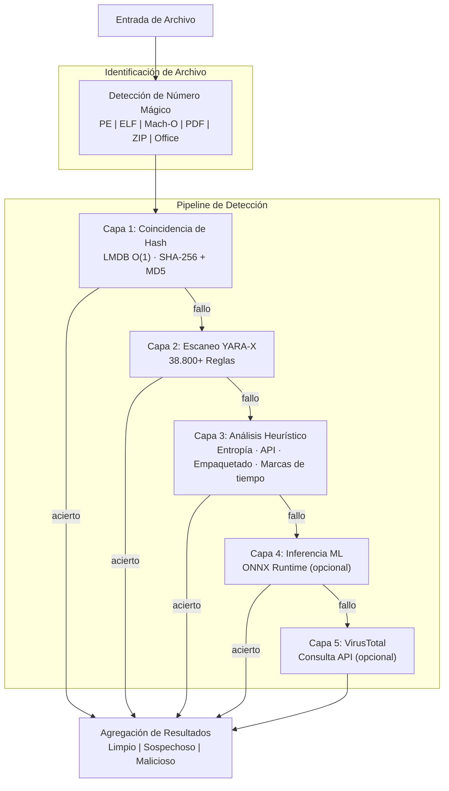

# PRX-SD

**PRX-SD** es un motor antivirus de alto rendimiento y código abierto escrito en Rust. Combina coincidencia de firmas basada en hashes, más de 38.800 reglas YARA, análisis heurístico consciente del tipo de archivo e inferencia ML opcional en un único pipeline de detección multicapa. PRX-SD se distribuye como herramienta de línea de comandos (`sd`), un demonio del sistema para protección en tiempo real y una interfaz gráfica de escritorio con Tauri + Vue 3.

PRX-SD está diseñado para ingenieros de seguridad, administradores de sistemas y respondedores de incidentes que necesitan un motor de detección de malware rápido, transparente y extensible -- uno que pueda escanear millones de archivos, monitorear directorios en tiempo real, detectar rootkits e integrarse con fuentes externas de inteligencia de amenazas -- todo sin depender de cajas negras comerciales opacas.

## ¿Por qué PRX-SD?

Los productos antivirus tradicionales son de código cerrado, consumen muchos recursos y son difíciles de personalizar. PRX-SD adopta un enfoque diferente:

- **Abierto y auditable.** Cada regla de detección, verificación heurística y umbral de puntuación es visible en el código fuente. Sin telemetría oculta, sin dependencia de la nube requerida.
- **Defensa multicapa.** Cinco capas de detección independientes garantizan que si un método falla, el siguiente lo captura.
- **Rendimiento Rust-first.** E/S sin copia, búsquedas de hash O(1) en LMDB y escaneo paralelo ofrecen un rendimiento que rivaliza con los motores comerciales en hardware estándar.
- **Extensible por diseño.** Plugins WASM, reglas YARA personalizadas y una arquitectura modular hacen que PRX-SD sea fácil de adaptar a entornos especializados.

## Características Principales

<div class="vp-features">

- **Pipeline de Detección Multicapa** -- La coincidencia de hashes, las reglas YARA-X, el análisis heurístico, la inferencia ML opcional y la integración opcional con VirusTotal trabajan en secuencia para maximizar las tasas de detección.

- **Protección en Tiempo Real** -- El demonio `sd monitor` vigila directorios mediante inotify (Linux) / FSEvents (macOS) y escanea archivos nuevos o modificados al instante.

- **Defensa contra Ransomware** -- Reglas YARA y heurísticas dedicadas detectan familias de ransomware incluyendo WannaCry, LockBit, Conti, REvil, BlackCat y más.

- **Más de 38.800 Reglas YARA** -- Agregadas de 8 fuentes comunitarias y de calidad comercial: Yara-Rules, Neo23x0 signature-base, ReversingLabs, ESET IOC, InQuest y 64 reglas integradas.

- **Base de Datos de Hashes LMDB** -- Los hashes SHA-256 y MD5 de abuse.ch MalwareBazaar, URLhaus, Feodo Tracker, ThreatFox, VirusShare (más de 20M) y una lista de bloqueo integrada se almacenan en LMDB para búsquedas O(1).

- **Multiplataforma** -- Linux (x86_64, aarch64), macOS (Apple Silicon, Intel) y Windows (WSL2). Detección nativa de tipos de archivo para formatos PE, ELF, Mach-O, PDF, Office y archivos comprimidos.

- **Sistema de Plugins WASM** -- Extiende la lógica de detección, añade escáneres personalizados o integra fuentes de amenazas propietarias mediante plugins WebAssembly.

</div>

## Arquitectura



## Instalación Rápida

```bash
curl -fsSL https://openprx.dev/install-sd.sh | bash
```

O instalar mediante Cargo:

```bash
cargo install prx-sd
```

Luego actualiza la base de datos de firmas:

```bash
sd update
```

Consulta la [Guía de Instalación](./getting-started/installation) para todos los métodos incluyendo Docker y compilación desde el código fuente.

## Secciones de Documentación

| Sección | Descripción |
|---------|-------------|
| [Instalación](./getting-started/installation) | Instalar PRX-SD en Linux, macOS o Windows WSL2 |
| [Inicio Rápido](./getting-started/quickstart) | Empezar a escanear con PRX-SD en 5 minutos |
| [Escaneo de Archivos y Directorios](./scanning/file-scan) | Referencia completa del comando `sd scan` |
| [Escaneo de Memoria](./scanning/memory-scan) | Escanear memoria de procesos en ejecución en busca de amenazas |
| [Detección de Rootkits](./scanning/rootkit) | Detectar rootkits en el kernel y en el espacio de usuario |
| [Escaneo de USB](./scanning/usb-scan) | Escanear medios extraíbles automáticamente |
| [Motor de Detección](./detection/) | Cómo funciona el pipeline multicapa |
| [Coincidencia de Hashes](./detection/hash-matching) | Base de datos de hashes LMDB y fuentes de datos |
| [Reglas YARA](./detection/yara-rules) | Más de 38.800 reglas de 8 fuentes |
| [Análisis Heurístico](./detection/heuristics) | Análisis conductual consciente del tipo de archivo |
| [Tipos de Archivo Admitidos](./detection/file-types) | Matriz de formatos y detección mágica |

## Información del Proyecto

- **Licencia:** MIT OR Apache-2.0
- **Lenguaje:** Rust (edición 2024)
- **Repositorio:** [github.com/openprx/prx-sd](https://github.com/openprx/prx-sd)
- **Rust Mínimo:** 1.85.0
- **GUI:** Tauri 2 + Vue 3
