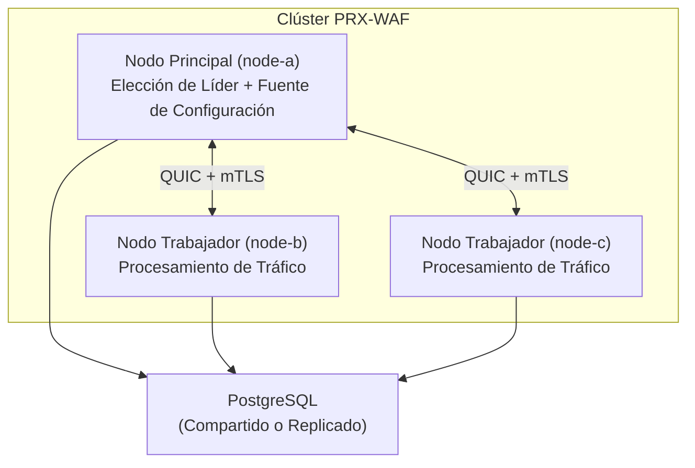

# Modo Clúster

PRX-WAF admite implementaciones de clúster multi-nodo para escalado horizontal y alta disponibilidad. El modo clúster usa comunicación entre nodos basada en QUIC, elección de líder inspirada en Raft y sincronización automática de reglas, configuración y eventos de seguridad en todos los nodos.

::: info
El modo clúster es completamente opcional. Por defecto, PRX-WAF se ejecuta en modo independiente sin sobrecarga de clúster. Habilítalo agregando una sección `[cluster]` a tu configuración.
:::

## Arquitectura

Un clúster de PRX-WAF consiste en un nodo **principal** y uno o más nodos **trabajadores**:



### Roles de los Nodos

| Rol | Descripción |
|-----|-------------|
| `main` | Mantiene la configuración y el conjunto de reglas autoritativo. Envía actualizaciones a los trabajadores. Participa en la elección de líder. |
| `worker` | Procesa el tráfico y aplica el pipeline WAF. Recibe actualizaciones de configuración y reglas del nodo principal. Envía eventos de seguridad al principal. |
| `auto` | Participa en la elección de líder inspirada en Raft. Cualquier nodo puede convertirse en el principal. |

## Qué Se Sincroniza

| Datos | Dirección | Intervalo |
|-------|-----------|-----------|
| Reglas | Principal a Trabajadores | Cada 10s (configurable) |
| Configuración | Principal a Trabajadores | Cada 30s (configurable) |
| Eventos de Seguridad | Trabajadores al Principal | Cada 5s o 100 eventos (lo que ocurra primero) |
| Estadísticas | Trabajadores al Principal | Cada 10s |

## Comunicación Entre Nodos

Toda la comunicación del clúster usa QUIC (vía Quinn) sobre UDP con TLS mutuo (mTLS):

- **Puerto:** `16851` (predeterminado)
- **Cifrado:** mTLS con certificados generados automáticamente o aprovisionados previamente
- **Protocolo:** Protocolo binario personalizado sobre flujos QUIC
- **Conexión:** Persistente con reconexión automática

## Elección de Líder

Cuando se configura `role = "auto"`, los nodos usan un protocolo de elección inspirado en Raft:

| Parámetro | Predeterminado | Descripción |
|-----------|----------------|-------------|
| `timeout_min_ms` | `150` | Tiempo de espera mínimo de elección (rango aleatorio) |
| `timeout_max_ms` | `300` | Tiempo de espera máximo de elección (rango aleatorio) |
| `heartbeat_interval_ms` | `50` | Intervalo de latido del principal a los trabajadores |
| `phi_suspect` | `8.0` | Umbral de sospecha del detector de fallos phi accrual |
| `phi_dead` | `12.0` | Umbral de muerte del detector de fallos phi accrual |

Cuando el nodo principal se vuelve inaccesible, los trabajadores esperan un tiempo de espera aleatorio dentro del rango configurado antes de iniciar una elección. El primer nodo en recibir una mayoría de votos se convierte en el nuevo principal.

## Monitoreo de Salud

El verificador de salud del clúster se ejecuta en cada nodo y monitorea la conectividad entre pares:

```toml
[cluster.health]
check_interval_secs   = 5    # Health check frequency
max_missed_heartbeats = 3    # Mark peer as unhealthy after N misses
```

Los nodos no saludables son excluidos del clúster hasta que se recuperan y vuelven a sincronizarse.

## Gestión de Certificados

Los nodos del clúster se autentican entre sí usando certificados mTLS:

- **Modo de generación automática:** El nodo principal genera un certificado CA y firma los certificados de los nodos automáticamente en el primer inicio. Los nodos trabajadores reciben sus certificados durante el proceso de unión.
- **Modo aprovisionado previamente:** Los certificados se generan sin conexión y se distribuyen a cada nodo antes del inicio.

```toml
[cluster.crypto]
ca_cert        = "/certs/cluster-ca.pem"
node_cert      = "/certs/node-a.pem"
node_key       = "/certs/node-a.key"
auto_generate  = true
ca_validity_days    = 3650   # 10 years
node_validity_days  = 365    # 1 year
renewal_before_days = 7      # Auto-renew 7 days before expiry
```

## Próximos Pasos

- [Implementación del Clúster](./deployment) -- Guía paso a paso de configuración multi-nodo
- [Referencia de Configuración](../configuration/reference) -- Todas las claves de configuración del clúster
- [Resolución de Problemas](../troubleshooting/) -- Problemas comunes del clúster
