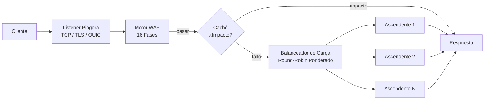

# Gateway

PRX-WAF está construido sobre [Pingora](https://github.com/cloudflare/pingora), la biblioteca HTTP proxy de Cloudflare en Rust. El gateway gestiona todo el tráfico entrante, enruta las solicitudes a los backends ascendentes y aplica el pipeline de detección WAF antes de reenviar.

## Soporte de Protocolos

| Protocolo | Estado | Notas |
|-----------|--------|-------|
| HTTP/1.1 | Compatible | Predeterminado |
| HTTP/2 | Compatible | Actualización automática vía ALPN |
| HTTP/3 (QUIC) | Opcional | Vía biblioteca Quinn, requiere config `[http3]` |
| WebSocket | Compatible | Proxy full duplex |

## Características Principales

### Balanceo de Carga

PRX-WAF distribuye el tráfico entre los backends ascendentes usando balanceo de carga round-robin ponderado. Cada entrada de host puede especificar múltiples servidores ascendentes con pesos relativos:

```toml
[[hosts]]
host        = "example.com"
port        = 80
remote_host = "10.0.0.1"
remote_port = 8080
guard_status = true
```

Los hosts también pueden gestionarse vía la interfaz de administración o la API REST en `/api/hosts`.

### Caché de Respuestas

El gateway incluye una caché LRU en memoria basada en moka para reducir la carga en los servidores ascendentes:

```toml
[cache]
enabled          = true
max_size_mb      = 256       # Maximum cache size
default_ttl_secs = 60        # Default TTL for cached responses
max_ttl_secs     = 3600      # Maximum TTL cap
```

La caché respeta los encabezados HTTP de caché estándar (`Cache-Control`, `Expires`, `ETag`, `Last-Modified`) y admite la invalidación de caché vía la API de administración.

### Túneles Inversos

PRX-WAF puede crear túneles inversos basados en WebSocket (similar a Cloudflare Tunnels) para exponer servicios internos sin abrir puertos de entrada en el firewall:

```bash
# List active tunnels
curl -H "Authorization: Bearer $TOKEN" http://localhost:9527/api/tunnels

# Create a tunnel
curl -X POST -H "Authorization: Bearer $TOKEN" \
  -H "Content-Type: application/json" \
  -d '{"name":"internal-api","target":"http://192.168.1.10:3000"}' \
  http://localhost:9527/api/tunnels
```

### Anti-Hotlinking

El gateway admite protección contra hotlinking basada en Referer por host. Cuando está habilitado, las solicitudes sin un encabezado Referer válido del dominio configurado son bloqueadas. Esto se configura por host en la interfaz de administración o vía la API.

## Arquitectura



## Próximos Pasos

- [Proxy Inverso](./reverse-proxy) -- Configuración detallada del enrutamiento de backend y balanceo de carga
- [SSL/TLS](./ssl-tls) -- HTTPS, Let's Encrypt y configuración de HTTP/3
- [Referencia de Configuración](../configuration/reference) -- Todas las claves de configuración del gateway
