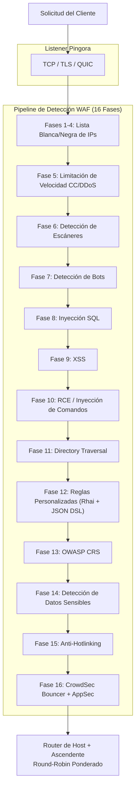

# PRX-WAF

**PRX-WAF** es un Firewall de Aplicaciones Web listo para producción construido sobre [Pingora](https://github.com/cloudflare/pingora) (la biblioteca HTTP proxy de Cloudflare en Rust). Combina un pipeline de detección de ataques de 16 fases, un motor de scripting Rhai, soporte para OWASP CRS, importación de reglas ModSecurity, integración con CrowdSec, plugins WASM y una interfaz de administración Vue 3 en un único binario desplegable.

PRX-WAF está diseñado para ingenieros DevOps, equipos de seguridad y operadores de plataformas que necesitan un WAF rápido, transparente y extensible -- uno que pueda gestionar millones de solicitudes, detectar ataques del OWASP Top 10, renovar automáticamente certificados TLS, escalar horizontalmente con modo clúster e integrarse con fuentes externas de inteligencia de amenazas -- todo sin depender de servicios WAF propietarios en la nube.

## ¿Por Qué PRX-WAF?

Los productos WAF tradicionales son propietarios, costosos y difíciles de personalizar. PRX-WAF adopta un enfoque diferente:

- **Abierto y auditable.** Cada regla de detección, umbral y mecanismo de puntuación es visible en el código fuente. Sin recopilación oculta de datos, sin dependencia de proveedores.
- **Defensa multi-fase.** 16 fases de detección secuenciales garantizan que si una verificación falla en detectar un ataque, las fases posteriores lo capturan.
- **Rendimiento Rust-first.** Construido sobre Pingora, PRX-WAF logra un rendimiento casi al nivel del hardware con una sobrecarga de latencia mínima en hardware estándar.
- **Extensible por diseño.** Las reglas YAML, scripts Rhai, plugins WASM y la importación de reglas ModSecurity hacen que PRX-WAF sea fácil de adaptar a cualquier pila de aplicaciones.

## Características Principales

<div class="vp-features">

- **Proxy Inverso Pingora** -- HTTP/1.1, HTTP/2 y HTTP/3 vía QUIC (Quinn). Balanceo de carga round-robin ponderado entre backends ascendentes.

- **Pipeline de Detección de 16 Fases** -- Lista blanca/negra de IPs, limitación de velocidad CC/DDoS, detección de escáneres, detección de bots, SQLi, XSS, RCE, directory traversal, reglas personalizadas, OWASP CRS, detección de datos sensibles, anti-hotlinking e integración con CrowdSec.

- **Motor de Reglas YAML** -- Reglas YAML declarativas con 11 operadores, 12 campos de solicitud, niveles de paranoia 1-4 y recarga en caliente sin tiempo de inactividad.

- **Soporte para OWASP CRS** -- Más de 310 reglas convertidas del OWASP ModSecurity Core Rule Set v4, cubriendo SQLi, XSS, RCE, LFI, RFI, detección de escáneres y más.

- **Integración con CrowdSec** -- Modo bouncer (caché de decisiones de LAPI), modo AppSec (inspección HTTP remota) y pusher de registros para inteligencia de amenazas comunitaria.

- **Modo Clúster** -- Comunicación entre nodos basada en QUIC, elección de líder inspirada en Raft, sincronización automática de reglas/config/eventos y gestión de certificados mTLS.

- **Interfaz de Administración Vue 3** -- Autenticación JWT + TOTP, monitoreo en tiempo real por WebSocket, gestión de hosts, gestión de reglas y paneles de eventos de seguridad.

- **Automatización SSL/TLS** -- Let's Encrypt vía ACME v2 (instant-acme), renovación automática de certificados y soporte HTTP/3 QUIC.

</div>

## Arquitectura

PRX-WAF está organizado como un espacio de trabajo Cargo de 7 crates:

| Crate | Rol |
|-------|-----|
| `prx-waf` | Binario: punto de entrada CLI, bootstrap del servidor |
| `gateway` | Proxy Pingora, HTTP/3, automatización SSL, caché, túneles |
| `waf-engine` | Pipeline de detección, motor de reglas, verificaciones, plugins, CrowdSec |
| `waf-storage` | Capa PostgreSQL (sqlx), migraciones, modelos |
| `waf-api` | API REST Axum, autenticación JWT/TOTP, WebSocket, UI estática |
| `waf-common` | Tipos compartidos: RequestCtx, WafDecision, HostConfig, config |
| `waf-cluster` | Consenso de clúster, transporte QUIC, sincronización de reglas, gestión de certificados |

### Flujo de Solicitudes



## Instalación Rápida

```bash
git clone https://github.com/openprx/prx-waf
cd prx-waf
docker compose up -d
```

Interfaz de administración: `http://localhost:9527` (credenciales predeterminadas: `admin` / `admin`)

Consulta la [Guía de Instalación](./getting-started/installation) para todos los métodos, incluyendo instalación con Cargo y compilación desde el código fuente.

## Secciones de la Documentación

| Sección | Descripción |
|---------|-------------|
| [Instalación](./getting-started/installation) | Instalar PRX-WAF vía Docker, Cargo o compilación desde el código fuente |
| [Inicio Rápido](./getting-started/quickstart) | Protege tu aplicación con PRX-WAF en 5 minutos |
| [Motor de Reglas](./rules/) | Cómo funciona el motor de reglas YAML |
| [Sintaxis YAML](./rules/yaml-syntax) | Referencia completa del esquema de reglas YAML |
| [Reglas Integradas](./rules/builtin-rules) | OWASP CRS, ModSecurity, parches CVE |
| [Reglas Personalizadas](./rules/custom-rules) | Escribe tus propias reglas de detección |
| [Gateway](./gateway/) | Descripción general del proxy inverso Pingora |
| [Proxy Inverso](./gateway/reverse-proxy) | Enrutamiento de backend y balanceo de carga |
| [SSL/TLS](./gateway/ssl-tls) | HTTPS, Let's Encrypt, HTTP/3 |
| [Modo Clúster](./cluster/) | Descripción general de la implementación multi-nodo |
| [Implementación del Clúster](./cluster/deployment) | Configuración del clúster paso a paso |
| [Interfaz de Administración](./admin-ui/) | Panel de gestión Vue 3 |
| [Configuración](./configuration/) | Descripción general de la configuración |
| [Referencia de Configuración](./configuration/reference) | Cada clave TOML documentada |
| [Referencia de CLI](./cli/) | Todos los comandos y subcomandos CLI |
| [Resolución de Problemas](./troubleshooting/) | Problemas comunes y soluciones |

## Información del Proyecto

- **Licencia:** MIT OR Apache-2.0
- **Lenguaje:** Rust (edición 2024)
- **Repositorio:** [github.com/openprx/prx-waf](https://github.com/openprx/prx-waf)
- **Rust Mínimo:** 1.82.0
- **Interfaz de Administración:** Vue 3 + Tailwind CSS
- **Base de Datos:** PostgreSQL 16+
