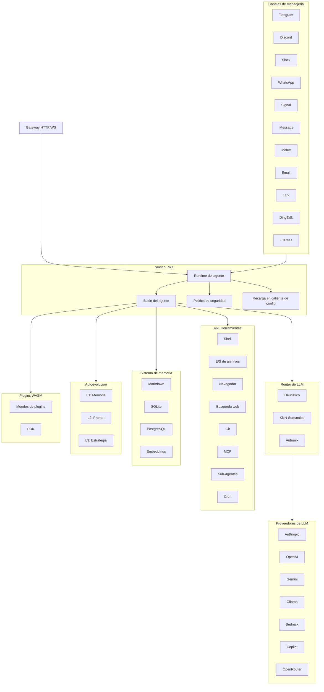

# PRX

**PRX** es un runtime de agente de IA de alto rendimiento y autoevolutivo, escrito en Rust. Conecta modelos de lenguaje de gran escala a 19 plataformas de mensajeria, proporciona mas de 46 herramientas integradas, soporta extensiones mediante plugins WASM y mejora autonomamente su propio comportamiento a traves de un sistema de autoevolucion de 3 capas.

PRX esta disenado para desarrolladores y equipos que necesitan un agente unico y unificado que funcione en todas las plataformas de mensajeria que utilizan -- desde Telegram y Discord hasta Slack, WhatsApp, Signal, iMessage, DingTalk, Lark y mas -- manteniendo seguridad, observabilidad y fiabilidad de nivel productivo.

## Por que PRX?

La mayoria de los frameworks de agentes de IA se centran en un unico punto de integracion o requieren extenso codigo de pegamento para conectar diferentes servicios. PRX adopta un enfoque diferente:

- **Un binario, todos los canales.** Un unico binario `prx` se conecta a las 19 plataformas de mensajeria simultaneamente. Sin bots separados, sin proliferacion de microservicios.
- **Autoevolutivo.** PRX refina autonomamente su memoria, prompts y estrategias basandose en la retroalimentacion de las interacciones -- con rollback de seguridad en cada capa.
- **Rendimiento Rust-first.** 177K lineas de Rust ofrecen baja latencia, minima huella de memoria y cero pausas de GC. El demonio funciona comodamente en una Raspberry Pi.
- **Extensible por diseno.** Plugins WASM, integracion de herramientas MCP y una arquitectura basada en traits hacen que PRX sea facil de extender sin necesidad de hacer fork.

## Caracteristicas principales

<div class="vp-features">

- **19 canales de mensajeria** -- Telegram, Discord, Slack, WhatsApp, Signal, iMessage, Matrix, Email, Lark, DingTalk, QQ, IRC, Mattermost, Nextcloud Talk, LINQ, CLI y mas.

- **9 proveedores de LLM** -- Anthropic Claude, OpenAI, Google Gemini, GitHub Copilot, Ollama, AWS Bedrock, GLM (Zhipu), OpenAI Codex, OpenRouter, ademas de cualquier endpoint compatible con OpenAI.

- **46+ herramientas integradas** -- Ejecucion de shell, E/S de archivos, automatizacion de navegador, busqueda web, peticiones HTTP, operaciones git, gestion de memoria, programacion cron, integracion MCP, sub-agentes y mas.

- **Autoevolucion de 3 capas** -- Evolucion L1 de memoria, evolucion L2 de prompts, evolucion L3 de estrategia -- cada una con limites de seguridad y rollback automatico.

- **Sistema de plugins WASM** -- Extiende PRX con componentes WebAssembly a traves de 6 mundos de plugins: tool, middleware, hook, cron, provider y storage. PDK completo con 47 funciones de host.

- **Router de LLM** -- Seleccion inteligente de modelos mediante puntuacion heuristica (capacidad, Elo, costo, latencia), enrutamiento semantico KNN y escalamiento basado en confianza Automix.

- **Seguridad productiva** -- Control de autonomia de 4 niveles, motor de politicas, aislamiento sandbox (Docker/Firejail/Bubblewrap/Landlock), almacen de secretos ChaCha20, autenticacion por emparejamiento.

- **Observabilidad** -- Trazado OpenTelemetry, metricas Prometheus, logging estructurado y una consola web integrada.

</div>

## Arquitectura



## Instalacion rapida

```bash
curl -fsSL https://openprx.dev/install.sh | bash
```

O instalar mediante Cargo:

```bash
cargo install openprx
```

Luego ejecuta el asistente de configuracion inicial:

```bash
prx onboard
```

Consulta la [Guia de instalacion](./getting-started/installation) para todos los metodos, incluyendo Docker y compilacion desde el codigo fuente.

## Secciones de la documentacion

| Seccion | Descripcion |
|---------|-------------|
| [Instalacion](./getting-started/installation) | Instalar PRX en Linux, macOS o Windows WSL2 |
| [Inicio rapido](./getting-started/quickstart) | Poner PRX en funcionamiento en 5 minutos |
| [Asistente de configuracion inicial](./getting-started/onboarding) | Configurar tu proveedor de LLM y ajustes iniciales |
| [Canales](./channels/) | Conectar con Telegram, Discord, Slack y 16 plataformas mas |
| [Proveedores](./providers/) | Configurar Anthropic, OpenAI, Gemini, Ollama y mas |
| [Herramientas](./tools/) | 46+ herramientas integradas para shell, navegador, git, memoria y mas |
| [Autoevolucion](./self-evolution/) | Sistema de mejora autonoma L1/L2/L3 |
| [Plugins (WASM)](./plugins/) | Extender PRX con componentes WebAssembly |
| [Configuracion](./config/) | Referencia completa de configuracion y recarga en caliente |
| [Seguridad](./security/) | Motor de politicas, sandbox, secretos, modelo de amenazas |
| [Referencia CLI](./cli/) | Referencia completa de comandos del binario `prx` |

## Informacion del proyecto

- **Licencia:** MIT OR Apache-2.0
- **Lenguaje:** Rust (edicion 2024)
- **Repositorio:** [github.com/openprx/prx](https://github.com/openprx/prx)
- **Rust minimo:** 1.92.0
