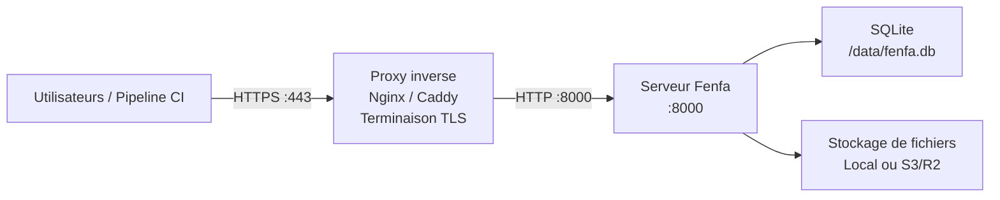

# Déploiement en production

Ce guide couvre tout ce qui est nécessaire pour exécuter Fenfa dans un environnement de production : proxy inverse avec TLS, configuration de jetons sécurisés, stratégie de sauvegarde et surveillance.

## Architecture



## Configuration du proxy inverse

### Caddy (Recommandé)

Caddy obtient et renouvelle automatiquement les certificats TLS depuis Let's Encrypt :

```
dist.example.com {
    reverse_proxy localhost:8000
}
```

C'est tout. Caddy gère HTTPS, HTTP/2 et la gestion des certificats automatiquement.

### Nginx

```nginx
server {
    listen 443 ssl http2;
    server_name dist.example.com;

    ssl_certificate /etc/letsencrypt/live/dist.example.com/fullchain.pem;
    ssl_certificate_key /etc/letsencrypt/live/dist.example.com/privkey.pem;

    client_max_body_size 2G;

    location / {
        proxy_pass http://127.0.0.1:8000;
        proxy_set_header Host $host;
        proxy_set_header X-Real-IP $remote_addr;
        proxy_set_header X-Forwarded-For $proxy_add_x_forwarded_for;
        proxy_set_header X-Forwarded-Proto $scheme;

        # Téléversements de gros fichiers
        proxy_request_buffering off;
        proxy_read_timeout 600s;
    }
}

server {
    listen 80;
    server_name dist.example.com;
    return 301 https://$host$request_uri;
}
```

::: warning client_max_body_size
Définissez `client_max_body_size` suffisamment grand pour vos plus gros builds. Les fichiers IPA et APK peuvent peser des centaines de mégaoctets. L'exemple ci-dessus autorise jusqu'à 2 Go.
:::

### Obtenir un certificat TLS

Avec Certbot et Nginx :

```bash
sudo certbot --nginx -d dist.example.com
```

Avec Certbot en mode autonome :

```bash
sudo certbot certonly --standalone -d dist.example.com
```

## Liste de contrôle de sécurité

### 1. Changer les jetons par défaut

Générez des jetons aléatoires sécurisés :

```bash
# Générer un jeton aléatoire de 32 caractères
openssl rand -hex 16
```

Définissez-les via des variables d'environnement ou la configuration :

```bash
FENFA_ADMIN_TOKEN=$(openssl rand -hex 16)
FENFA_UPLOAD_TOKEN=$(openssl rand -hex 16)
```

### 2. Lier à localhost

N'exposez Fenfa que via le proxy inverse :

```yaml
ports:
  - "127.0.0.1:8000:8000"  # Pas 0.0.0.0:8000
```

### 3. Définir le domaine principal

Configurez le domaine public correct pour les manifestes iOS et les callbacks :

```bash
FENFA_PRIMARY_DOMAIN=https://dist.example.com
```

::: danger Manifestes iOS
Si `primary_domain` est incorrect, l'installation iOS OTA échouera. Le manifeste plist contient des URLs de téléchargement qu'iOS utilise pour récupérer le fichier IPA. Ces URLs doivent être accessibles depuis l'appareil de l'utilisateur.
:::

### 4. Jetons de téléversement séparés

Émettez différents jetons de téléversement pour différents pipelines CI/CD ou membres d'équipe :

```json
{
  "auth": {
    "upload_tokens": [
      "token-for-ios-pipeline",
      "token-for-android-pipeline",
      "token-for-desktop-pipeline"
    ],
    "admin_tokens": [
      "admin-token-for-ops-team"
    ]
  }
}
```

Cela permet de révoquer des jetons individuels sans perturber les autres pipelines.

## Stratégie de sauvegarde

### Quoi sauvegarder

| Composant | Chemin | Taille | Fréquence |
|-----------|--------|--------|-----------|
| Base de données SQLite | `/data/fenfa.db` | Petite (< 100 Mo typiquement) | Quotidienne |
| Fichiers téléversés | `/app/uploads/` | Peut être grande | Après chaque téléversement (ou utiliser S3) |
| Fichier de configuration | `config.json` | Minuscule | À chaque modification |

### Sauvegarde SQLite

```bash
# Copier le fichier de base de données (sûr pendant que Fenfa fonctionne -- SQLite utilise le mode WAL)
cp /data/fenfa.db /backups/fenfa-$(date +%Y%m%d).db
```

### Script de sauvegarde automatisé

```bash
#!/bin/bash
BACKUP_DIR="/backups/fenfa"
DATE=$(date +%Y%m%d-%H%M)

mkdir -p "$BACKUP_DIR"

# Base de données
cp /path/to/data/fenfa.db "$BACKUP_DIR/fenfa-$DATE.db"

# Téléversements (si stockage local)
tar czf "$BACKUP_DIR/uploads-$DATE.tar.gz" /path/to/uploads/

# Nettoyage des anciennes sauvegardes (garder 30 jours)
find "$BACKUP_DIR" -name "*.db" -mtime +30 -delete
find "$BACKUP_DIR" -name "*.tar.gz" -mtime +30 -delete
```

::: tip Stockage S3
Si vous utilisez le stockage compatible S3 (R2, AWS S3, MinIO), les fichiers téléversés sont déjà sur un backend de stockage redondant. Vous n'avez besoin de sauvegarder que la base de données SQLite.
:::

## Surveillance

### Vérification de santé

Surveillez l'endpoint `/healthz` :

```bash
curl -sf http://localhost:8000/healthz || echo "Fenfa is down"
```

### Avec la surveillance de disponibilité

Pointez votre service de surveillance de disponibilité (UptimeRobot, Hetrix, etc.) sur :

```
https://dist.example.com/healthz
```

Réponse attendue : `{"ok": true}` avec HTTP 200.

### Surveillance des journaux

Fenfa enregistre sur stdout. Utilisez le pilote de journal de votre runtime de conteneur pour transférer les journaux vers votre système d'agrégation :

```yaml
services:
  fenfa:
    logging:
      driver: "json-file"
      options:
        max-size: "10m"
        max-file: "3"
```

## Docker Compose de production complet

```yaml
version: "3.8"

services:
  fenfa:
    image: fenfa/fenfa:latest
    container_name: fenfa
    restart: unless-stopped
    ports:
      - "127.0.0.1:8000:8000"
    environment:
      FENFA_ADMIN_TOKEN: ${FENFA_ADMIN_TOKEN}
      FENFA_UPLOAD_TOKEN: ${FENFA_UPLOAD_TOKEN}
      FENFA_PRIMARY_DOMAIN: https://dist.example.com
    volumes:
      - fenfa-data:/data
      - fenfa-uploads:/app/uploads
    healthcheck:
      test: ["CMD", "wget", "-q", "--spider", "http://localhost:8000/healthz"]
      interval: 30s
      timeout: 5s
      retries: 3
      start_period: 10s
    logging:
      driver: "json-file"
      options:
        max-size: "10m"
        max-file: "3"
    deploy:
      resources:
        limits:
          memory: 512M

volumes:
  fenfa-data:
  fenfa-uploads:
```

## Étapes suivantes

- [Déploiement Docker](./docker) -- Bases Docker et configuration
- [Référence de configuration](../configuration/) -- Tous les paramètres
- [Dépannage](../troubleshooting/) -- Problèmes courants en production
