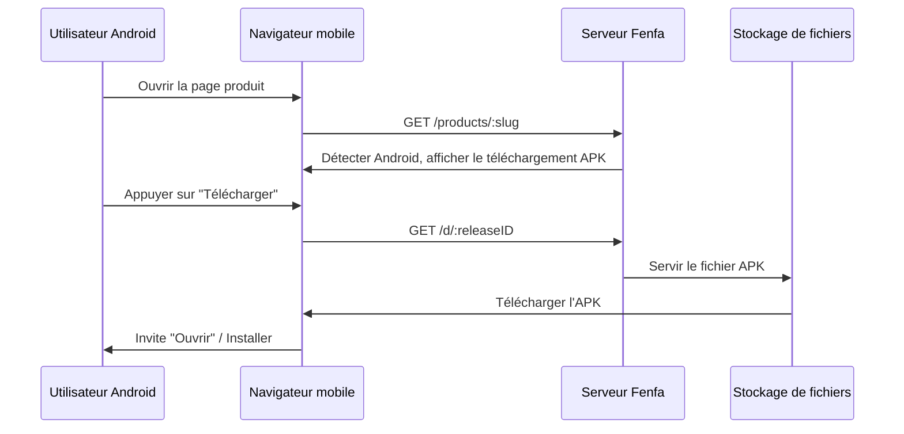

# Distribution Android

La distribution Android dans Fenfa est simple : téléversez un fichier APK, et les utilisateurs le téléchargent directement depuis la page produit. Fenfa détecte automatiquement les appareils Android et affiche le bouton de téléchargement approprié.

## Comment ça fonctionne



Contrairement à iOS, Android ne nécessite pas de protocole spécial pour l'installation. Le fichier APK est téléchargé directement via HTTP(S), et l'utilisateur l'installe en utilisant le gestionnaire de packages système.

## Configurer une variante Android

Créez une variante Android pour votre produit :

```bash
curl -X POST http://localhost:8000/admin/api/products/prd_abc123/variants \
  -H "X-Auth-Token: YOUR_ADMIN_TOKEN" \
  -H "Content-Type: application/json" \
  -d '{
    "platform": "android",
    "display_name": "Android",
    "identifier": "com.example.myapp",
    "arch": "universal",
    "installer_type": "apk"
  }'
```

::: tip Variantes d'architecture
Si vous compilez des APK séparés par architecture, créez plusieurs variantes :
- `Android ARM64` (arch : `arm64-v8a`)
- `Android ARM` (arch : `armeabi-v7a`)
- `Android x86_64` (arch : `x86_64`)

Si vous distribuez un APK universel ou AAB, une seule variante avec l'architecture `universal` est suffisante.
:::

## Téléverser des fichiers APK

### Téléversement standard

```bash
curl -X POST http://localhost:8000/upload \
  -H "X-Auth-Token: YOUR_UPLOAD_TOKEN" \
  -F "variant_id=var_android" \
  -F "app_file=@app-release.apk" \
  -F "version=2.1.0" \
  -F "build=210" \
  -F "changelog=Added dark mode support"
```

### Téléversement intelligent

Le téléversement intelligent extrait automatiquement les métadonnées des fichiers APK :

```bash
curl -X POST http://localhost:8000/admin/api/smart-upload \
  -H "X-Auth-Token: YOUR_ADMIN_TOKEN" \
  -F "variant_id=var_android" \
  -F "app_file=@app-release.apk"
```

Les métadonnées extraites incluent :
- Nom de package (`com.example.myapp`)
- Nom de version (`2.1.0`)
- Code de version (`210`)
- Icône de l'application
- Version SDK minimum

## Installation par l'utilisateur

Quand un utilisateur visite la page produit sur un appareil Android :

1. La page détecte automatiquement la plateforme Android.
2. L'utilisateur appuie sur le bouton **Télécharger**.
3. Le navigateur télécharge le fichier APK.
4. Android invite l'utilisateur à installer l'APK.

::: warning Sources inconnues
Les utilisateurs doivent activer "Installer depuis des sources inconnues" (ou "Installer des applications inconnues" sur les versions Android plus récentes) dans les paramètres de leur appareil avant d'installer des APK depuis Fenfa. Il s'agit d'une exigence Android standard pour les applications en sideloading.
:::

## Lien de téléchargement direct

Chaque version a une URL de téléchargement direct qui fonctionne avec n'importe quel client HTTP :

```bash
# Télécharger via curl
curl -LO http://localhost:8000/d/rel_xxx

# Télécharger via wget
wget http://localhost:8000/d/rel_xxx
```

Cette URL prend en charge les requêtes HTTP Range pour les téléchargements reprenables sur des connexions lentes.

## Étapes suivantes

- [Distribution bureau](./desktop) -- Distribution macOS, Windows et Linux
- [Gestion des versions](../products/releases) -- Versionner et gérer vos versions APK
- [API de téléversement](../api/upload) -- Automatiser les téléversements APK depuis CI/CD
