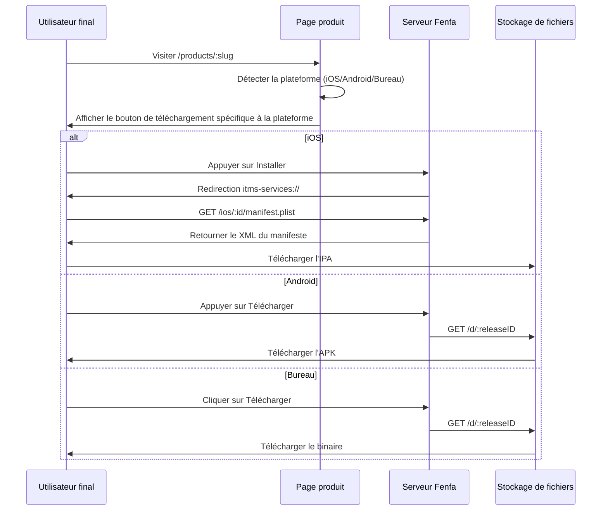

# Aperçu de distribution

Fenfa fournit une expérience de distribution unifiée pour toutes les plateformes. Chaque produit obtient une page de téléchargement publique qui détecte automatiquement la plateforme du visiteur et affiche le bouton de téléchargement approprié.

## Comment fonctionne la distribution



## Page de téléchargement du produit

Chaque produit publié a une page publique à `/products/:slug`. La page comprend :

- **Icône et nom de l'application** depuis la configuration du produit
- **Détection de plateforme** -- La page utilise le User-Agent du navigateur pour afficher le bon bouton de téléchargement en premier
- **Code QR** -- Généré automatiquement pour une numérisation mobile facile
- **Historique des versions** -- Toutes les versions pour la variante sélectionnée, les plus récentes en premier
- **Journaux des modifications** -- Notes par version affichées inline
- **Variantes multiples** -- Si un produit a des variantes pour plusieurs plateformes, les utilisateurs peuvent basculer entre elles

## Distribution spécifique à la plateforme

| Plateforme | Méthode | Détails |
|------------|---------|---------|
| iOS | OTA via `itms-services://` | Manifeste plist + téléchargement IPA direct. Nécessite HTTPS. |
| Android | Téléchargement direct d'APK | Le navigateur télécharge l'APK. L'utilisateur active "Installer depuis des sources inconnues". |
| macOS | Téléchargement direct | Fichiers DMG, PKG ou ZIP téléchargés via le navigateur. |
| Windows | Téléchargement direct | Fichiers EXE, MSI ou ZIP téléchargés via le navigateur. |
| Linux | Téléchargement direct | Fichiers DEB, RPM, AppImage ou tar.gz téléchargés via le navigateur. |

## Liens de téléchargement direct

Chaque version a une URL de téléchargement direct :

```
https://your-domain.com/d/:releaseID
```

Cette URL :
- Retourne le fichier binaire avec les en-têtes `Content-Type` et `Content-Disposition` corrects
- Prend en charge les requêtes HTTP Range pour les téléchargements reprenables
- Incrémente le compteur de téléchargements
- Fonctionne avec n'importe quel client HTTP (curl, wget, navigateurs)

## Suivi d'événements

Fenfa suit trois types d'événements :

| Événement | Déclencheur | Données suivies |
|-----------|-------------|-----------------|
| `visit` | L'utilisateur ouvre la page du produit | IP, User-Agent, variante |
| `click` | L'utilisateur clique sur un bouton de téléchargement | IP, User-Agent, ID de version |
| `download` | Le fichier est réellement téléchargé | IP, User-Agent, ID de version |

Les événements peuvent être consultés dans le panneau d'administration ou exportés en CSV :

```bash
curl -o events.csv http://localhost:8000/admin/exports/events.csv \
  -H "X-Auth-Token: YOUR_ADMIN_TOKEN"
```

## Exigence HTTPS

::: warning iOS nécessite HTTPS
L'installation iOS OTA via `itms-services://` nécessite que le serveur utilise HTTPS avec un certificat TLS valide. Pour les tests locaux, vous pouvez utiliser des outils comme `ngrok` ou `mkcert`. Pour la production, utilisez un proxy inverse avec Let's Encrypt. Voir [Déploiement en production](../deployment/production).
:::

## Guides par plateforme

- [Distribution iOS](./ios) -- Installation OTA, génération de manifeste, liaison UDID des appareils
- [Distribution Android](./android) -- Distribution et installation d'APK
- [Distribution bureau](./desktop) -- Distribution macOS, Windows et Linux
