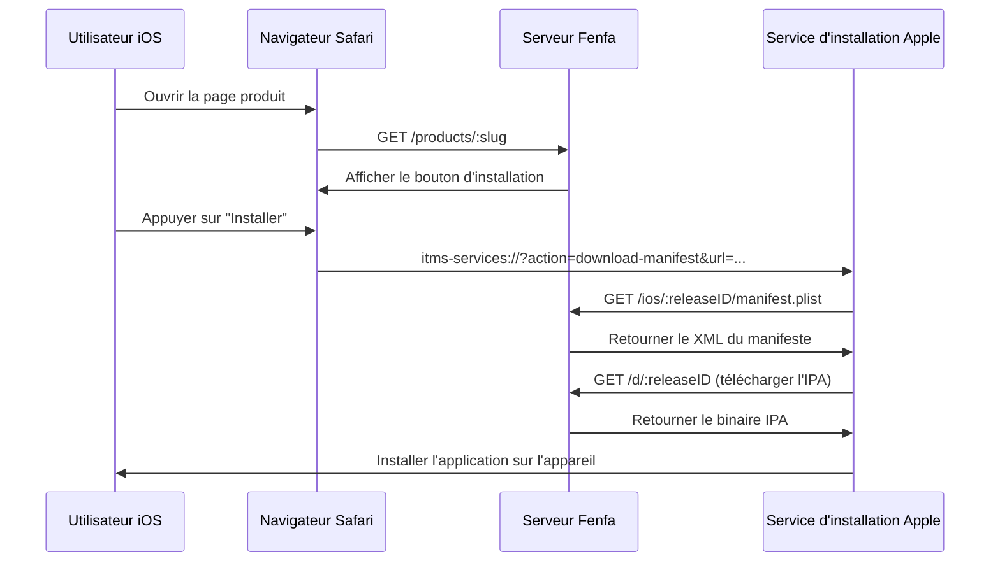
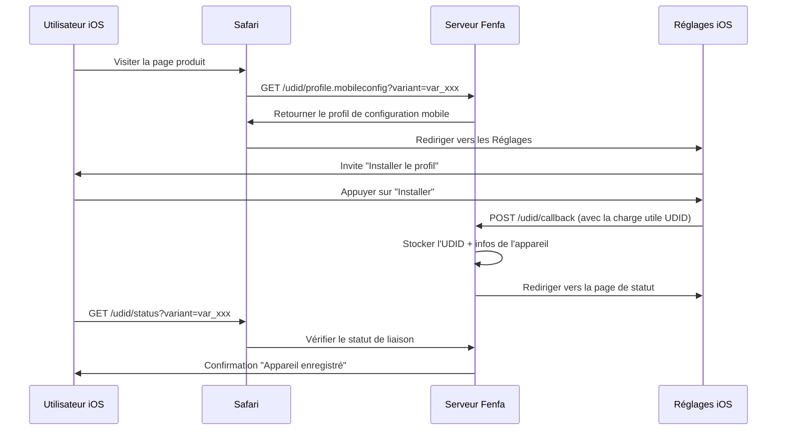

# Distribution iOS

Fenfa fournit un support complet pour la distribution iOS OTA (Over-The-Air), incluant la génération de manifestes `itms-services://`, la liaison UDID des appareils pour le provisionnement ad-hoc, et une intégration optionnelle avec l'API Apple Developer pour l'enregistrement automatique des appareils.

## Comment fonctionne iOS OTA



iOS utilise le protocole `itms-services://` pour installer des applications directement depuis une page web. Quand un utilisateur appuie sur le bouton d'installation, Safari transfère au système d'installation, qui :

1. Récupère le manifeste plist depuis Fenfa
2. Télécharge le fichier IPA
3. Installe l'application sur l'appareil

::: warning HTTPS requis
L'installation iOS OTA nécessite HTTPS avec un certificat TLS valide. Les certificats auto-signés ne fonctionneront pas. Pour les tests locaux, utilisez `ngrok` pour créer un tunnel HTTPS temporaire.
:::

## Génération de manifeste

Fenfa génère automatiquement le fichier `manifest.plist` pour chaque version iOS. Le manifeste est servi à :

```
GET /ios/:releaseID/manifest.plist
```

Le manifeste contient :
- L'identifiant de bundle (depuis le champ identifiant de la variante)
- La version du bundle (depuis la version de la version)
- L'URL de téléchargement (pointant vers `/d/:releaseID`)
- Le titre de l'application

Le lien d'installation `itms-services://` est :

```
itms-services://?action=download-manifest&url=https://your-domain.com/ios/rel_xxx/manifest.plist
```

Ce lien est automatiquement inclus dans la réponse de l'API de téléversement et affiché sur la page produit.

## Liaison UDID des appareils

Pour la distribution ad-hoc, les appareils iOS doivent être enregistrés dans le profil de provisionnement de l'application. Fenfa fournit un flux de liaison UDID qui collecte les identifiants des appareils auprès des utilisateurs.

### Comment fonctionne la liaison UDID



### Endpoints UDID

| Endpoint | Méthode | Description |
|----------|---------|-------------|
| `/udid/profile.mobileconfig?variant=:variantID` | GET | Télécharger le profil de configuration mobile |
| `/udid/callback` | POST | Callback d'iOS après l'installation du profil (contient l'UDID) |
| `/udid/status?variant=:variantID` | GET | Vérifier si l'appareil actuel est lié |

### Sécurité

Le flux de liaison UDID utilise des nonces à usage unique pour prévenir les attaques par rejeu :
- Chaque téléchargement de profil génère un nonce unique
- Le nonce est intégré dans l'URL de callback
- Une fois utilisé, le nonce ne peut pas être réutilisé
- Les nonces expirent après un délai configurable

## Intégration de l'API Apple Developer

Fenfa peut enregistrer automatiquement des appareils avec votre compte Apple Developer, éliminant l'étape manuelle d'ajout d'UDIDs dans le portail Apple Developer.

### Configuration

1. Allez dans **Panneau d'administration > Paramètres > API Apple Developer**.
2. Entrez vos identifiants API App Store Connect :

| Champ | Description |
|-------|-------------|
| Key ID | ID de clé API (ex. "ABC123DEF4") |
| Issuer ID | ID émetteur (format UUID) |
| Private Key | Contenu de la clé privée au format PEM |
| Team ID | Votre ID d'équipe Apple Developer |

::: tip Créer des clés API
Dans le [Portail Apple Developer](https://developer.apple.com/account/resources/authkeys/list), créez une clé API avec la permission "Devices". Téléchargez le fichier `.p8` de clé privée -- il ne peut être téléchargé qu'une seule fois.
:::

### Enregistrer des appareils

Une fois configuré, vous pouvez enregistrer des appareils avec Apple depuis le panneau d'administration :

**Appareil unique :**

```bash
curl -X POST http://localhost:8000/admin/api/devices/DEVICE_ID/register-apple \
  -H "X-Auth-Token: YOUR_ADMIN_TOKEN"
```

**Enregistrement en lot :**

```bash
curl -X POST http://localhost:8000/admin/api/devices/register-apple \
  -H "X-Auth-Token: YOUR_ADMIN_TOKEN"
```

### Vérifier le statut de l'API Apple

```bash
curl http://localhost:8000/admin/api/apple/status \
  -H "X-Auth-Token: YOUR_ADMIN_TOKEN"
```

### Lister les appareils enregistrés chez Apple

```bash
curl http://localhost:8000/admin/api/apple/devices \
  -H "X-Auth-Token: YOUR_ADMIN_TOKEN"
```

## Flux de travail de distribution ad-hoc

Le flux complet pour la distribution iOS ad-hoc :

1. **L'utilisateur lie son appareil** -- Visite la page produit, installe le profil mobileconfig, l'UDID est capturé.
2. **L'administrateur enregistre l'appareil** -- Dans le panneau d'administration, enregistrez l'appareil avec Apple (ou utilisez l'enregistrement en lot).
3. **Le développeur re-signe l'IPA** -- Mettez à jour le profil de provisionnement pour inclure le nouvel appareil, re-signez l'IPA.
4. **Téléverser le nouveau build** -- Téléversez l'IPA re-signé vers Fenfa.
5. **L'utilisateur installe** -- L'utilisateur peut maintenant installer l'application via la page produit.

::: info Distribution Enterprise
Si vous avez un compte Apple Enterprise Developer, vous pouvez ignorer entièrement la liaison UDID. Les profils Enterprise permettent l'installation sur n'importe quel appareil. Configurez la variante en conséquence et téléversez des IPA signés en entreprise.
:::

## Gérer les appareils iOS

Affichez tous les appareils liés dans le panneau d'administration ou via l'API :

```bash
curl http://localhost:8000/admin/api/ios_devices \
  -H "X-Auth-Token: YOUR_ADMIN_TOKEN"
```

Exportez les appareils en CSV :

```bash
curl -o devices.csv http://localhost:8000/admin/exports/ios_devices.csv \
  -H "X-Auth-Token: YOUR_ADMIN_TOKEN"
```

## Étapes suivantes

- [Distribution Android](./android) -- Distribution d'APK Android
- [API de téléversement](../api/upload) -- Automatiser les téléversements iOS depuis CI/CD
- [Déploiement en production](../deployment/production) -- Configurer HTTPS pour iOS OTA
