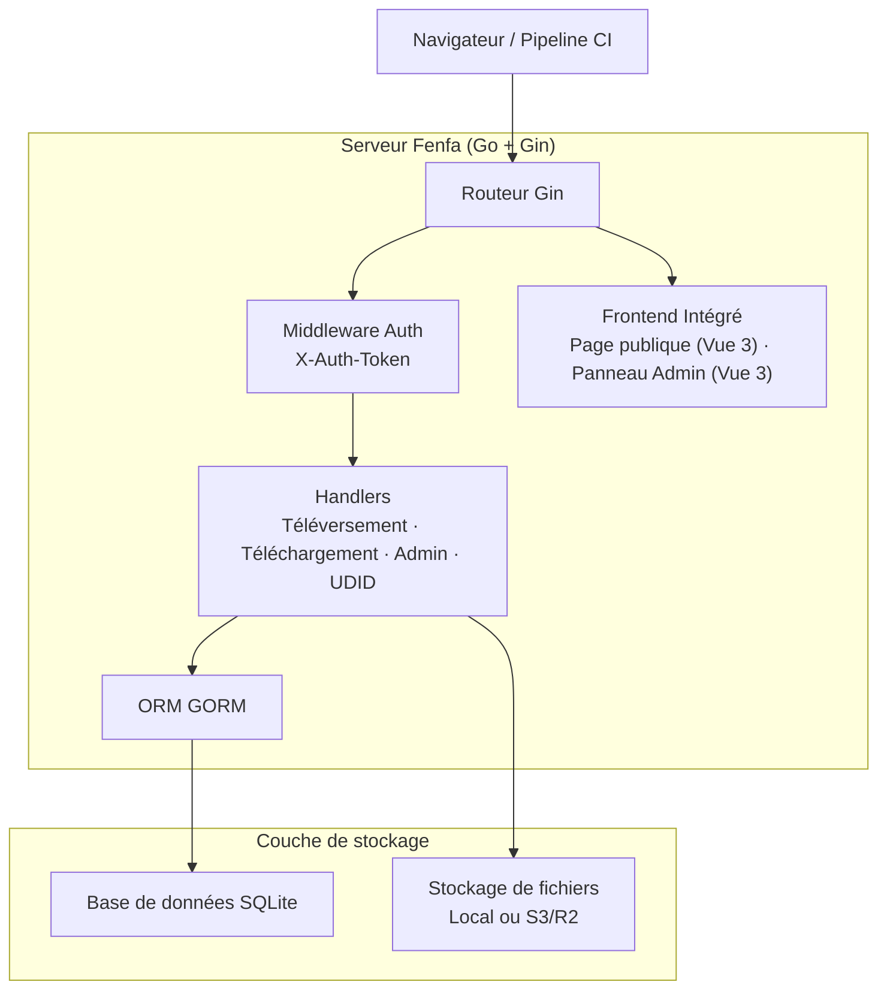
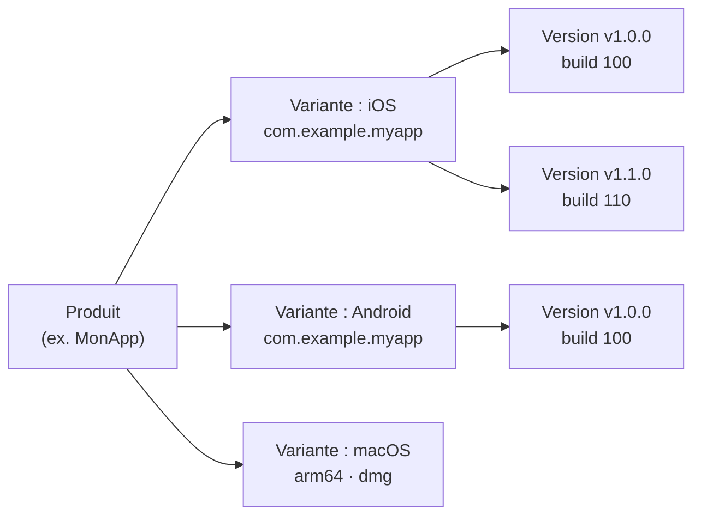

# Fenfa

**Fenfa** (分发, "distribuer" en chinois) est une plateforme de distribution d'applications auto-hébergée pour iOS, Android, macOS, Windows et Linux. Téléversez des builds, obtenez des pages d'installation avec codes QR, et gérez les versions via un panneau d'administration -- le tout depuis un seul binaire Go avec frontend intégré et stockage SQLite.

Fenfa est conçu pour les équipes de développement, les ingénieurs QA et les départements informatiques d'entreprise qui ont besoin d'un canal de distribution d'applications privé et contrôlable -- un canal qui gère l'installation iOS OTA, la distribution d'APK Android et la livraison d'applications bureau sans dépendre des boutiques d'applications publiques ou de services tiers.

## Pourquoi Fenfa ?

Les boutiques d'applications publiques imposent des délais de révision, des restrictions de contenu et des préoccupations de confidentialité. Les services de distribution tiers facturent des frais par téléchargement et contrôlent vos données. Fenfa vous donne le contrôle total :

- **Auto-hébergé.** Vos builds, votre serveur, vos données. Pas de dépendance fournisseur, pas de frais par téléchargement.
- **Multi-plateforme.** Une seule page produit dessert iOS, Android, macOS, Windows et Linux avec détection automatique de la plateforme.
- **Zéro dépendance.** Un seul binaire Go avec SQLite intégré. Pas de Redis, pas de PostgreSQL, pas de file de messages.
- **Distribution iOS OTA.** Prise en charge complète de la génération de manifestes `itms-services://`, de la liaison UDID des appareils et de l'intégration de l'API Apple Developer pour le provisionnement ad-hoc.

## Fonctionnalités clés

<div class="vp-features">

- **Téléversement intelligent** -- Détection automatique des métadonnées de l'application (bundle ID, version, icône) depuis les packages IPA et APK. Il suffit de téléverser le fichier et Fenfa s'occupe du reste.

- **Pages produit** -- Pages de téléchargement publiques avec codes QR, détection de plateforme et journaux de modifications par version. Partagez une seule URL pour toutes les plateformes.

- **Liaison UDID iOS** -- Flux d'enregistrement des appareils pour la distribution ad-hoc. Les utilisateurs lient leur UDID d'appareil via un profil de configuration mobile guidé, et les administrateurs peuvent enregistrer automatiquement les appareils via l'API Apple Developer.

- **Stockage S3/R2** -- Stockage d'objets compatible S3 optionnel (Cloudflare R2, AWS S3, MinIO) pour un hébergement de fichiers évolutif. Le stockage local fonctionne immédiatement.

- **Panneau d'administration** -- Panneau d'administration Vue 3 complet pour gérer les produits, variantes, versions, appareils et paramètres système. Prend en charge les interfaces en chinois et en anglais.

- **Authentification par jeton** -- Portées de jetons d'administration et de téléversement séparées. Les pipelines CI/CD utilisent des jetons de téléversement ; les administrateurs utilisent des jetons d'administration pour un contrôle total.

- **Suivi d'événements** -- Suivez les visites de page, les clics de téléchargement et les téléchargements de fichiers par version. Exportez les événements en CSV pour l'analyse.

</div>

## Architecture



## Modèle de données



- **Produit** : Une application logique avec un nom, un slug, une icône et une description. Une seule page produit dessert toutes les plateformes.
- **Variante** : Une cible de build spécifique à une plateforme (iOS, Android, macOS, Windows, Linux) avec son propre identifiant, architecture et type d'installateur.
- **Version** : Un build spécifique téléversé avec numéro de version, numéro de build, journal des modifications et fichier binaire.

## Installation rapide

```bash
docker run -d --name fenfa -p 8000:8000 fenfa/fenfa:latest
```

Visitez `http://localhost:8000/admin` et connectez-vous avec le jeton `dev-admin-token`.

Consultez le [Guide d'installation](./getting-started/installation) pour Docker Compose, les builds depuis les sources et la configuration en production.

## Sections de documentation

| Section | Description |
|---------|-------------|
| [Installation](./getting-started/installation) | Installer Fenfa avec Docker ou compiler depuis les sources |
| [Démarrage rapide](./getting-started/quickstart) | Faire fonctionner Fenfa et téléverser votre premier build en 5 minutes |
| [Gestion des produits](./products/) | Créer et gérer des produits multi-plateformes |
| [Variantes de plateforme](./products/variants) | Configurer les variantes iOS, Android et bureau |
| [Gestion des versions](./products/releases) | Téléverser, versionner et gérer les versions |
| [Aperçu de distribution](./distribution/) | Comment Fenfa distribue les applications aux utilisateurs finaux |
| [Distribution iOS](./distribution/ios) | Installation iOS OTA, génération de manifeste, liaison UDID |
| [Distribution Android](./distribution/android) | Distribution d'APK Android |
| [Distribution bureau](./distribution/desktop) | Distribution macOS, Windows et Linux |
| [Aperçu API](./api/) | Référence API REST |
| [API de téléversement](./api/upload) | Téléverser des builds via API ou CI/CD |
| [API d'administration](./api/admin) | Référence complète de l'API d'administration |
| [Configuration](./configuration/) | Toutes les options de configuration |
| [Déploiement Docker](./deployment/docker) | Déploiement Docker et Docker Compose |
| [Déploiement en production](./deployment/production) | Proxy inverse, TLS, sauvegardes et surveillance |
| [Dépannage](./troubleshooting/) | Problèmes courants et solutions |

## Informations sur le projet

- **Licence :** MIT
- **Langage :** Go 1.25+ (backend), Vue 3 + Vite (frontend)
- **Base de données :** SQLite (via GORM)
- **Dépôt :** [github.com/openprx/fenfa](https://github.com/openprx/fenfa)
- **Organisation :** [OpenPRX](https://github.com/openprx)
