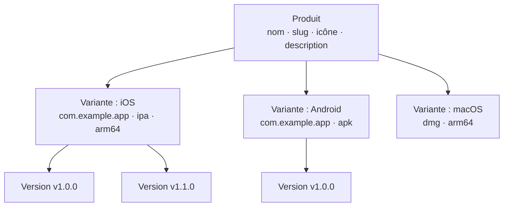

# Gestion des produits

Les produits sont l'unité organisationnelle de niveau supérieur dans Fenfa. Chaque produit représente une seule application et peut contenir plusieurs variantes de plateforme (iOS, Android, macOS, Windows, Linux). Un produit a sa propre page de téléchargement publique, son icône et son URL slug.

## Concepts



- **Produit** : L'application logique. A un slug unique qui devient l'URL de la page de téléchargement (`/products/:slug`).
- **Variante** : Une cible de build spécifique à une plateforme sous un produit. Voir [Variantes de plateforme](./variants).
- **Version** : Un build spécifique téléversé sous une variante. Voir [Gestion des versions](./releases).

## Créer un produit

### Via le panneau d'administration

1. Naviguez vers **Produits** dans la barre latérale.
2. Cliquez sur **Créer un produit**.
3. Remplissez les champs :

| Champ | Requis | Description |
|-------|--------|-------------|
| Nom | Oui | Nom d'affichage (ex. "MonApp") |
| Slug | Oui | Identifiant URL (ex. "monapp"). Doit être unique. |
| Description | Non | Brève description de l'application affichée sur la page de téléchargement |
| Icône | Non | Icône de l'application (téléversée en tant que fichier image) |

4. Cliquez sur **Enregistrer**.

### Via API

```bash
curl -X POST http://localhost:8000/admin/api/products \
  -H "X-Auth-Token: YOUR_ADMIN_TOKEN" \
  -H "Content-Type: application/json" \
  -d '{
    "name": "MyApp",
    "slug": "myapp",
    "description": "A cross-platform mobile app"
  }'
```

## Lister les produits

### Via le panneau d'administration

La page **Produits** dans le panneau d'administration affiche tous les produits avec leur nombre de variantes et le total des téléchargements.

### Via API

```bash
curl http://localhost:8000/admin/api/products \
  -H "X-Auth-Token: YOUR_ADMIN_TOKEN"
```

Réponse :

```json
{
  "ok": true,
  "data": [
    {
      "id": "prd_abc123",
      "name": "MyApp",
      "slug": "myapp",
      "description": "A cross-platform mobile app",
      "published": true,
      "created_at": "2025-01-15T10:30:00Z"
    }
  ]
}
```

## Mettre à jour un produit

```bash
curl -X PUT http://localhost:8000/admin/api/products/prd_abc123 \
  -H "X-Auth-Token: YOUR_ADMIN_TOKEN" \
  -H "Content-Type: application/json" \
  -d '{
    "name": "MyApp Pro",
    "description": "Updated description"
  }'
```

## Supprimer un produit

::: danger Suppression en cascade
La suppression d'un produit supprime définitivement toutes ses variantes, versions et fichiers téléversés.
:::

```bash
curl -X DELETE http://localhost:8000/admin/api/products/prd_abc123 \
  -H "X-Auth-Token: YOUR_ADMIN_TOKEN"
```

## Publier et dépublier

Les produits peuvent être publiés ou dépubliés. Les produits dépubliés retournent un 404 sur leur page de téléchargement publique.

```bash
# Dépublier
curl -X PUT http://localhost:8000/admin/api/apps/prd_abc123/unpublish \
  -H "X-Auth-Token: YOUR_ADMIN_TOKEN"

# Publier
curl -X PUT http://localhost:8000/admin/api/apps/prd_abc123/publish \
  -H "X-Auth-Token: YOUR_ADMIN_TOKEN"
```

## Page de téléchargement publique

Chaque produit publié a une page de téléchargement publique à :

```
https://your-domain.com/products/:slug
```

La page propose :
- Icône, nom et description de l'application
- Boutons de téléchargement spécifiques à la plateforme (détectés automatiquement selon l'appareil du visiteur)
- Code QR pour la numérisation mobile
- Historique des versions avec numéros de version et journaux des modifications
- Liens `itms-services://` iOS pour l'installation OTA

## Format d'ID

Les IDs de produit utilisent le préfixe `prd_` suivi d'une chaîne aléatoire (ex. `prd_abc123`). Les IDs sont générés automatiquement et ne peuvent pas être modifiés.

## Étapes suivantes

- [Variantes de plateforme](./variants) -- Ajouter des variantes iOS, Android et bureau à votre produit
- [Gestion des versions](./releases) -- Téléverser et gérer les builds
- [Aperçu de distribution](../distribution/) -- Comment les utilisateurs finaux installent vos applications
