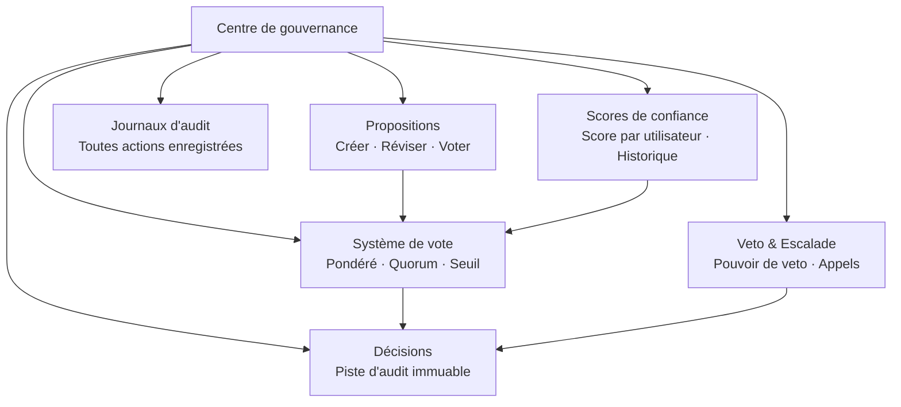

# Centre de gouvernance

Le centre de gouvernance est un module central d'OpenPR qui apporte une prise de décision transparente et structurée à la gestion de projet. Il fournit des propositions, le vote, les décisions, les scores de confiance, les mécanismes de veto et des pistes d'audit complètes.

## Pourquoi la gouvernance ?

Les outils de gestion de projet traditionnels se concentrent sur le suivi des tâches mais laissent la prise de décision non structurée. Le centre de gouvernance d'OpenPR garantit que :

- **Les décisions sont documentées.** Chaque proposition, vote et décision est enregistré avec des pistes d'audit complètes.
- **Les processus sont transparents.** Les seuils de vote, les règles de quorum et les scores de confiance sont visibles pour tous les membres.
- **Le pouvoir est distribué.** Les mécanismes de veto et les voies d'escalade empêchent les décisions unilatérales.
- **L'historique est préservé.** Les décisions créent un journal immuable de ce qui a été décidé, par qui et pourquoi.

## Modules de gouvernance

| Module | Description |
|--------|-------------|
| [Propositions](./proposals) | Créer, réviser et voter sur les propositions |
| [Vote & Décisions](./voting) | Vote pondéré avec règles de quorum et de seuil |
| [Scores de confiance](./trust-scores) | Score de réputation par utilisateur avec historique |
| Veto & Escalade | Pouvoir de veto avec vote d'escalade et appels |
| Domaines de décision | Catégoriser les décisions par domaine |
| Évaluations d'impact | Évaluer l'impact des propositions avec des métriques |
| Journaux d'audit | Enregistrement complet de toutes les actions de gouvernance |

## Schéma de base de données

Le module de gouvernance utilise 20 tables dédiées :

| Table | Objectif |
|-------|---------|
| `proposals` | Enregistrements de propositions |
| `proposal_templates` | Modèles de propositions réutilisables |
| `proposal_comments` | Discussions sur les propositions |
| `proposal_issue_links` | Lier les propositions aux problèmes associés |
| `votes` | Enregistrements de votes individuels |
| `decisions` | Enregistrements de décisions finalisées |
| `decision_domains` | Domaines de catégorisation des décisions |
| `decision_audit_reports` | Rapports d'audit sur les décisions |
| `governance_configs` | Paramètres de gouvernance de l'espace de travail |
| `governance_audit_logs` | Tous les journaux d'actions de gouvernance |
| `vetoers` | Utilisateurs avec pouvoir de veto |
| `veto_events` | Enregistrements d'actions de veto |
| `appeals` | Appels contre les décisions ou vetos |
| `trust_scores` | Scores de confiance actuels par utilisateur |
| `trust_score_logs` | Historique des changements de scores de confiance |
| `impact_reviews` | Évaluations d'impact des propositions |
| `impact_metrics` | Mesures d'impact quantitatives |
| `review_participants` | Enregistrements d'attribution des révisions |
| `feedback_loop_links` | Connexions de boucles de rétroaction |

## Points de terminaison API

| Catégorie | Chemin de base | Opérations |
|-----------|---------------|------------|
| Propositions | `/api/proposals/*` | Créer, voter, soumettre, archiver |
| Gouvernance | `/api/governance/*` | Configuration, journaux d'audit |
| Décisions | `/api/decisions/*` | Enregistrements de décisions |
| Scores de confiance | `/api/trust-scores/*` | Scores, historique, appels |
| Veto | `/api/veto/*` | Veto, escalade, vote |

## Outils MCP

| Outil | Paramètres | Description |
|-------|-----------|-------------|
| `proposals.list` | `project_id` | Lister les propositions avec filtre de statut optionnel |
| `proposals.get` | `proposal_id` | Obtenir les détails d'une proposition |
| `proposals.create` | `project_id`, `title`, `description` | Créer une proposition de gouvernance |

## Étapes suivantes

- [Propositions](./proposals) -- Créer et gérer les propositions de gouvernance
- [Vote & Décisions](./voting) -- Configurer les règles de vote et voir les décisions
- [Scores de confiance](./trust-scores) -- Comprendre le mécanisme de scores de confiance
