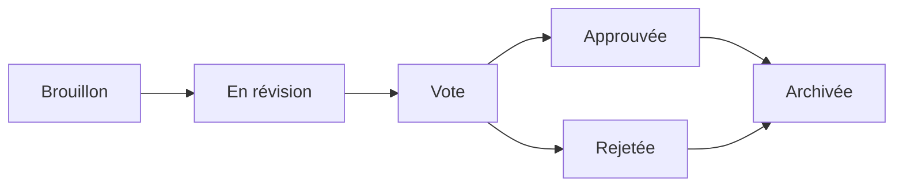

# Propositions

Les propositions sont le point d'entrée pour les décisions de gouvernance dans OpenPR. Une proposition décrit un changement, une amélioration ou une décision qui nécessite l'avis de l'équipe, et suit un cycle de vie structuré depuis la création jusqu'au vote et à une décision finale.

## Cycle de vie d'une proposition



1. **Brouillon** -- L'auteur crée la proposition avec un titre, une description et du contexte.
2. **En révision** -- Les membres de l'équipe discutent et fournissent des retours via les commentaires.
3. **Vote** -- La période de vote s'ouvre. Les membres votent selon les règles de gouvernance.
4. **Approuvée/Rejetée** -- Le vote se clôt. Le résultat est déterminé par le seuil et le quorum.
5. **Archivée** -- La décision est enregistrée et la proposition est archivée.

## Créer une proposition

### Via l'interface web

1. Naviguez vers votre projet.
2. Allez dans **Gouvernance** > **Propositions**.
3. Cliquez sur **Nouvelle proposition**.
4. Remplissez le titre, la description et les problèmes liés.
5. Cliquez sur **Créer**.

### Via l'API

```bash
curl -X POST http://localhost:8080/api/proposals \
  -H "Content-Type: application/json" \
  -H "Authorization: Bearer <token>" \
  -d '{
    "project_id": "<project_uuid>",
    "title": "Adopter TypeScript pour les modules frontend",
    "description": "Proposition de migration des modules frontend de JavaScript vers TypeScript pour une meilleure sécurité des types."
  }'
```

### Via MCP

```json
{
  "method": "tools/call",
  "params": {
    "name": "proposals.create",
    "arguments": {
      "project_id": "<project_uuid>",
      "title": "Adopter TypeScript pour les modules frontend",
      "description": "Proposition de migration des modules frontend de JavaScript vers TypeScript."
    }
  }
}
```

## Modèles de propositions

Les administrateurs de l'espace de travail peuvent créer des modèles de propositions pour standardiser le format. Les modèles définissent :

- Le pattern de titre
- Les sections requises dans la description
- Les paramètres de vote par défaut

Les modèles sont gérés dans **Paramètres de l'espace de travail** > **Gouvernance** > **Modèles**.

## Lier les propositions aux problèmes

Les propositions peuvent être liées à des problèmes associés via la table `proposal_issue_links`. Cela crée une référence bidirectionnelle :

- Depuis la proposition, vous pouvez voir quels problèmes sont affectés.
- Depuis un problème, vous pouvez voir quelles propositions le référencent.

## Commentaires sur les propositions

Chaque proposition a son propre fil de discussion, séparé des commentaires sur les problèmes. Les commentaires sur les propositions prennent en charge la mise en forme markdown et sont visibles pour tous les membres de l'espace de travail.

## Outils MCP

| Outil | Paramètres | Description |
|-------|-----------|-------------|
| `proposals.list` | `project_id` | Lister les propositions, filtre `status` optionnel |
| `proposals.get` | `proposal_id` | Obtenir les détails complets d'une proposition |
| `proposals.create` | `project_id`, `title`, `description` | Créer une nouvelle proposition |

## Étapes suivantes

- [Vote & Décisions](./voting) -- Comment les votes sont exprimés et les décisions sont prises
- [Scores de confiance](./trust-scores) -- Comment les scores de confiance affectent le poids du vote
- [Vue d'ensemble de la gouvernance](./index) -- Référence complète du module de gouvernance
