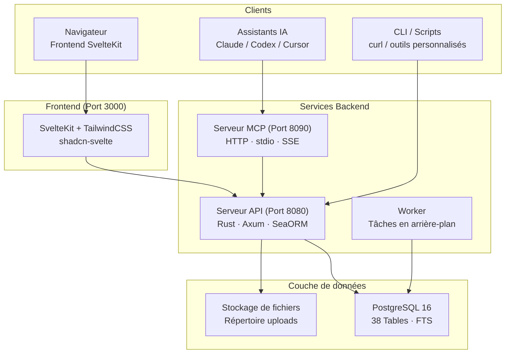

# OpenPR

**OpenPR** est une plateforme de gestion de projet open-source conçue pour les équipes qui ont besoin d'une gouvernance transparente, de workflows assistés par IA et d'un contrôle total sur leurs données de projet. Elle combine le suivi des problèmes, la planification de sprints, les tableaux kanban et un centre de gouvernance complet -- propositions, vote, scores de confiance, mécanismes de veto -- en une seule plateforme auto-hébergée.

OpenPR est construit avec **Rust** (Axum + SeaORM) pour le backend et **SvelteKit** pour le frontend, appuyé par **PostgreSQL**. Il expose une API REST et un serveur MCP intégré avec 34 outils sur trois protocoles de transport, ce qui en fait un fournisseur d'outils de première classe pour les assistants IA comme Claude, Codex et autres clients compatibles MCP.

## Pourquoi OpenPR ?

La plupart des outils de gestion de projet sont soit des plateformes SaaS à source fermée avec une personnalisation limitée, soit des alternatives open-source qui manquent de fonctionnalités de gouvernance. OpenPR adopte une approche différente :

- **Auto-hébergé et auditable.** Vos données de projet restent sur votre infrastructure. Chaque fonctionnalité, chaque décision enregistrée, chaque journal d'audit est sous votre contrôle.
- **Gouvernance intégrée.** Les propositions, le vote, les scores de confiance, le pouvoir de veto et l'escalade ne sont pas des ajouts -- ils sont des modules fondamentaux avec un support API complet.
- **Natif à l'IA.** Un serveur MCP intégré transforme OpenPR en fournisseur d'outils pour les agents IA. Les jetons bot, l'attribution de tâches IA et les rappels webhook permettent des workflows entièrement automatisés.
- **Performance Rust.** Le backend gère des milliers de requêtes concurrentes avec une utilisation minimale des ressources. La recherche plein texte PostgreSQL permet des recherches instantanées sur toutes les entités.

## Fonctionnalités clés

| Catégorie | Fonctionnalités |
|-----------|-----------------|
| **Gestion de projet** | Espaces de travail, projets, problèmes, tableau kanban, sprints, étiquettes, commentaires, pièces jointes, fil d'activité, notifications, recherche plein texte |
| **Centre de gouvernance** | Propositions, vote avec quorum, décisions, veto et escalade, scores de confiance avec historique et appels, modèles de propositions, évaluations d'impact, journaux d'audit |
| **Intégration IA** | Jetons bot (préfixe `opr_`), enregistrement d'agents IA, attribution de tâches IA avec suivi de progression, révision IA sur les propositions, serveur MCP (34 outils, 3 transports), rappels webhook |
| **Authentification** | JWT (jetons d'accès + rafraîchissement), authentification par jeton bot, accès basé sur les rôles (admin/utilisateur), permissions limitées à l'espace de travail (propriétaire/admin/membre) |
| **Déploiement** | Docker Compose, Podman, proxy inverse Caddy/Nginx, PostgreSQL 15+ |

## Architecture



## Pile technologique

| Couche | Technologie |
|--------|-------------|
| **Backend** | Rust, Axum, SeaORM, PostgreSQL |
| **Frontend** | SvelteKit, TailwindCSS, shadcn-svelte |
| **MCP** | JSON-RPC 2.0 (HTTP + stdio + SSE) |
| **Auth** | JWT (accès + rafraîchissement) + Jetons Bot (`opr_`) |
| **Déploiement** | Docker Compose, Podman, Caddy, Nginx |

## Démarrage rapide

```bash
git clone https://github.com/openprx/openpr.git
cd openpr
cp .env.example .env
docker-compose up -d
```

Les services démarrent sur :
- **Frontend** : http://localhost:3000
- **API** : http://localhost:8080
- **Serveur MCP** : http://localhost:8090

Le premier utilisateur enregistré devient automatiquement administrateur.

Consultez le [Guide d'installation](./getting-started/installation) pour toutes les méthodes de déploiement, ou le [Démarrage rapide](./getting-started/quickstart) pour être opérationnel en 5 minutes.

## Sections de la documentation

| Section | Description |
|---------|-------------|
| [Installation](./getting-started/installation) | Docker Compose, build depuis les sources et options de déploiement |
| [Démarrage rapide](./getting-started/quickstart) | Démarrer OpenPR en 5 minutes |
| [Gestion des espaces de travail](./workspace/) | Espaces de travail, projets et rôles des membres |
| [Problèmes & Suivi](./issues/) | Problèmes, états de workflow, sprints et étiquettes |
| [Centre de gouvernance](./governance/) | Propositions, vote, décisions et scores de confiance |
| [API REST](./api/) | Authentification, points de terminaison et formats de réponse |
| [Serveur MCP](./mcp-server/) | Intégration IA avec 34 outils et 3 transports |
| [Configuration](./configuration/) | Variables d'environnement et paramètres |
| [Déploiement](./deployment/docker) | Guides de déploiement Docker et production |
| [Dépannage](./troubleshooting/) | Problèmes courants et solutions |

## Projets associés

| Dépôt | Description |
|-------|-------------|
| [openpr](https://github.com/openprx/openpr) | Plateforme principale (ce projet) |
| [openpr-webhook](https://github.com/openprx/openpr-webhook) | Récepteur webhook pour les intégrations externes |
| [prx](https://github.com/openprx/prx) | Framework d'assistant IA avec MCP OpenPR intégré |
| [prx-memory](https://github.com/openprx/prx-memory) | Mémoire MCP locale pour les agents de codage |

## Informations du projet

- **Licence :** MIT OR Apache-2.0
- **Langage :** Rust (édition 2024)
- **Dépôt :** [github.com/openprx/openpr](https://github.com/openprx/openpr)
- **Rust minimum :** 1.75.0
- **Frontend :** SvelteKit
