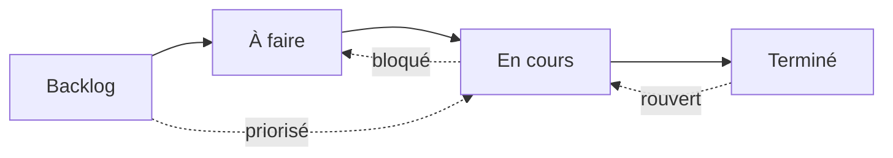
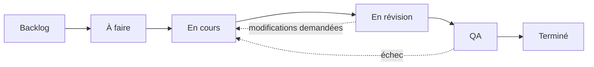

# États du workflow

Chaque problème dans OpenPR a un **état** qui représente sa position dans le workflow. Les colonnes du tableau kanban correspondent directement à ces états.

OpenPR est livré avec quatre états par défaut, mais prend en charge des **états de workflow entièrement personnalisés** via un système de résolution à 3 niveaux. Vous pouvez définir différents workflows par projet, par espace de travail, ou vous appuyer sur les valeurs par défaut du système.

## États par défaut



| État | Valeur | Description |
|------|--------|-------------|
| **Backlog** | `backlog` | Idées, travaux futurs et éléments non planifiés. Pas encore planifiés. |
| **À faire** | `todo` | Planifié et priorisé. Prêt à être pris en charge. |
| **En cours** | `in_progress` | Activement traité par un responsable. |
| **Terminé** | `done` | Complété et vérifié. |

Ce sont les états intégrés avec lesquels chaque nouvel espace de travail commence. Vous pouvez les personnaliser ou ajouter des états supplémentaires comme décrit dans [Workflows personnalisés](#workflows-personnalisés) ci-dessous.

## Transitions d'état

OpenPR permet des transitions d'état flexibles. Il n'y a pas de contraintes imposées -- n'importe quel état peut passer à n'importe quel autre état. Les patterns courants incluent :

| Transition | Déclencheur | Exemple |
|-----------|------------|---------|
| Backlog -> À faire | Planification de sprint, priorisation | Problème intégré dans le prochain sprint |
| À faire -> En cours | Le développeur prend le travail | Le responsable commence l'implémentation |
| En cours -> Terminé | Travail complété | Pull request fusionné |
| En cours -> À faire | Travail bloqué ou en pause | En attente d'une dépendance externe |
| Terminé -> En cours | Problème rouvert | Régression de bug découverte |
| Backlog -> En cours | Correctif urgent | Problème critique en production |

## Workflows personnalisés

OpenPR prend en charge les états de workflow personnalisés via un système de **résolution à 3 niveaux**. Quand l'API valide un état pour un élément de travail, elle résout le workflow effectif en vérifiant trois niveaux dans l'ordre :

```
Workflow du projet  >  Workflow de l'espace de travail  >  Valeurs par défaut du système
```

Si un projet définit son propre workflow, cela a la priorité. Sinon, le workflow au niveau de l'espace de travail est utilisé. Si aucun n'existe, les quatre états par défaut du système s'appliquent.

### Schéma de base de données

Les workflows personnalisés sont stockés dans deux tables (introduites dans la migration `0024_workflow_config.sql`) :

- **`workflows`** -- Définit un workflow nommé attaché à un projet ou un espace de travail.
- **`workflow_states`** -- Les états individuels dans un workflow.

Chaque état a les propriétés suivantes :

| Champ | Type | Description |
|-------|------|-------------|
| `key` | string | Identifiant lisible par la machine (ex. `in_review`) |
| `display_name` | string | Nom lisible par l'humain (ex. "En révision") |
| `category` | string | Catégorie de groupement pour l'état |
| `position` | integer | Ordre d'affichage sur le tableau kanban |
| `color` | string | Code couleur hex pour le badge d'état |
| `is_initial` | boolean | Si c'est l'état par défaut pour les nouveaux problèmes |
| `is_terminal` | boolean | Si cet état représente l'achèvement |

### Créer un workflow personnalisé via l'API

**Étape 1 -- Créer un workflow pour un projet :**

```bash
curl -X POST http://localhost:8080/api/workflows \
  -H "Content-Type: application/json" \
  -H "Authorization: Bearer <token>" \
  -d '{
    "name": "Flux ingénierie",
    "project_id": "<project_uuid>"
  }'
```

**Étape 2 -- Ajouter des états au workflow :**

```bash
curl -X POST http://localhost:8080/api/workflows/<workflow_id>/states \
  -H "Content-Type: application/json" \
  -H "Authorization: Bearer <token>" \
  -d '{
    "key": "in_review",
    "display_name": "En révision",
    "category": "active",
    "position": 3,
    "color": "#f59e0b",
    "is_initial": false,
    "is_terminal": false
  }'
```

### Exemple : Workflow d'ingénierie à 6 états



| État | Clé | Catégorie | Initial | Terminal |
|------|-----|-----------|---------|----------|
| Backlog | `backlog` | backlog | oui | non |
| À faire | `todo` | planned | non | non |
| En cours | `in_progress` | active | non | non |
| En révision | `in_review` | active | non | non |
| QA | `qa` | active | non | non |
| Terminé | `done` | completed | non | oui |

### Validation dynamique

Quand l'état d'un élément de travail est mis à jour, l'API valide le nouvel état par rapport au **workflow effectif** pour ce projet. Si vous définissez une clé d'état qui n'existe pas dans le workflow résolu, l'API retourne une erreur `422 Unprocessable Entity`. Les états ne sont pas codés en dur -- ils sont recherchés dynamiquement au moment de la requête.

## Tableau kanban

La vue tableau affiche les problèmes sous forme de cartes dans des colonnes correspondant aux états du workflow. Faites glisser une carte entre les colonnes pour changer son état. Quand des workflows personnalisés sont actifs, le tableau reflète automatiquement les états personnalisés et leur ordre configuré.

Chaque carte affiche :
- L'identifiant du problème (ex. `API-42`)
- Le titre
- L'indicateur de priorité
- L'avatar du responsable
- Les badges d'étiquettes

## Mettre à jour l'état via l'API

```bash
# Déplacer le problème vers "in_progress"
curl -X PATCH http://localhost:8080/api/issues/<issue_id> \
  -H "Content-Type: application/json" \
  -H "Authorization: Bearer <token>" \
  -d '{"state": "in_progress"}'
```

## Mettre à jour l'état via MCP

```json
{
  "method": "tools/call",
  "params": {
    "name": "work_items.update",
    "arguments": {
      "work_item_id": "<issue_uuid>",
      "state": "in_progress"
    }
  }
}
```

## Niveaux de priorité

En plus des états, chaque problème peut avoir un niveau de priorité :

| Priorité | Valeur | Description |
|----------|--------|-------------|
| Faible | `low` | Agréable à avoir, pas de pression de temps |
| Moyenne | `medium` | Priorité standard, travail planifié |
| Haute | `high` | Important, devrait être traité bientôt |
| Urgente | `urgent` | Critique, nécessite une attention immédiate |

## Suivi des activités

Chaque changement d'état est enregistré dans le fil d'activité du problème avec l'acteur, l'horodatage et les anciennes/nouvelles valeurs. Cela fournit une piste d'audit complète.

## Étapes suivantes

- [Planification de sprints](./sprints) -- Organiser les problèmes en itérations à durée fixe
- [Étiquettes](./labels) -- Ajouter une catégorisation aux problèmes
- [Vue d'ensemble des problèmes](./index) -- Référence complète des champs de problème
