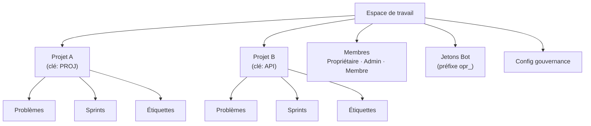

# Gestion des espaces de travail

Un **espace de travail** est l'unité organisationnelle de niveau supérieur dans OpenPR. Il fournit une isolation multi-locataire -- chaque espace de travail possède ses propres projets, membres, étiquettes, jetons bot et paramètres de gouvernance. Les utilisateurs peuvent appartenir à plusieurs espaces de travail.

## Créer un espace de travail

Après connexion, cliquez sur **Créer un espace de travail** sur le tableau de bord ou naviguez vers **Paramètres** > **Espaces de travail** > **Nouveau**.

Fournissez :

| Champ | Requis | Description |
|-------|--------|-------------|
| Nom | Oui | Nom d'affichage (ex. "Équipe ingénierie") |
| Slug | Oui | Identifiant convivial pour les URL (ex. "ingenierie") |

L'utilisateur créateur est automatiquement attribué au rôle de **Propriétaire**.

## Structure de l'espace de travail



## Paramètres de l'espace de travail

Accédez aux paramètres de l'espace de travail via l'icône d'engrenage ou **Paramètres** dans la barre latérale :

- **Général** -- Mettre à jour le nom, le slug et la description de l'espace de travail.
- **Membres** -- Inviter des utilisateurs, changer les rôles, retirer des membres. Voir [Membres](./members).
- **Jetons Bot** -- Créer et gérer les jetons bot MCP.
- **Gouvernance** -- Configurer les seuils de vote, les modèles de propositions et les règles de scores de confiance. Voir [Gouvernance](../governance/).
- **Webhooks** -- Configurer des points de terminaison webhook pour les intégrations externes.

## Accès API

```bash
# Lister les espaces de travail
curl -H "Authorization: Bearer <token>" \
  http://localhost:8080/api/workspaces

# Obtenir les détails d'un espace de travail
curl -H "Authorization: Bearer <token>" \
  http://localhost:8080/api/workspaces/<workspace_id>
```

## Accès MCP

Via le serveur MCP, les assistants IA opèrent dans l'espace de travail spécifié par la variable d'environnement `OPENPR_WORKSPACE_ID`. Tous les outils MCP limitent automatiquement les opérations à cet espace de travail.

## Étapes suivantes

- [Projets](./projects) -- Créer et gérer des projets dans un espace de travail
- [Membres & Permissions](./members) -- Inviter des utilisateurs et configurer les rôles
