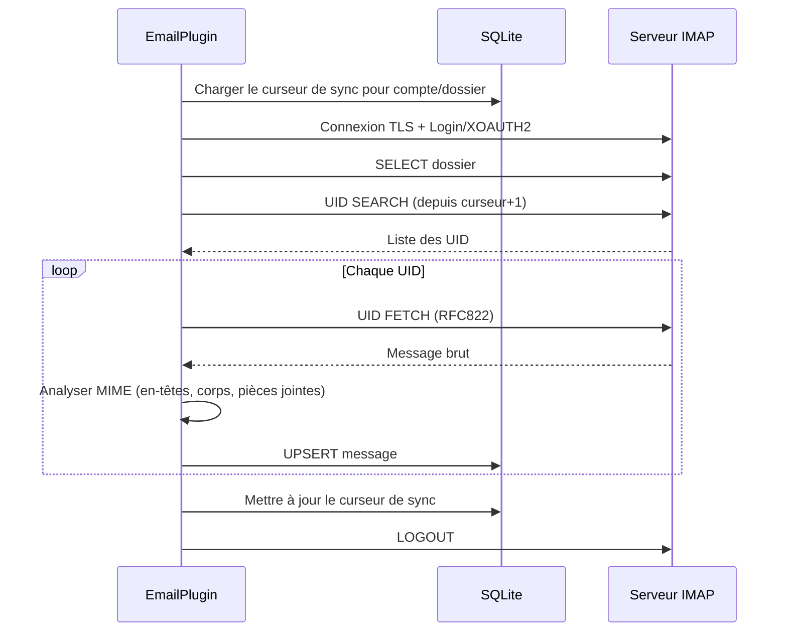

# Configuration IMAP

PRX-Email se connecte aux serveurs IMAP via TLS en utilisant la bibliothèque `rustls`. Il prend en charge l'authentification par mot de passe et XOAUTH2 pour Gmail et Outlook. La synchronisation de la boîte de réception est basée sur les UID et incrémentale, avec persistance des curseurs dans la base de données SQLite.

## Configuration IMAP de base

```rust
use prx_email::plugin::{ImapConfig, AuthConfig};

let imap = ImapConfig {
    host: "imap.example.com".to_string(),
    port: 993,
    user: "you@example.com".to_string(),
    auth: AuthConfig {
        password: Some("your-app-password".to_string()),
        oauth_token: None,
    },
};
```

### Champs de configuration

| Champ | Type | Requis | Description |
|-------|------|----------|-------------|
| `host` | `String` | Oui | Nom d'hôte du serveur IMAP (ne doit pas être vide) |
| `port` | `u16` | Oui | Port du serveur IMAP (typiquement 993 pour TLS) |
| `user` | `String` | Oui | Nom d'utilisateur IMAP (généralement l'adresse email) |
| `auth.password` | `Option<String>` | L'un des deux | Mot de passe d'application pour IMAP LOGIN |
| `auth.oauth_token` | `Option<String>` | L'un des deux | Jeton d'accès OAuth pour XOAUTH2 |

::: warning Authentification
Exactement l'un de `password` ou `oauth_token` doit être défini. Définir les deux ou aucun entraînera une erreur de validation.
:::

## Paramètres courants des fournisseurs

| Fournisseur | Hôte | Port | Méthode d'auth |
|----------|------|------|-------------|
| Gmail | `imap.gmail.com` | 993 | Mot de passe d'application ou XOAUTH2 |
| Outlook / Office 365 | `outlook.office365.com` | 993 | XOAUTH2 (recommandé) |
| Yahoo | `imap.mail.yahoo.com` | 993 | Mot de passe d'application |
| Fastmail | `imap.fastmail.com` | 993 | Mot de passe d'application |
| ProtonMail Bridge | `127.0.0.1` | 1143 | Mot de passe Bridge |

## Synchroniser la boîte de réception

La méthode `sync` se connecte au serveur IMAP, sélectionne un dossier, récupère les nouveaux messages par UID et les stocke dans SQLite :

```rust
use prx_email::plugin::SyncRequest;

plugin.sync(SyncRequest {
    account_id: 1,
    folder: Some("INBOX".to_string()),
    cursor: None,        // Reprendre depuis le dernier curseur sauvegardé
    now_ts: now,
    max_messages: 100,   // Récupérer au plus 100 messages par sync
})?;
```

### Flux de synchronisation



### Synchronisation incrémentale

PRX-Email utilise des curseurs basés sur les UID pour éviter de re-récupérer des messages. Après chaque synchronisation :

1. Le UID le plus élevé vu est sauvegardé comme curseur
2. La prochaine synchronisation commence à `curseur + 1`
3. Les messages avec des paires `(account_id, message_id)` existantes sont mis à jour (UPSERT)

Le curseur est stocké dans la table `sync_state` avec la clé composée `(account_id, folder_id)`.

## Synchronisation multi-dossiers

Synchronisez plusieurs dossiers pour le même compte :

```rust
for folder in &["INBOX", "Sent", "Drafts", "Archive"] {
    plugin.sync(SyncRequest {
        account_id,
        folder: Some(folder.to_string()),
        cursor: None,
        now_ts: now,
        max_messages: 100,
    })?;
}
```

## Planificateur de synchronisation

Pour une synchronisation périodique, utilisez le sync runner intégré :

```rust
use prx_email::plugin::{SyncJob, SyncRunnerConfig};

let jobs = vec![
    SyncJob { account_id: 1, folder: "INBOX".into(), max_messages: 100 },
    SyncJob { account_id: 1, folder: "Sent".into(), max_messages: 50 },
    SyncJob { account_id: 2, folder: "INBOX".into(), max_messages: 100 },
];

let config = SyncRunnerConfig {
    max_concurrency: 4,         // Max tâches par tick du runner
    base_backoff_seconds: 10,   // Backoff initial en cas d'échec
    max_backoff_seconds: 300,   // Backoff maximum (5 minutes)
};

let report = plugin.run_sync_runner(&jobs, now, &config);
println!(
    "Exécution {} : tentatives={}, réussies={}, échouées={}",
    report.run_id, report.attempted, report.succeeded, report.failed
);
```

### Comportement du planificateur

- **Plafond de concurrence** : Au plus `max_concurrency` tâches s'exécutent par tick
- **Backoff sur échec** : Backoff exponentiel avec formule `base * 2^failures`, limité par `max_backoff_seconds`
- **Vérification d'échéance** : Les tâches sont ignorées si leur fenêtre de backoff n'a pas expiré
- **Suivi de l'état** : Par clé `account::dossier`, suit `(next_allowed_at, failure_count)`

## Analyse des messages

Les messages entrants sont analysés avec le crate `mail-parser` avec les extractions suivantes :

| Champ | Source | Notes |
|-------|--------|-------|
| `message_id` | En-tête `Message-ID` | Fallback vers SHA-256 des octets bruts |
| `subject` | En-tête `Subject` | |
| `sender` | Première adresse de l'en-tête `From` | |
| `recipients` | Toutes les adresses de l'en-tête `To` | Séparées par des virgules |
| `body_text` | Première partie `text/plain` | |
| `body_html` | Première partie `text/html` | Fallback : extraction de section brute |
| `snippet` | 120 premiers caractères de body_text ou body_html | |
| `references_header` | En-tête `References` | Pour le threading |
| `attachments` | Parties de pièces jointes MIME | Métadonnées sérialisées en JSON |

## TLS

Toutes les connexions IMAP utilisent TLS via `rustls` avec le bundle de certificats `webpki-roots`. Il n'y a pas d'option pour désactiver TLS ou utiliser STARTTLS -- les connexions sont toujours chiffrées dès le début.

## Étapes suivantes

- [Configuration SMTP](./smtp) -- Configurer l'envoi d'emails
- [Authentification OAuth](./oauth) -- Configurer XOAUTH2 pour Gmail et Outlook
- [Stockage SQLite](../storage/) -- Comprendre le schéma de la base de données
