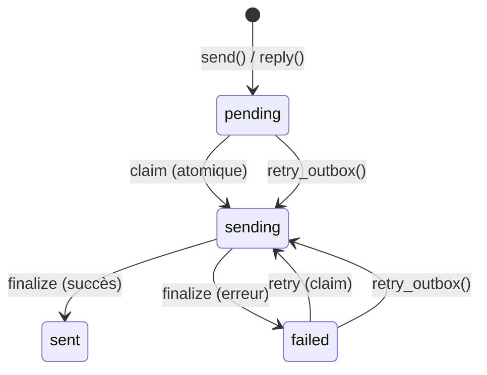

# Configuration SMTP

PRX-Email envoie des emails via SMTP en utilisant le crate `lettre` avec TLS `rustls`. Le pipeline de boîte d'envoi utilise un flux de travail atomique claim-send-finalize pour empêcher les envois dupliqués, avec une nouvelle tentative à backoff exponentiel et des clés d'idempotence déterministes de Message-ID.

## Configuration SMTP de base

```rust
use prx_email::plugin::{SmtpConfig, AuthConfig};

let smtp = SmtpConfig {
    host: "smtp.example.com".to_string(),
    port: 465,
    user: "you@example.com".to_string(),
    auth: AuthConfig {
        password: Some("your-app-password".to_string()),
        oauth_token: None,
    },
};
```

### Champs de configuration

| Champ | Type | Requis | Description |
|-------|------|----------|-------------|
| `host` | `String` | Oui | Nom d'hôte du serveur SMTP (ne doit pas être vide) |
| `port` | `u16` | Oui | Port du serveur SMTP (465 pour TLS implicite, 587 pour STARTTLS) |
| `user` | `String` | Oui | Nom d'utilisateur SMTP (généralement l'adresse email) |
| `auth.password` | `Option<String>` | L'un des deux | Mot de passe pour SMTP AUTH PLAIN/LOGIN |
| `auth.oauth_token` | `Option<String>` | L'un des deux | Jeton d'accès OAuth pour XOAUTH2 |

## Paramètres courants des fournisseurs

| Fournisseur | Hôte | Port | Méthode d'auth |
|----------|------|------|-------------|
| Gmail | `smtp.gmail.com` | 465 | Mot de passe d'application ou XOAUTH2 |
| Outlook / Office 365 | `smtp.office365.com` | 587 | XOAUTH2 |
| Yahoo | `smtp.mail.yahoo.com` | 465 | Mot de passe d'application |
| Fastmail | `smtp.fastmail.com` | 465 | Mot de passe d'application |

## Envoyer des emails

### Envoi de base

```rust
use prx_email::plugin::SendEmailRequest;

let response = plugin.send(SendEmailRequest {
    account_id: 1,
    to: "recipient@example.com".to_string(),
    subject: "Bonjour".to_string(),
    body_text: "Corps du message ici.".to_string(),
    now_ts: now,
    attachment: None,
    failure_mode: None,
});
```

### Répondre à un message

```rust
use prx_email::plugin::ReplyEmailRequest;

let response = plugin.reply(ReplyEmailRequest {
    account_id: 1,
    in_reply_to_message_id: "<original-msg-id@example.com>".to_string(),
    body_text: "Merci pour votre message !".to_string(),
    now_ts: now,
    attachment: None,
    failure_mode: None,
});
```

Les réponses définissent automatiquement :
- L'en-tête `In-Reply-To`
- La chaîne `References` depuis le message parent
- Le destinataire déduit de l'expéditeur du message parent
- Le sujet préfixé par `Re:`

## Pipeline de boîte d'envoi

Le pipeline de boîte d'envoi garantit une livraison fiable des emails via une machine à états atomique :



### Règles de la machine à états

| Transition | Condition | Garde |
|-----------|-----------|-------|
| `pending` -> `sending` | `claim_outbox_for_send()` | `status IN ('pending','failed') AND next_attempt_at <= now` |
| `sending` -> `sent` | Fournisseur a accepté | `update_outbox_status_if_current(status='sending')` |
| `sending` -> `failed` | Fournisseur a rejeté ou erreur réseau | `update_outbox_status_if_current(status='sending')` |
| `failed` -> `sending` | `retry_outbox()` | `status IN ('pending','failed') AND next_attempt_at <= now` |

### Idempotence

Chaque message de boîte d'envoi obtient un Message-ID déterministe :

```
<outbox-{id}-{retries}@prx-email.local>
```

Cela garantit que les nouvelles tentatives se distinguent de l'envoi original, et les fournisseurs qui dédupliquent par Message-ID accepteront chaque nouvelle tentative.

### Backoff de nouvelle tentative

Les envois échoués utilisent un backoff exponentiel :

```
next_attempt_at = now + base_backoff * 2^retries
```

Avec un backoff de base de 5 secondes :

| Tentative | Backoff |
|-------|---------|
| 1 | 10s |
| 2 | 20s |
| 3 | 40s |
| 4 | 80s |
| 5 | 160s |
| 6 | 320s |
| 7 | 640s |
| 10 | 5 120s (~85 min) |

### Nouvelle tentative manuelle

```rust
use prx_email::plugin::RetryOutboxRequest;

let response = plugin.retry_outbox(RetryOutboxRequest {
    outbox_id: 42,
    now_ts: now,
    failure_mode: None,
});
```

La nouvelle tentative est rejetée si :
- Le statut de la boîte d'envoi est `sent` ou `sending` (non relançable)
- `next_attempt_at` n'a pas encore été atteint (`retry_not_due`)

## Pièces jointes

### Envoyer avec une pièce jointe

```rust
use prx_email::plugin::{SendEmailRequest, AttachmentInput};

let response = plugin.send(SendEmailRequest {
    account_id: 1,
    to: "recipient@example.com".to_string(),
    subject: "Rapport en pièce jointe".to_string(),
    body_text: "Veuillez trouver le rapport en pièce jointe.".to_string(),
    now_ts: now,
    attachment: Some(AttachmentInput {
        filename: "report.pdf".to_string(),
        content_type: "application/pdf".to_string(),
        base64: Some(base64_encoded_content),
        path: None,
    }),
    failure_mode: None,
});
```

### Politique des pièces jointes

`AttachmentPolicy` applique des restrictions de taille et de type MIME :

```rust
use prx_email::plugin::AttachmentPolicy;

let policy = AttachmentPolicy {
    max_size_bytes: 25 * 1024 * 1024,  // 25 MiO
    allowed_content_types: [
        "application/pdf",
        "image/jpeg",
        "image/png",
        "text/plain",
        "application/zip",
    ].into_iter().map(String::from).collect(),
};
```

| Règle | Comportement |
|------|----------|
| Taille dépasse `max_size_bytes` | Rejeté avec `attachment exceeds size limit` |
| Type MIME absent de `allowed_content_types` | Rejeté avec `attachment content type is not allowed` |
| Pièce jointe par chemin sans `attachment_store` | Rejeté avec `attachment store not configured` |
| Chemin échappant la racine de stockage (`../` traversal) | Rejeté avec `attachment path escapes storage root` |

### Pièces jointes basées sur un chemin

Pour les pièces jointes stockées sur disque, configurez le stockage de pièces jointes :

```rust
use prx_email::plugin::AttachmentStoreConfig;

let store = AttachmentStoreConfig {
    enabled: true,
    dir: "/var/lib/prx-email/attachments".to_string(),
};
```

La résolution des chemins inclut des gardes contre la traversée de répertoire -- tout chemin se résolvant hors de la racine de stockage configurée est rejeté, y compris les échappements basés sur les liens symboliques.

## Format de réponse de l'API

Toutes les opérations d'envoi retournent un `ApiResponse<SendResult>` :

```rust
pub struct SendResult {
    pub outbox_id: i64,
    pub status: String,          // "sent" ou "failed"
    pub retries: i64,
    pub provider_message_id: Option<String>,
    pub next_attempt_at: i64,
}
```

## Étapes suivantes

- [Authentification OAuth](./oauth) -- Configurer XOAUTH2 pour les fournisseurs qui l'exigent
- [Référence de configuration](../configuration/) -- Tous les paramètres et variables d'environnement
- [Dépannage](../troubleshooting/) -- Problèmes SMTP courants et solutions
