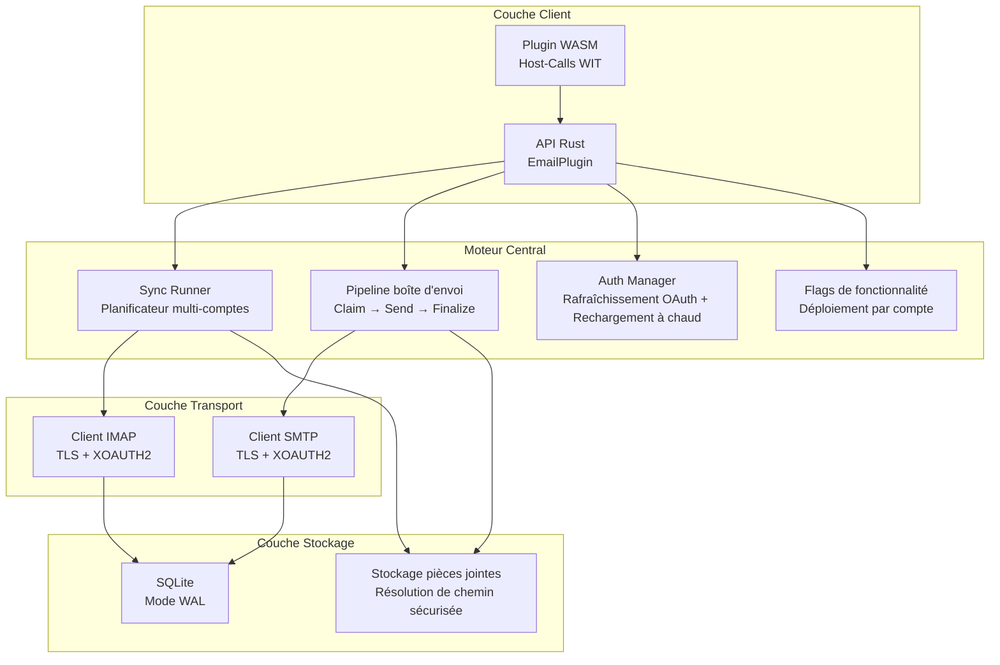

# PRX-Email

**PRX-Email** est un plugin de client email auto-hébergé écrit en Rust avec persistance SQLite et des primitives robustes pour la production. Il fournit la synchronisation de boîte de réception IMAP, l'envoi SMTP avec un pipeline de boîte d'envoi atomique, l'authentification OAuth 2.0 pour Gmail et Outlook, la gouvernance des pièces jointes et une interface de plugin WASM pour l'intégration dans l'écosystème PRX.

PRX-Email est conçu pour les développeurs et les équipes qui ont besoin d'un backend email fiable et intégrable -- un backend qui gère la planification de synchronisation multi-comptes, la livraison sécurisée de la boîte d'envoi avec nouvelle tentative et backoff, la gestion du cycle de vie des jetons OAuth, et le déploiement de flags de fonctionnalité -- sans dépendre d'APIs email SaaS tierces.

## Pourquoi PRX-Email ?

La plupart des intégrations email s'appuient sur des APIs spécifiques aux fournisseurs ou des wrappers IMAP/SMTP fragiles qui ignorent les préoccupations de production comme les envois dupliqués, l'expiration des jetons et la sécurité des pièces jointes. PRX-Email adopte une approche différente :

- **Boîte d'envoi robuste pour la production.** La machine à états atomique claim-and-finalize empêche les envois dupliqués. Le backoff exponentiel et les clés d'idempotence déterministes de Message-ID garantissent des nouvelles tentatives sécurisées.
- **Authentification OAuth en priorité.** Support natif XOAUTH2 pour IMAP et SMTP avec suivi de l'expiration des jetons, fournisseurs de rafraîchissement extensibles et rechargement à chaud depuis les variables d'environnement.
- **Stockage SQLite natif.** Le mode WAL, le checkpointing borné et les requêtes paramétrées fournissent une persistance locale rapide et fiable sans dépendances de base de données externe.
- **Extensible via WASM.** Le plugin compile en WebAssembly et expose les opérations email via les host-calls WIT, avec un commutateur de sécurité réseau qui désactive par défaut les connexions IMAP/SMTP réelles.

## Fonctionnalités clés

<div class="vp-features">

- **Synchronisation de boîte de réception IMAP** -- Connectez-vous à n'importe quel serveur IMAP avec TLS. Synchronisez plusieurs comptes et dossiers avec une récupération incrémentale basée sur les UID et la persistance des curseurs.

- **Pipeline de boîte d'envoi SMTP** -- Le flux de travail atomique claim-send-finalize empêche les envois dupliqués. Les messages échoués sont relancés avec un backoff exponentiel et des limites configurables.

- **Authentification OAuth 2.0** -- XOAUTH2 pour Gmail et Outlook. Suivi de l'expiration des jetons, fournisseurs de rafraîchissement extensibles et rechargement à chaud basé sur les variables d'environnement sans redémarrages.

- **Planificateur de synchronisation multi-comptes** -- Interrogation périodique par compte et dossier avec concurrence configurable, backoff sur échec et plafonds stricts par exécution.

- **Persistance SQLite** -- Mode WAL, synchronisation NORMAL, délai d'expiration d'occupation 5s. Schéma complet avec comptes, dossiers, messages, boîte d'envoi, état de synchronisation et flags de fonctionnalité.

- **Gouvernance des pièces jointes** -- Limites de taille maximale, application de la liste blanche MIME et gardes contre la traversée de répertoire protègent contre les pièces jointes surdimensionnées ou malveillantes.

- **Déploiement de flags de fonctionnalité** -- Flags de fonctionnalité par compte avec déploiement basé sur pourcentage. Contrôlez indépendamment les capacités de lecture de boîte de réception, de recherche, d'envoi, de réponse et de nouvelle tentative.

- **Interface de plugin WASM** -- Compilez en WebAssembly pour une exécution en bac à sable dans le runtime PRX. Les host-calls fournissent les opérations email.sync, list, get, search, send et reply.

- **Observabilité** -- Métriques runtime en mémoire (tentatives/succès/échecs de synchronisation, échecs d'envoi, nombre de nouvelles tentatives) et payloads de journaux structurés avec compte, dossier, message_id, run_id et error_code.

</div>

## Architecture



## Installation rapide

Clonez le dépôt et compilez :

```bash
git clone https://github.com/openprx/prx_email.git
cd prx_email
cargo build --release
```

Ou ajoutez comme dépendance dans votre `Cargo.toml` :

```toml
[dependencies]
prx_email = { git = "https://github.com/openprx/prx_email.git" }
```

Consultez le [Guide d'installation](./getting-started/installation) pour les instructions de configuration complètes incluant la compilation du plugin WASM.

## Sections de la documentation

| Section | Description |
|---------|-------------|
| [Installation](./getting-started/installation) | Installer PRX-Email, configurer les dépendances et compiler le plugin WASM |
| [Démarrage rapide](./getting-started/quickstart) | Configurer votre premier compte et envoyer un email en 5 minutes |
| [Gestion des comptes](./accounts/) | Ajouter, configurer et gérer les comptes email |
| [Configuration IMAP](./accounts/imap) | Paramètres du serveur IMAP, TLS et synchronisation des dossiers |
| [Configuration SMTP](./accounts/smtp) | Paramètres du serveur SMTP, TLS et pipeline d'envoi |
| [Authentification OAuth](./accounts/oauth) | Configuration OAuth 2.0 pour Gmail et Outlook |
| [Stockage SQLite](./storage/) | Schéma de la base de données, mode WAL, optimisation des performances et maintenance |
| [Plugins WASM](./plugins/) | Compiler et déployer le plugin WASM avec les host-calls WIT |
| [Référence de configuration](./configuration/) | Toutes les variables d'environnement, paramètres runtime et options de politique |
| [Dépannage](./troubleshooting/) | Problèmes courants et solutions |

## Informations sur le projet

- **Licence :** MIT OR Apache-2.0
- **Langage :** Rust (édition 2024)
- **Dépôt :** [github.com/openprx/prx_email](https://github.com/openprx/prx_email)
- **Stockage :** SQLite (rusqlite avec fonctionnalité bundled)
- **IMAP :** crate `imap` avec TLS rustls
- **SMTP :** crate `lettre` avec TLS rustls
