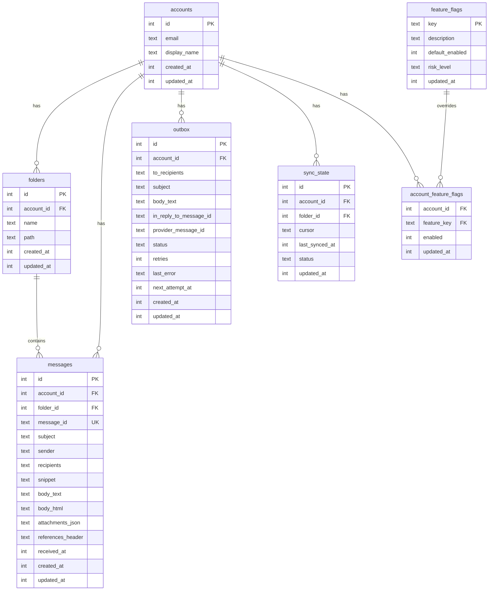

# Stockage SQLite

PRX-Email utilise SQLite comme seul backend de stockage, accessible via le crate `rusqlite` avec la compilation SQLite bundled. La base de données s'exécute en mode WAL avec les clés étrangères activées, fournissant des lectures concurrentes rapides et une isolation d'écriture fiable.

## Configuration de la base de données

### Paramètres par défaut

| Paramètre | Valeur | Description |
|---------|-------|-------------|
| `journal_mode` | WAL | Write-Ahead Logging pour les lectures concurrentes |
| `synchronous` | NORMAL | Durabilité/performance équilibrées |
| `foreign_keys` | ON | Appliquer l'intégrité référentielle |
| `busy_timeout` | 5000ms | Temps d'attente pour la base de données verrouillée |
| `wal_autocheckpoint` | 1000 pages | Seuil de checkpoint WAL automatique |

### Configuration personnalisée

```rust
use prx_email::db::{EmailStore, StoreConfig, SynchronousMode};

let config = StoreConfig {
    enable_wal: true,
    busy_timeout_ms: 5_000,
    wal_autocheckpoint_pages: 1_000,
    synchronous: SynchronousMode::Normal,
};

let store = EmailStore::open_with_config("./email.db", &config)?;
```

### Modes synchrones

| Mode | Durabilité | Performance | Cas d'utilisation |
|------|-----------|-------------|----------|
| `Full` | Maximum | Écritures les plus lentes | Charges de travail financières ou de conformité |
| `Normal` | Bonne (défaut) | Équilibrée | Utilisation générale en production |
| `Off` | Minimale | Écritures les plus rapides | Développement et tests uniquement |

### Base de données en mémoire

Pour les tests, utilisez une base de données en mémoire :

```rust
let store = EmailStore::open_in_memory()?;
store.migrate()?;
```

## Schéma

Le schéma de la base de données est appliqué via des migrations incrémentielles. L'exécution de `store.migrate()` applique toutes les migrations en attente.

### Tables



### Index

| Table | Index | Objectif |
|-------|-------|---------|
| `messages` | `(account_id)` | Filtrer les messages par compte |
| `messages` | `(folder_id)` | Filtrer les messages par dossier |
| `messages` | `(subject)` | Recherche LIKE sur les sujets |
| `messages` | `(account_id, message_id)` | Contrainte unique pour UPSERT |
| `outbox` | `(account_id)` | Filtrer la boîte d'envoi par compte |
| `outbox` | `(status, next_attempt_at)` | Revendiquer les enregistrements éligibles de la boîte d'envoi |
| `sync_state` | `(account_id, folder_id)` | Contrainte unique pour UPSERT |
| `account_feature_flags` | `(account_id)` | Recherches de flags de fonctionnalité |

## Migrations

Les migrations sont intégrées dans le binaire et appliquées dans l'ordre :

| Migration | Description |
|-----------|-------------|
| `0001_init.sql` | Tables comptes, dossiers, messages, sync_state |
| `0002_outbox.sql` | Table boîte d'envoi pour le pipeline d'envoi |
| `0003_rollout.sql` | Flags de fonctionnalité et flags de fonctionnalité par compte |
| `0005_m41.sql` | Raffinements du schéma M4.1 |
| `0006_m42_perf.sql` | Index de performance M4.2 |

Des colonnes supplémentaires (`body_html`, `attachments_json`, `references_header`) sont ajoutées via `ALTER TABLE` si elles ne sont pas présentes.

## Optimisation des performances

### Charges de travail à forte intensité de lecture

Pour les applications qui lisent beaucoup plus qu'elles n'écrivent (clients email typiques) :

```rust
let config = StoreConfig {
    enable_wal: true,              // Lectures concurrentes
    busy_timeout_ms: 10_000,       // Délai plus élevé pour la contention
    wal_autocheckpoint_pages: 2_000, // Checkpoints moins fréquents
    synchronous: SynchronousMode::Normal,
};
```

### Charges de travail à forte intensité d'écriture

Pour les opérations de synchronisation à volume élevé :

```rust
let config = StoreConfig {
    enable_wal: true,
    busy_timeout_ms: 5_000,
    wal_autocheckpoint_pages: 500, // Checkpoints plus fréquents
    synchronous: SynchronousMode::Normal,
};
```

### Analyse du plan de requête

Vérifiez les requêtes lentes avec `EXPLAIN QUERY PLAN` :

```sql
EXPLAIN QUERY PLAN
SELECT * FROM messages
WHERE account_id = 1 AND subject LIKE '%facture%'
ORDER BY received_at DESC LIMIT 50;
```

## Planification de capacité

### Facteurs de croissance

| Table | Modèle de croissance | Stratégie de rétention |
|-------|---------------|-------------------|
| `messages` | Table dominante ; croît à chaque synchronisation | Purger les anciens messages périodiquement |
| `outbox` | Accumule l'historique des envoyés + échoués | Supprimer les anciens enregistrements envoyés |
| Fichier WAL | Pics lors des rafales d'écriture | Checkpoint automatique |

### Seuils de surveillance

- Suivre séparément la taille du fichier DB et la taille du WAL
- Alerter lorsque le WAL reste grand sur plusieurs checkpoints
- Alerter lorsque le backlog d'échecs de la boîte d'envoi dépasse le SLO opérationnel

## Maintenance des données

### Helpers de nettoyage

```rust
// Supprimer les enregistrements de boîte d'envoi envoyés de plus de 30 jours
let cutoff = now - 30 * 86400;
let deleted = repo.delete_sent_outbox_before(cutoff)?;
println!("Supprimé {} anciens enregistrements envoyés", deleted);

// Supprimer les messages de plus de 90 jours
let cutoff = now - 90 * 86400;
let deleted = repo.delete_old_messages_before(cutoff)?;
println!("Supprimé {} anciens messages", deleted);
```

### SQL de maintenance

Vérifier la distribution des statuts de la boîte d'envoi :

```sql
SELECT status, COUNT(*) FROM outbox GROUP BY status;
```

Distribution de l'âge des messages :

```sql
SELECT
  CASE
    WHEN received_at >= strftime('%s','now') - 86400 THEN 'lt_1d'
    WHEN received_at >= strftime('%s','now') - 604800 THEN 'lt_7d'
    ELSE 'ge_7d'
  END AS age_bucket,
  COUNT(*)
FROM messages
GROUP BY age_bucket;
```

Checkpoint WAL et compactage :

```sql
PRAGMA wal_checkpoint(TRUNCATE);
VACUUM;
```

::: warning VACUUM
`VACUUM` reconstruit tout le fichier de base de données et nécessite un espace disque libre égal à la taille de la base de données. Exécutez-le dans une fenêtre de maintenance après de grandes suppressions.
:::

## Sécurité SQL

Toutes les requêtes de base de données utilisent des instructions paramétrées pour prévenir l'injection SQL :

```rust
// Sécurisé : requête paramétrée
conn.execute(
    "SELECT * FROM messages WHERE account_id = ?1 AND message_id = ?2",
    params![account_id, message_id],
)?;
```

Les identifiants dynamiques (noms de tables, noms de colonnes) sont validés contre `^[a-zA-Z_][a-zA-Z0-9_]{0,62}$` avant utilisation dans les chaînes SQL.

## Étapes suivantes

- [Référence de configuration](../configuration/) -- Tous les paramètres runtime
- [Dépannage](../troubleshooting/) -- Problèmes liés à la base de données
- [Configuration IMAP](../accounts/imap) -- Comprendre le flux de données de synchronisation
