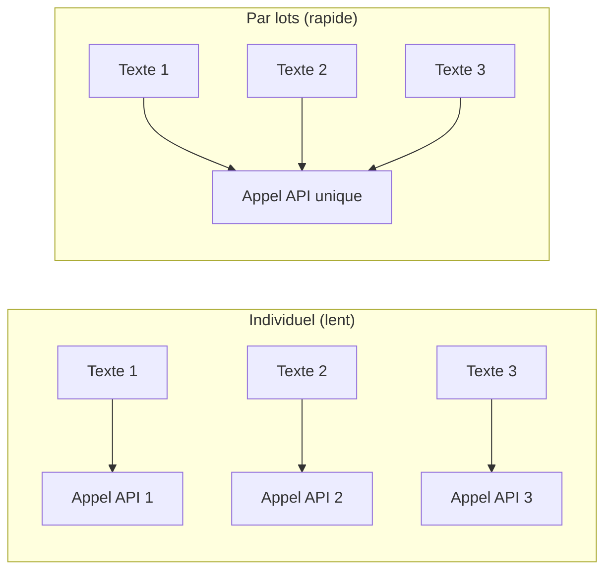

# Traitement par lots

Lorsque vous travaillez avec de grands ensembles de mémoire, embéder un texte à la fois est inefficace. PRX-Memory prend en charge l'embedding par lots pour réduire les allers-retours API et améliorer le débit.

## Fonctionnement de l'embedding par lots

Au lieu de faire des appels API individuels pour chaque mémoire, le traitement par lots regroupe plusieurs textes en une seule requête. La plupart des fournisseurs d'embedding prennent en charge des tailles de lot de 100--2048 textes par appel.



## Cas d'utilisation

### Import initial

Lors de l'importation d'un grand ensemble de connaissances existantes, utilisez `memory_import` pour charger les mémoires et déclencher l'embedding par lots :

```json
{
  "jsonrpc": "2.0",
  "id": 1,
  "method": "tools/call",
  "params": {
    "name": "memory_import",
    "arguments": {
      "data": "... JSON de mémoire exporté ..."
    }
  }
}
```

### Ré-embedding après changement de modèle

Lors du passage à un nouveau modèle d'embedding, l'outil `memory_reembed` traite toutes les mémoires stockées en lots :

```json
{
  "jsonrpc": "2.0",
  "id": 1,
  "method": "tools/call",
  "params": {
    "name": "memory_reembed",
    "arguments": {}
  }
}
```

### Compactage du stockage

L'outil `memory_compact` optimise le stockage et peut déclencher le ré-embedding pour les entrées avec des vecteurs obsolètes ou manquants :

```json
{
  "jsonrpc": "2.0",
  "id": 1,
  "method": "tools/call",
  "params": {
    "name": "memory_compact",
    "arguments": {}
  }
}
```

## Conseils de performance

| Conseil | Description |
|-----|-------------|
| Utilisez des fournisseurs compatibles avec les lots | Jina et les points de terminaison compatibles OpenAI prennent en charge de grandes tailles de lot |
| Planifiez pendant les faibles utilisations | Les opérations par lots rivalisent pour le même quota API que les requêtes en temps réel |
| Surveillez via les métriques | Utilisez le point de terminaison `/metrics` pour suivre les comptages d'appels d'embedding et les latences |
| Choisissez des modèles efficaces | Les modèles plus petits (768 dimensions) s'embédent plus rapidement que les plus grands (3072 dimensions) |

## Limitation de débit

La plupart des fournisseurs d'embedding imposent des limites de débit. PRX-Memory gère les réponses de limite de débit (HTTP 429) avec un backoff automatique. Si vous rencontrez une limitation de débit persistante :

- Réduisez la taille des lots en traitant moins de mémoires à la fois.
- Utilisez un fournisseur avec des limites de débit plus élevées.
- Répartissez les opérations par lots sur une fenêtre de temps plus longue.

::: tip
Pour les opérations de ré-embedding à grande échelle, envisagez d'utiliser un serveur d'inférence local pour éviter entièrement les limites de débit. Définissez `PRX_EMBED_PROVIDER=openai-compatible` et pointez `PRX_EMBED_BASE_URL` vers votre serveur local.
:::

## Étapes suivantes

- [Modèles pris en charge](./models) -- Choisir le bon modèle d'embedding
- [Backends de stockage](../storage/) -- Où les vecteurs sont stockés
- [Référence de configuration](../configuration/) -- Toutes les variables d'environnement
