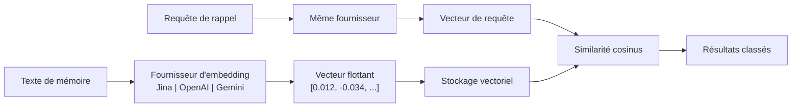

# Moteur d'embedding

Le moteur d'embedding est le fondement de la capacité de récupération sémantique de PRX-Memory. Il convertit les textes de mémoire en vecteurs de haute dimension qui capturent le sens, permettant une recherche basée sur la similarité qui va au-delà de la correspondance par mots-clés.

## Fonctionnement

Lorsqu'une mémoire est stockée avec l'embedding activé, PRX-Memory :

1. Envoie le texte de la mémoire au fournisseur d'embedding configuré.
2. Reçoit une représentation vectorielle (typiquement 768--3072 dimensions).
3. Stocke le vecteur aux côtés des métadonnées de la mémoire.
4. Utilise le vecteur pour la recherche par similarité cosinus lors du rappel.



## Architecture du fournisseur

Le crate `prx-memory-embed` définit un trait de fournisseur que tous les backends d'embedding implémentent. Cette conception permet de changer de fournisseur sans modifier le code de l'application.

Fournisseurs pris en charge :

| Fournisseur | Clé d'environnement | Description |
|----------|----------------|-------------|
| Compatible OpenAI | `PRX_EMBED_PROVIDER=openai-compatible` | Toute API compatible OpenAI (OpenAI, Azure, serveurs locaux) |
| Jina | `PRX_EMBED_PROVIDER=jina` | Modèles d'embedding Jina AI |
| Gemini | `PRX_EMBED_PROVIDER=gemini` | Modèles d'embedding Google Gemini |

## Configuration

Définissez le fournisseur et les identifiants via des variables d'environnement :

```bash
PRX_EMBED_PROVIDER=jina
PRX_EMBED_API_KEY=your_api_key
PRX_EMBED_MODEL=jina-embeddings-v3
PRX_EMBED_BASE_URL=https://api.jina.ai  # optionnel, pour les points de terminaison personnalisés
```

::: tip Clés de fallback du fournisseur
Si `PRX_EMBED_API_KEY` n'est pas défini, le système revient aux clés spécifiques au fournisseur :
- Jina : `JINA_API_KEY`
- Gemini : `GEMINI_API_KEY`
:::

## Quand activer les embeddings

| Scénario | Embeddings nécessaires ? |
|----------|--------------------|
| Petit ensemble de mémoire (<100 entrées) | Optionnel -- la recherche lexicale peut suffire |
| Grand ensemble de mémoire (1000+ entrées) | Recommandé -- la similarité vectorielle améliore grandement le rappel |
| Requêtes en langage naturel | Recommandé -- capture le sens sémantique |
| Filtrage exact par étiquette/portée | Non requis -- la recherche lexicale gère cela |
| Rappel multilingue | Recommandé -- les modèles multilingues fonctionnent dans plusieurs langues |

## Caractéristiques de performance

- **Latence :** 50--200ms par appel d'embedding selon le fournisseur et le modèle.
- **Mode batch :** Regroupez plusieurs textes dans un seul appel API pour réduire les allers-retours.
- **Mise en cache locale :** Les vecteurs sont stockés localement et réutilisés ; seules les mémoires nouvelles ou modifiées nécessitent des appels d'embedding.
- **Benchmark 100k :** Récupération p95 sous 123ms pour rappel lexical+importance+récence sur 100 000 entrées (sans appels réseau).

## Étapes suivantes

- [Modèles pris en charge](./models) -- Comparaison détaillée des modèles
- [Traitement par lots](./batch-processing) -- Embedding en masse efficace
- [Reranking](../reranking/) -- Reranking en deuxième étape pour une meilleure précision
