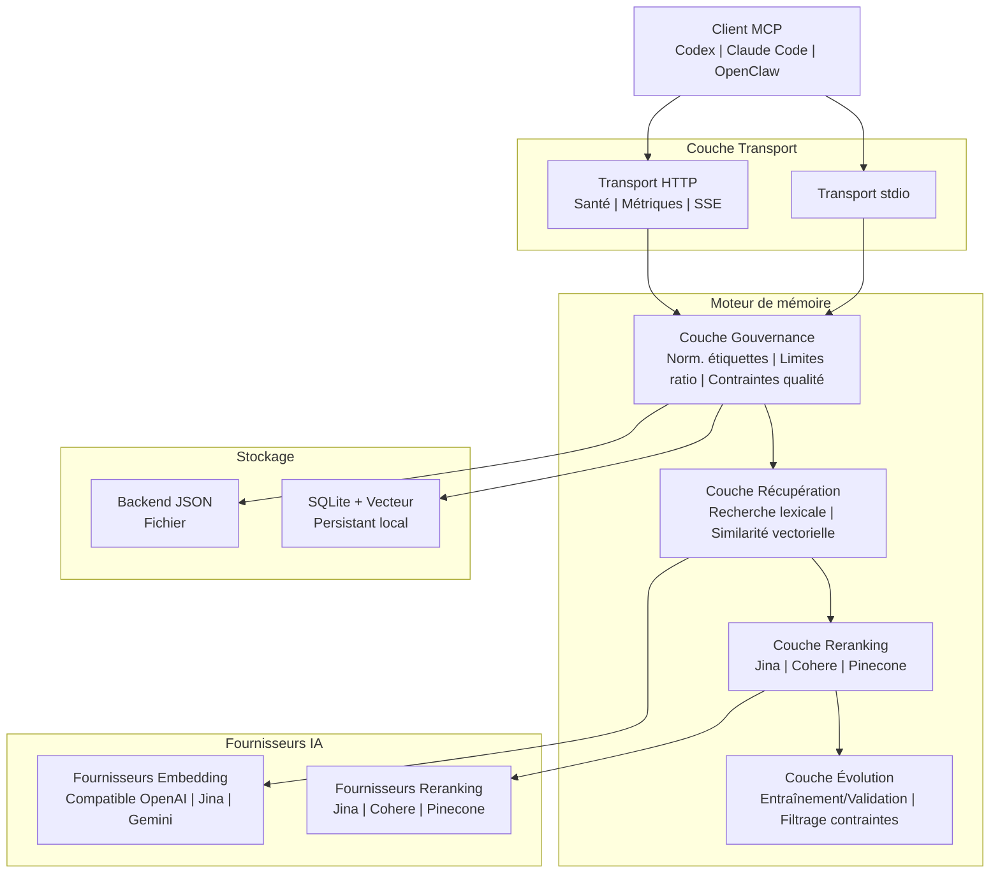

# PRX-Memory

**PRX-Memory** est un moteur de mémoire sémantique local conçu pour les agents de codage. Il combine la récupération basée sur l'embedding, le reranking, les contrôles de gouvernance et une évolution mesurable en un seul composant compatible MCP. PRX-Memory est livré comme un démon autonome (`prx-memoryd`) qui communique via stdio ou HTTP, le rendant compatible avec Codex, Claude Code, OpenClaw, OpenPRX et tout autre client MCP.

PRX-Memory se concentre sur les **connaissances d'ingénierie réutilisables**, pas sur les journaux bruts. Le système stocke des mémoires structurées avec des étiquettes, des portées et des scores d'importance, puis les récupère en combinant la recherche lexicale, la similarité vectorielle et le reranking optionnel -- le tout gouverné par des contraintes de qualité et de sécurité.

## Pourquoi PRX-Memory ?

La plupart des agents de codage traitent la mémoire comme une réflexion après coup -- fichiers plats, journaux non structurés ou services cloud propriétaires. PRX-Memory adopte une approche différente :

- **Local d'abord.** Toutes les données restent sur votre machine. Aucune dépendance cloud, aucune télémétrie, aucune donnée ne quitte votre réseau.
- **Structuré et gouverné.** Chaque entrée de mémoire suit un format standardisé avec des étiquettes, des portées, des catégories et des contraintes de qualité. La normalisation des étiquettes et les limites de ratio préviennent la dérive.
- **Récupération sémantique.** Combinez la correspondance lexicale avec la similarité vectorielle et le reranking optionnel pour trouver les mémoires les plus pertinentes pour un contexte donné.
- **Évolution mesurable.** L'outil `memory_evolve` utilise des divisions entraînement/validation et le filtrage par contraintes pour accepter ou rejeter les améliorations candidates -- sans approximation.
- **MCP natif.** Support de première classe pour le Model Context Protocol via les transports stdio et HTTP, avec des modèles de ressources, des manifestes de compétences et des sessions en streaming.

## Fonctionnalités clés

<div class="vp-features">

- **Embedding multi-fournisseurs** -- Prend en charge les fournisseurs d'embedding compatibles OpenAI, Jina et Gemini via une interface d'adaptateur unifiée. Changez de fournisseur en modifiant une variable d'environnement.

- **Pipeline de reranking** -- Reranking optionnel en deuxième étape utilisant les rerankeurs Jina, Cohere ou Pinecone pour améliorer la précision de récupération au-delà de la simple similarité vectorielle.

- **Contrôles de gouvernance** -- Le format de mémoire structurée avec normalisation des étiquettes, limites de ratio, maintenance périodique et contraintes de qualité garantit un niveau élevé de qualité de la mémoire dans le temps.

- **Évolution de la mémoire** -- L'outil `memory_evolve` évalue les changements candidats en utilisant des tests d'acceptation entraînement/validation et le filtrage par contraintes, fournissant des garanties d'amélioration mesurables.

- **Serveur MCP double transport** -- Exécutez en tant que serveur stdio pour une intégration directe ou en tant que serveur HTTP avec des vérifications de santé, des métriques Prometheus et des sessions en streaming.

- **Distribution de compétences** -- Packages de compétences de gouvernance intégrés découvrables via les protocoles de ressources et d'outils MCP, avec des modèles de payload pour des opérations de mémoire standardisées.

- **Observabilité** -- Point de terminaison de métriques Prometheus, modèles de tableau de bord Grafana, seuils d'alerte configurables et contrôles de cardinalité pour les déploiements en production.

</div>

## Architecture



## Démarrage rapide

Compilez et exécutez le démon de mémoire :

```bash
cargo build -p prx-memory-mcp --bin prx-memoryd

PRX_MEMORYD_TRANSPORT=stdio \
PRX_MEMORY_DB=./data/memory-db.json \
./target/debug/prx-memoryd
```

Ou installez via Cargo :

```bash
cargo install prx-memory-mcp
```

Consultez le [Guide d'installation](./getting-started/installation) pour toutes les méthodes et options de configuration.

## Crates du workspace

| Crate | Description |
|-------|-------------|
| `prx-memory-core` | Primitives de domaine pour le scoring et l'évolution |
| `prx-memory-embed` | Abstraction et adaptateurs du fournisseur d'embedding |
| `prx-memory-rerank` | Abstraction et adaptateurs du fournisseur de reranking |
| `prx-memory-ai` | Abstraction de fournisseur unifiée pour l'embedding et le reranking |
| `prx-memory-skill` | Payloads de compétences de gouvernance intégrés |
| `prx-memory-storage` | Moteur de stockage persistant local (JSON, SQLite, LanceDB) |
| `prx-memory-mcp` | Surface du serveur MCP avec transports stdio et HTTP |

## Sections de la documentation

| Section | Description |
|---------|-------------|
| [Installation](./getting-started/installation) | Compiler depuis les sources ou installer via Cargo |
| [Démarrage rapide](./getting-started/quickstart) | Mettre PRX-Memory en route en 5 minutes |
| [Moteur d'embedding](./embedding/) | Fournisseurs d'embedding et traitement par lots |
| [Modèles pris en charge](./embedding/models) | Modèles compatibles OpenAI, Jina, Gemini |
| [Moteur de reranking](./reranking/) | Pipeline de reranking en deuxième étape |
| [Backends de stockage](./storage/) | JSON, SQLite et recherche vectorielle |
| [Intégration MCP](./mcp/) | Protocole MCP, outils, ressources et modèles |
| [Référence API Rust](./api/) | API bibliothèque pour intégrer PRX-Memory dans des projets Rust |
| [Configuration](./configuration/) | Toutes les variables d'environnement et profils |
| [Dépannage](./troubleshooting/) | Problèmes courants et solutions |

## Informations sur le projet

- **Licence :** MIT OR Apache-2.0
- **Langage :** Rust (édition 2024)
- **Dépôt :** [github.com/openprx/prx-memory](https://github.com/openprx/prx-memory)
- **Rust minimum :** chaîne d'outils stable
- **Transports :** stdio, HTTP
