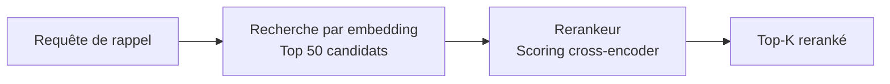

# Moteur de reranking

Le reranking est une étape optionnelle de récupération en deuxième étape qui réordonne les résultats candidats à l'aide d'un modèle cross-encoder dédié. Bien que la récupération basée sur l'embedding soit rapide, elle opère sur des vecteurs pré-calculés qui peuvent ne pas capturer la pertinence fine. Le reranking applique un modèle plus puissant à un ensemble candidat plus petit, améliorant significativement la précision.

## Fonctionnement

1. **Première étape (récupération) :** La recherche par similarité vectorielle retourne un large ensemble de candidats (par exemple, le top 50).
2. **Deuxième étape (reranking) :** Un modèle cross-encoder score chaque candidat par rapport à la requête, produisant un classement raffiné.
3. **Résultat final :** Les top-k résultats rerankés sont retournés à l'appelant.



## Pourquoi le reranking est important

| Métrique | Sans reranking | Avec reranking |
|--------|-------------------|----------------|
| Couverture de rappel | Élevée (récupération large) | Identique (inchangée) |
| Précision au top-5 | Modérée | Significativement améliorée |
| Latence | Plus faible (~50ms) | Plus élevée (~150ms supplémentaires) |
| Coût API | Embedding uniquement | Embedding + reranking |

Le reranking est le plus utile quand :

- Votre base de mémoire est grande (1000+ entrées).
- Les requêtes sont ambiguës ou en langage naturel.
- La précision en tête de la liste de résultats est plus importante que la latence.

## Fournisseurs pris en charge

| Fournisseur | Valeur de config | Description |
|----------|-------------|-------------|
| Jina | `PRX_RERANK_PROVIDER=jina` | Modèles de rerankeur Jina AI |
| Cohere | `PRX_RERANK_PROVIDER=cohere` | API de reranking Cohere |
| Pinecone | `PRX_RERANK_PROVIDER=pinecone` | Service de reranking Pinecone |
| Compatible Pinecone | `PRX_RERANK_PROVIDER=pinecone-compatible` | Points de terminaison compatibles Pinecone personnalisés |
| Aucun | `PRX_RERANK_PROVIDER=none` | Désactiver le reranking |

## Configuration

```bash
PRX_RERANK_PROVIDER=cohere
PRX_RERANK_API_KEY=your_cohere_key
PRX_RERANK_MODEL=rerank-v3.5
```

::: tip Clés de fallback du fournisseur
Si `PRX_RERANK_API_KEY` n'est pas défini, le système revient aux clés spécifiques au fournisseur :
- Jina : `JINA_API_KEY`
- Cohere : `COHERE_API_KEY`
- Pinecone : `PINECONE_API_KEY`
:::

## Désactiver le reranking

Pour fonctionner sans reranking, omettez la variable `PRX_RERANK_PROVIDER` ou définissez-la explicitement :

```bash
PRX_RERANK_PROVIDER=none
```

Le rappel fonctionne toujours en utilisant la correspondance lexicale et la similarité vectorielle sans l'étape de reranking.

## Étapes suivantes

- [Modèles de reranking](./models) -- Comparaison détaillée des modèles
- [Moteur d'embedding](../embedding/) -- Récupération en première étape
- [Référence de configuration](../configuration/) -- Toutes les variables d'environnement
