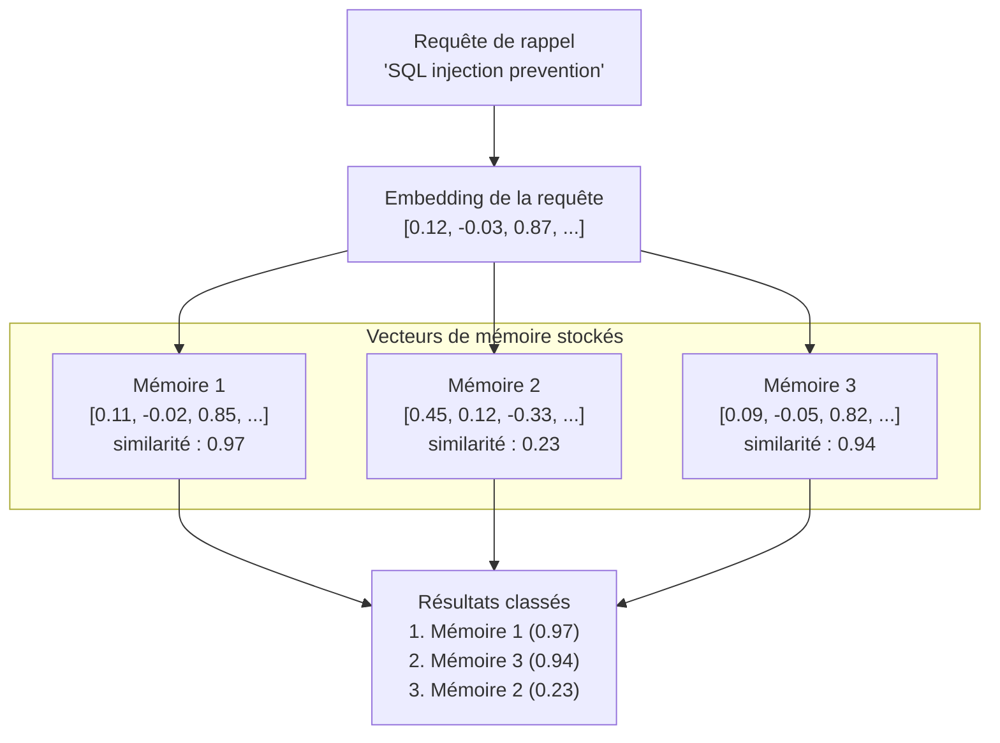

# Recherche vectorielle

La recherche vectorielle est le mécanisme central qui permet la récupération sémantique de mémoire dans PRX-Memory. Au lieu de faire correspondre des mots-clés, la recherche vectorielle compare la similarité mathématique entre les embeddings de la requête et de la mémoire pour trouver des résultats conceptuellement liés.

## Fonctionnement

1. **Embedding de la requête :** La requête de rappel est envoyée au fournisseur d'embedding configuré, produisant un vecteur.
2. **Calcul de similarité :** Le vecteur de requête est comparé à tous les vecteurs de mémoire stockés en utilisant la similarité cosinus.
3. **Scoring :** Chaque mémoire reçoit un score de similarité entre -1.0 et 1.0 (plus élevé = plus similaire).
4. **Classement :** Les résultats sont triés par score et combinés avec d'autres signaux (correspondance lexicale, importance, récence).



## Similarité cosinus

PRX-Memory utilise la similarité cosinus comme métrique de distance. La similarité cosinus mesure l'angle entre deux vecteurs, en ignorant la magnitude :

```
similarité(A, B) = (A . B) / (|A| * |B|)
```

| Score | Signification |
|-------|---------|
| 0.95--1.0 | Sens quasi-identique |
| 0.80--0.95 | Très liés |
| 0.60--0.80 | Quelque peu liés |
| < 0.60 | Probablement non liés |

## Classement combiné

La similarité vectorielle est un signal dans le classement multi-signal de PRX-Memory. Le score final combine :

| Signal | Poids | Description |
|--------|--------|-------------|
| Similarité vectorielle | Élevé | Pertinence sémantique de la comparaison d'embeddings |
| Correspondance lexicale | Moyen | Chevauchement de mots-clés entre la requête et le texte de mémoire |
| Score d'importance | Moyen | Importance assignée par l'utilisateur ou calculée par le système |
| Récence | Faible | Les mémoires plus récentes reçoivent un petit bonus |

La pondération exacte dépend de la configuration de rappel et de l'activation des embeddings et du reranking.

## Performance

Le benchmark à 100k entrées montre :

| Métrique | Valeur |
|--------|-------|
| Taille du jeu de données | 100 000 entrées |
| Latence p95 | 122,683ms |
| Seuil | < 300ms |
| Méthode | Lexical + importance + récence (sans appels réseau) |

::: info
Ce benchmark mesure uniquement le chemin de classement de récupération, sans appels réseau d'embedding ou de reranking. La latence de bout en bout dépend des temps de réponse du fournisseur.
:::

## Considérations de mise à l'échelle

| Taille du jeu de données | Approche recommandée |
|-------------|---------------------|
| < 10 000 | Similarité cosinus par force brute (backend JSON ou SQLite) |
| 10 000--100 000 | SQLite avec scan vectoriel en mémoire |
| > 100 000 | LanceDB avec indexation ANN |

Pour les jeux de données dépassant 100 000 entrées, activez le backend LanceDB pour la recherche par plus proche voisin approximatif (ANN), qui fournit un temps de requête sous-linéaire.

## Étapes suivantes

- [Moteur d'embedding](../embedding/) -- Comment les vecteurs sont générés
- [Reranking](../reranking/) -- Amélioration de précision en deuxième étape
- [Backends de stockage](./index) -- Choisir le bon backend de stockage
