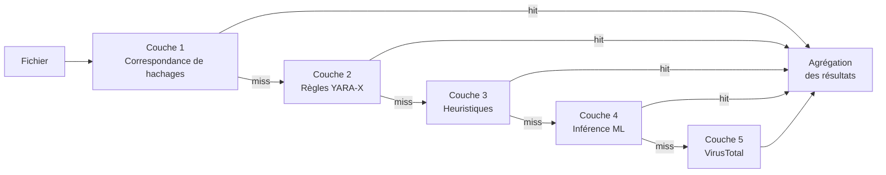

# Moteur de détection

PRX-SD utilise un pipeline de détection multicouche pour identifier les logiciels malveillants. Chaque couche utilise une technique différente et s'exécute en séquence du plus rapide au plus approfondi. Cette approche de défense en profondeur garantit que même si une couche rate une menace, les couches suivantes peuvent la détecter.

## Présentation du pipeline

Le pipeline de détection traite chaque fichier à travers jusqu'à cinq couches :



## Résumé des couches

| Couche | Moteur | Vitesse | Couverture | Requis |
|--------|--------|---------|------------|--------|
| **Couche 1** | Correspondance de hachages LMDB | ~1 microseconde/fichier | Logiciels malveillants connus (correspondance exacte) | Oui (par défaut) |
| **Couche 2** | Analyse de règles YARA-X | ~0,3 ms/fichier | Basé sur des motifs (38 800+ règles) | Oui (par défaut) |
| **Couche 3** | Analyse heuristique | ~1-5 ms/fichier | Indicateurs comportementaux par type de fichier | Oui (par défaut) |
| **Couche 4** | Inférence ML ONNX | ~10-50 ms/fichier | Logiciels malveillants nouveaux/polymorphes | Optionnel (`--features ml`) |
| **Couche 5** | API VirusTotal | ~200-500 ms/fichier | Consensus de 70+ fournisseurs | Optionnel (`--features virustotal`) |

## Couche 1 : Correspondance de hachages

La couche la plus rapide. PRX-SD calcule le hachage SHA-256 de chaque fichier et le recherche dans une base de données LMDB contenant des hachages connus comme malveillants. LMDB fournit un temps de recherche en O(1) avec des E/S mappées en mémoire, rendant cette couche essentiellement gratuite en termes de performance.

**Sources de données :**
- abuse.ch MalwareBazaar (dernières 48 heures, mises à jour toutes les 5 minutes)
- abuse.ch URLhaus (mises à jour horaires)
- abuse.ch Feodo Tracker (Emotet/Dridex/TrickBot, toutes les 5 minutes)
- abuse.ch ThreatFox (plateforme de partage d'IOC)
- VirusShare (20M+ hachages MD5, mise à jour `--full` optionnelle)
- Liste de blocage intégrée (EICAR, WannaCry, NotPetya, Emotet, et plus)

Une correspondance de hachage produit immédiatement un verdict `MALICIOUS`. Les couches restantes sont ignorées pour ce fichier.

Consultez [Correspondance de hachages](./hash-matching) pour les détails.

## Couche 2 : Règles YARA-X

Si aucune correspondance de hachage n'est trouvée, le fichier est analysé avec plus de 38 800 règles YARA en utilisant le moteur YARA-X (la réécriture Rust de nouvelle génération de YARA). Les règles détectent les logiciels malveillants en faisant correspondre des motifs d'octets, des chaînes et des conditions structurelles dans le contenu des fichiers.

**Sources de règles :**
- 64 règles intégrées (ransomwares, chevaux de Troie, backdoors, rootkits, mineurs, webshells)
- Yara-Rules/rules (maintenus par la communauté, GitHub)
- Neo23x0/signature-base (règles de haute qualité pour les APT et les logiciels malveillants courants)
- ReversingLabs YARA (règles open-source de qualité commerciale)
- ESET IOC (suivi des menaces persistantes avancées)
- InQuest (logiciels malveillants dans les documents : OLE, DDE, macros malveillantes)

Une correspondance de règle YARA produit un verdict `MALICIOUS` avec le nom de la règle inclus dans le rapport.

Consultez [Règles YARA](./yara-rules) pour les détails.

## Couche 3 : Analyse heuristique

Les fichiers qui passent les vérifications de hachage et YARA sont analysés à l'aide d'heuristiques adaptées au type de fichier. PRX-SD identifie le type de fichier via la détection par nombre magique et applique des vérifications ciblées :

| Type de fichier | Vérifications heuristiques |
|-----------------|---------------------------|
| PE (Windows) | Entropie des sections, imports d'API suspects, détection de packer, anomalies d'horodatage |
| ELF (Linux) | Entropie des sections, références LD_PRELOAD, persistance cron/systemd, motifs de backdoor SSH |
| Mach-O (macOS) | Entropie des sections, injection dylib, persistance LaunchAgent, accès au trousseau |
| Office (docx/xlsx) | Macros VBA, champs DDE, liens de modèles externes, déclencheurs d'exécution automatique |
| PDF | JavaScript intégré, actions Launch, actions URI, flux obfusqués |

Chaque vérification contribue à un score cumulatif :

| Score | Verdict |
|-------|---------|
| 0 - 29 | **Propre** |
| 30 - 59 | **Suspect** -- révision manuelle recommandée |
| 60 - 100 | **Malveillant** -- menace à haute confiance |

Consultez [Analyse heuristique](./heuristics) pour les détails.

## Couche 4 : Inférence ML (optionnel)

Lorsque compilé avec la fonctionnalité `ml`, PRX-SD peut faire passer les fichiers par un modèle d'apprentissage automatique ONNX entraîné sur des millions d'échantillons de logiciels malveillants. Cette couche est particulièrement efficace pour détecter les logiciels malveillants nouveaux et polymorphes qui échappent à la détection basée sur les signatures.

```bash
# Compiler avec le support ML
cargo build --release --features ml
```

Le modèle ML s'exécute localement en utilisant ONNX Runtime. Aucune connexion cloud n'est requise.

::: tip Quand utiliser le ML
L'inférence ML ajoute une latence (~10-50 ms par fichier). Activez-la pour des analyses ciblées de fichiers ou de répertoires suspects, plutôt que pour des analyses complètes du disque où les trois premières couches offrent une couverture suffisante.
:::

## Couche 5 : VirusTotal (optionnel)

Lorsque compilé avec la fonctionnalité `virustotal` et configuré avec une clé API, PRX-SD peut soumettre des hachages de fichiers à VirusTotal pour un consensus de 70+ fournisseurs d'antivirus.

```bash
# Compiler avec le support VirusTotal
cargo build --release --features virustotal

# Configurer la clé API
sd config set virustotal.api_key "YOUR_API_KEY"
```

::: warning Limites de débit
L'API VirusTotal gratuite autorise 4 requêtes par minute et 500 par jour. PRX-SD respecte automatiquement ces limites. Cette couche est mieux utilisée comme étape de confirmation finale, pas pour l'analyse en masse.
:::

## Agrégation des résultats

Lorsqu'un fichier est analysé sur plusieurs couches, le verdict final est déterminé par la **gravité la plus élevée** trouvée dans toutes les couches :

```
MALICIOUS > SUSPICIOUS > CLEAN
```

Si la couche 1 retourne `MALICIOUS`, le fichier est signalé comme malveillant indépendamment de ce que les autres couches pourraient dire. Si la couche 3 retourne `SUSPICIOUS` et qu'aucune autre couche ne retourne `MALICIOUS`, le fichier est signalé comme suspect.

Le rapport d'analyse inclut des détails de chaque couche qui a produit un résultat, donnant à l'analyste un contexte complet.

## Désactiver des couches

Pour des cas d'utilisation spécialisés, les couches individuelles peuvent être désactivées :

```bash
# Analyse par hachage uniquement (la plus rapide, menaces connues uniquement)
sd scan /path --no-yara --no-heuristics

# Ignorer les heuristiques (hachage + YARA uniquement)
sd scan /path --no-heuristics
```

## Étapes suivantes

- [Correspondance de hachages](./hash-matching) -- Plongée approfondie dans la base de données de hachages LMDB
- [Règles YARA](./yara-rules) -- Sources de règles et gestion des règles personnalisées
- [Analyse heuristique](./heuristics) -- Vérifications comportementales adaptées au type de fichier
- [Types de fichiers supportés](./file-types) -- Matrice des formats de fichiers et détection par nombre magique
