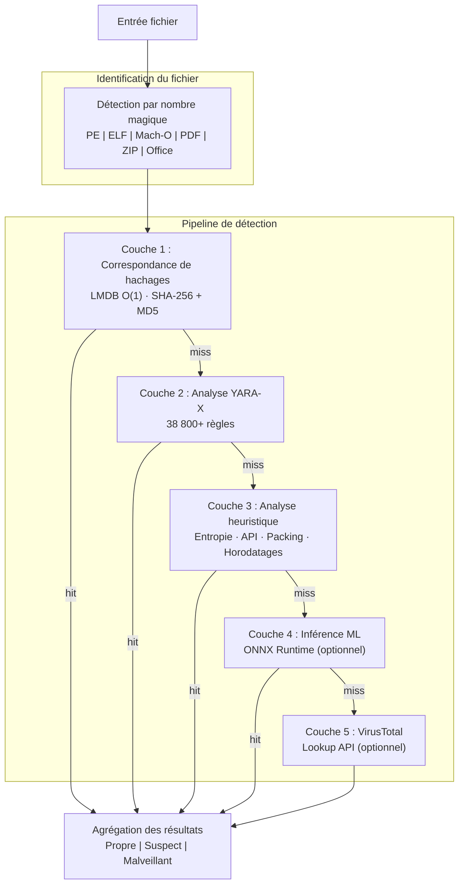

# PRX-SD

**PRX-SD** est un moteur antivirus open-source haute performance écrit en Rust. Il combine la correspondance de signatures par hachage, plus de 38 800 règles YARA, une analyse heuristique adaptée au type de fichier et une inférence ML optionnelle dans un pipeline de détection multicouche unique. PRX-SD se présente sous la forme d'un outil en ligne de commande (`sd`), d'un démon système pour la protection en temps réel et d'une interface graphique de bureau Tauri + Vue 3.

PRX-SD est conçu pour les ingénieurs en sécurité, les administrateurs système et les intervenants en cas d'incident qui ont besoin d'un moteur de détection de logiciels malveillants rapide, transparent et extensible -- capable d'analyser des millions de fichiers, de surveiller des répertoires en temps réel, de détecter les rootkits et de s'intégrer avec des flux de renseignements sur les menaces externes -- sans dépendre de boîtes noires commerciales opaques.

## Pourquoi PRX-SD ?

Les produits antivirus traditionnels sont à source fermée, gourmands en ressources et difficiles à personnaliser. PRX-SD adopte une approche différente :

- **Ouvert et auditable.** Chaque règle de détection, vérification heuristique et seuil de notation est visible dans le code source. Pas de télémétrie cachée, pas de dépendance cloud requise.
- **Défense multicouche.** Cinq couches de détection indépendantes garantissent que si une méthode rate une menace, la suivante la détecte.
- **Performance Rust-first.** L'I/O sans copie, les lookups de hachage LMDB en O(1) et l'analyse parallèle offrent un débit qui rivalise avec les moteurs commerciaux sur du matériel standard.
- **Extensible par conception.** Les plugins WASM, les règles YARA personnalisées et une architecture modulaire rendent PRX-SD facile à adapter à des environnements spécialisés.

## Fonctionnalités clés

<div class="vp-features">

- **Pipeline de détection multicouche** -- La correspondance de hachages, les règles YARA-X, l'analyse heuristique, l'inférence ML optionnelle et l'intégration VirusTotal optionnelle fonctionnent en séquence pour maximiser les taux de détection.

- **Protection en temps réel** -- Le démon `sd monitor` surveille les répertoires via inotify (Linux) / FSEvents (macOS) et analyse instantanément les fichiers nouveaux ou modifiés.

- **Défense contre les ransomwares** -- Des règles YARA et des heuristiques dédiées détectent les familles de ransomwares incluant WannaCry, LockBit, Conti, REvil, BlackCat, et plus.

- **Plus de 38 800 règles YARA** -- Agrégées depuis 8 sources communautaires et commerciales : Yara-Rules, Neo23x0 signature-base, ReversingLabs, ESET IOC, InQuest et 64 règles intégrées.

- **Base de données de hachages LMDB** -- Les hachages SHA-256 et MD5 provenant de abuse.ch MalwareBazaar, URLhaus, Feodo Tracker, ThreatFox, VirusShare (20M+) et d'une liste de blocage intégrée sont stockés dans LMDB pour des lookups en O(1).

- **Multiplateforme** -- Linux (x86_64, aarch64), macOS (Apple Silicon, Intel) et Windows (WSL2). Détection native du type de fichier pour les formats PE, ELF, Mach-O, PDF, Office et archive.

- **Système de plugins WASM** -- Étendez la logique de détection, ajoutez des scanners personnalisés ou intégrez des flux de menaces propriétaires via des plugins WebAssembly.

</div>

## Architecture



## Installation rapide

```bash
curl -fsSL https://raw.githubusercontent.com/openprx/prx-sd/main/install.sh | bash
```

Ou installer via Cargo :

```bash
cargo install prx-sd
```

Puis mettre à jour la base de données de signatures :

```bash
sd update
```

Consultez le [Guide d'installation](./getting-started/installation) pour toutes les méthodes, y compris Docker et la compilation depuis les sources.

## Sections de documentation

| Section | Description |
|---------|-------------|
| [Installation](./getting-started/installation) | Installer PRX-SD sur Linux, macOS ou Windows WSL2 |
| [Démarrage rapide](./getting-started/quickstart) | Mettre PRX-SD en marche en 5 minutes |
| [Analyse de fichiers et répertoires](./scanning/file-scan) | Référence complète de la commande `sd scan` |
| [Analyse de la mémoire](./scanning/memory-scan) | Analyser la mémoire des processus en cours d'exécution |
| [Détection de rootkits](./scanning/rootkit) | Détecter les rootkits kernel et espace utilisateur |
| [Analyse USB](./scanning/usb-scan) | Analyser automatiquement les supports amovibles |
| [Moteur de détection](./detection/) | Fonctionnement du pipeline multicouche |
| [Correspondance de hachages](./detection/hash-matching) | Base de données de hachages LMDB et sources de données |
| [Règles YARA](./detection/yara-rules) | 38 800+ règles provenant de 8 sources |
| [Analyse heuristique](./detection/heuristics) | Analyse comportementale adaptée au type de fichier |
| [Types de fichiers supportés](./detection/file-types) | Matrice des formats de fichiers et détection par nombre magique |

## Informations sur le projet

- **Licence :** MIT OR Apache-2.0
- **Langage :** Rust (édition 2024)
- **Dépôt :** [github.com/openprx/prx-sd](https://github.com/openprx/prx-sd)
- **Rust minimum :** 1.85.0
- **Interface graphique :** Tauri 2 + Vue 3
