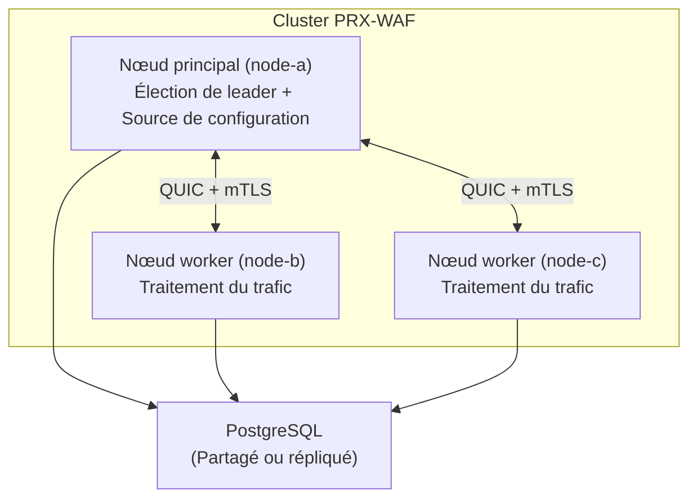

# Mode cluster

PRX-WAF prend en charge les déploiements en cluster multi-nœuds pour la mise à l'échelle horizontale et la haute disponibilité. Le mode cluster utilise la communication inter-nœuds basée sur QUIC, l'élection de leader inspirée de Raft et la synchronisation automatique des règles, de la configuration et des événements de sécurité à travers tous les nœuds.

::: info
Le mode cluster est entièrement optionnel. Par défaut, PRX-WAF s'exécute en mode autonome sans surcoût de cluster. Activez-le en ajoutant une section `[cluster]` à votre configuration.
:::

## Architecture

Un cluster PRX-WAF se compose d'un nœud **principal** et d'un ou plusieurs nœuds **worker** :



### Rôles des nœuds

| Rôle | Description |
|------|-------------|
| `main` | Détient la configuration et l'ensemble de règles faisant autorité. Pousse les mises à jour vers les workers. Participe à l'élection de leader. |
| `worker` | Traite le trafic et applique le pipeline WAF. Reçoit les mises à jour de configuration et de règles du nœud principal. Renvoie les événements de sécurité au principal. |
| `auto` | Participe à l'élection de leader inspirée de Raft. N'importe quel nœud peut devenir le principal. |

## Ce qui est synchronisé

| Données | Direction | Intervalle |
|------|-----------|----------|
| Règles | Principal vers Workers | Toutes les 10s (configurable) |
| Configuration | Principal vers Workers | Toutes les 30s (configurable) |
| Événements de sécurité | Workers vers Principal | Toutes les 5s ou 100 événements (selon ce qui arrive en premier) |
| Statistiques | Workers vers Principal | Toutes les 10s |

## Communication inter-nœuds

Toute la communication de cluster utilise QUIC (via Quinn) sur UDP avec TLS mutuel (mTLS) :

- **Port :** `16851` (défaut)
- **Chiffrement :** mTLS avec certificats auto-générés ou pré-provisionnés
- **Protocole :** Protocole binaire personnalisé sur les flux QUIC
- **Connexion :** Persistante avec reconnexion automatique

## Élection de leader

Lorsque `role = "auto"` est configuré, les nœuds utilisent un protocole d'élection inspiré de Raft :

| Paramètre | Défaut | Description |
|-----------|---------|-------------|
| `timeout_min_ms` | `150` | Délai d'élection minimum (plage aléatoire) |
| `timeout_max_ms` | `300` | Délai d'élection maximum (plage aléatoire) |
| `heartbeat_interval_ms` | `50` | Intervalle de heartbeat principal vers worker |
| `phi_suspect` | `8.0` | Seuil de suspicion du détecteur de défaillances phi accrual |
| `phi_dead` | `12.0` | Seuil mort du détecteur de défaillances phi accrual |

Lorsque le nœud principal devient inaccessible, les workers attendent un délai aléatoire dans la plage configurée avant d'initier une élection. Le premier nœud à recevoir une majorité de votes devient le nouveau principal.

## Surveillance de la santé

Le vérificateur de santé du cluster s'exécute sur chaque nœud et surveille la connectivité des pairs :

```toml
[cluster.health]
check_interval_secs   = 5    # Fréquence de vérification de santé
max_missed_heartbeats = 3    # Marquer le pair comme non sain après N manques
```

Les nœuds non sains sont exclus du cluster jusqu'à leur récupération et re-synchronisation.

## Gestion des certificats

Les nœuds de cluster s'authentifient mutuellement en utilisant des certificats mTLS :

- **Mode auto-génération :** Le nœud principal génère un certificat CA et signe les certificats de nœuds automatiquement au premier démarrage. Les nœuds worker reçoivent leurs certificats pendant le processus d'adhésion.
- **Mode pré-provisionné :** Les certificats sont générés hors ligne et distribués à chaque nœud avant le démarrage.

```toml
[cluster.crypto]
ca_cert        = "/certs/cluster-ca.pem"
node_cert      = "/certs/node-a.pem"
node_key       = "/certs/node-a.key"
auto_generate  = true
ca_validity_days    = 3650   # 10 ans
node_validity_days  = 365    # 1 an
renewal_before_days = 7      # Auto-renouveler 7 jours avant expiration
```

## Étapes suivantes

- [Déploiement cluster](./deployment) -- Guide de configuration multi-nœuds étape par étape
- [Référence de configuration](../configuration/reference) -- Toutes les clés de configuration du cluster
- [Dépannage](../troubleshooting/) -- Problèmes courants de cluster
