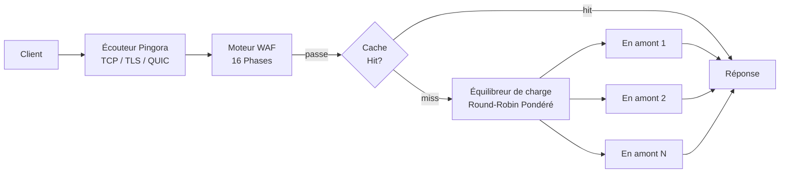

# Passerelle

PRX-WAF est construit sur [Pingora](https://github.com/cloudflare/pingora), la bibliothèque proxy HTTP Rust de Cloudflare. La passerelle gère tout le trafic entrant, achemine les requêtes vers les backends en amont et applique le pipeline de détection WAF avant de les transmettre.

## Support des protocoles

| Protocole | État | Notes |
|----------|--------|-------|
| HTTP/1.1 | Pris en charge | Par défaut |
| HTTP/2 | Pris en charge | Mise à niveau automatique via ALPN |
| HTTP/3 (QUIC) | Optionnel | Via la bibliothèque Quinn, nécessite la config `[http3]` |
| WebSocket | Pris en charge | Proxying full duplex |

## Fonctionnalités clés

### Équilibrage de charge

PRX-WAF distribue le trafic entre les backends en amont en utilisant l'équilibrage de charge round-robin pondéré. Chaque entrée d'hôte peut spécifier plusieurs serveurs en amont avec des poids relatifs :

```toml
[[hosts]]
host        = "example.com"
port        = 80
remote_host = "10.0.0.1"
remote_port = 8080
guard_status = true
```

Les hôtes peuvent également être gérés via l'interface d'administration ou l'API REST à `/api/hosts`.

### Mise en cache des réponses

La passerelle inclut un cache LRU en mémoire basé sur moka pour réduire la charge sur les serveurs en amont :

```toml
[cache]
enabled          = true
max_size_mb      = 256       # Taille maximale du cache
default_ttl_secs = 60        # TTL par défaut pour les réponses mises en cache
max_ttl_secs     = 3600      # Plafond TTL maximum
```

Le cache respecte les en-têtes de cache HTTP standard (`Cache-Control`, `Expires`, `ETag`, `Last-Modified`) et prend en charge l'invalidation du cache via l'API d'administration.

### Tunnels inversés

PRX-WAF peut créer des tunnels inversés basés sur WebSocket (similaires aux tunnels Cloudflare) pour exposer les services internes sans ouvrir les ports de pare-feu entrants :

```bash
# Lister les tunnels actifs
curl -H "Authorization: Bearer $TOKEN" http://localhost:9527/api/tunnels

# Créer un tunnel
curl -X POST -H "Authorization: Bearer $TOKEN" \
  -H "Content-Type: application/json" \
  -d '{"name":"internal-api","target":"http://192.168.1.10:3000"}' \
  http://localhost:9527/api/tunnels
```

### Anti-hotlinking

La passerelle prend en charge la protection anti-hotlink basée sur Referer par hôte. Lorsqu'activé, les requêtes sans en-tête Referer valide depuis le domaine configuré sont bloquées. Cela est configuré par hôte dans l'interface d'administration ou via l'API.

## Architecture



## Étapes suivantes

- [Proxy inverse](./reverse-proxy) -- Configuration détaillée du routage backend et de l'équilibrage de charge
- [SSL/TLS](./ssl-tls) -- Configuration HTTPS, Let's Encrypt et HTTP/3
- [Référence de configuration](../configuration/reference) -- Toutes les clés de configuration de la passerelle
