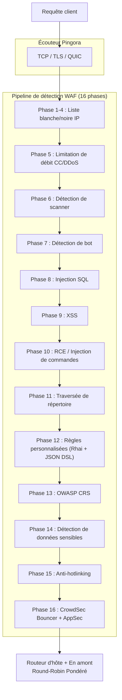

# PRX-WAF

**PRX-WAF** est un proxy de pare-feu d'applications web prêt pour la production, construit sur [Pingora](https://github.com/cloudflare/pingora) (la bibliothèque proxy HTTP Rust de Cloudflare). Il combine un pipeline de détection d'attaques en 16 phases, un moteur de script Rhai, le support OWASP CRS, l'import de règles ModSecurity, l'intégration CrowdSec, des plugins WASM et une interface d'administration Vue 3 en un seul binaire déployable.

PRX-WAF est conçu pour les ingénieurs DevOps, les équipes de sécurité et les opérateurs de plateforme qui ont besoin d'un WAF rapide, transparent et extensible -- capable de traiter des millions de requêtes, de détecter les attaques OWASP Top 10, de renouveler automatiquement les certificats TLS, de s'adapter horizontalement avec le mode cluster, et de s'intégrer avec des flux externes de renseignements sur les menaces -- sans dépendre de services WAF cloud propriétaires.

## Pourquoi PRX-WAF ?

Les produits WAF traditionnels sont propriétaires, coûteux et difficiles à personnaliser. PRX-WAF adopte une approche différente :

- **Ouvert et auditable.** Chaque règle de détection, seuil et mécanisme de notation est visible dans le code source. Pas de collecte de données cachée, pas de verrouillage fournisseur.
- **Défense multi-phases.** 16 phases de détection séquentielles garantissent que si un contrôle manque une attaque, les phases suivantes la détectent.
- **Performance Rust en premier.** Construit sur Pingora, PRX-WAF atteint un débit proche du débit maximal avec un surcoût de latence minimal sur du matériel standard.
- **Extensible par conception.** Les règles YAML, les scripts Rhai, les plugins WASM et l'import de règles ModSecurity rendent PRX-WAF facile à adapter à n'importe quelle pile d'applications.

## Fonctionnalités clés

<div class="vp-features">

- **Proxy inverse Pingora** -- HTTP/1.1, HTTP/2 et HTTP/3 via QUIC (Quinn). Équilibrage de charge round-robin pondéré entre les backends en amont.

- **Pipeline de détection en 16 phases** -- Liste blanche/noire IP, limitation de débit CC/DDoS, détection de scanner, détection de bot, SQLi, XSS, RCE, traversée de répertoire, règles personnalisées, OWASP CRS, détection de données sensibles, anti-hotlinking et intégration CrowdSec.

- **Moteur de règles YAML** -- Règles YAML déclaratives avec 11 opérateurs, 12 champs de requête, niveaux de paranoïa 1-4 et rechargement à chaud sans interruption de service.

- **Support OWASP CRS** -- 310+ règles converties depuis l'OWASP ModSecurity Core Rule Set v4, couvrant SQLi, XSS, RCE, LFI, RFI, détection de scanner et plus.

- **Intégration CrowdSec** -- Mode bouncer (cache de décisions depuis LAPI), mode AppSec (inspection HTTP à distance) et log pusher pour le renseignement communautaire sur les menaces.

- **Mode cluster** -- Communication inter-nœuds basée sur QUIC, élection de leader inspirée de Raft, synchronisation automatique des règles/configurations/événements et gestion des certificats mTLS.

- **Interface d'administration Vue 3** -- Authentification JWT + TOTP, surveillance WebSocket en temps réel, gestion des hôtes, gestion des règles et tableaux de bord des événements de sécurité.

- **Automatisation SSL/TLS** -- Let's Encrypt via ACME v2 (instant-acme), renouvellement automatique des certificats et support HTTP/3 QUIC.

</div>

## Architecture

PRX-WAF est organisé comme un espace de travail Cargo de 7 crates :

| Crate | Rôle |
|-------|------|
| `prx-waf` | Binaire : point d'entrée CLI, bootstrap du serveur |
| `gateway` | Proxy Pingora, HTTP/3, automatisation SSL, mise en cache, tunnels |
| `waf-engine` | Pipeline de détection, moteur de règles, vérifications, plugins, CrowdSec |
| `waf-storage` | Couche PostgreSQL (sqlx), migrations, modèles |
| `waf-api` | API REST Axum, auth JWT/TOTP, WebSocket, UI statique |
| `waf-common` | Types partagés : RequestCtx, WafDecision, HostConfig, config |
| `waf-cluster` | Consensus de cluster, transport QUIC, synchronisation des règles, gestion des certificats |

### Flux de requêtes



## Installation rapide

```bash
git clone https://github.com/openprx/prx-waf
cd prx-waf
docker compose up -d
```

Interface d'administration : `http://localhost:9527` (identifiants par défaut : `admin` / `admin`)

Consultez le [Guide d'installation](./getting-started/installation) pour toutes les méthodes, y compris l'installation Cargo et la compilation depuis les sources.

## Sections de documentation

| Section | Description |
|---------|-------------|
| [Installation](./getting-started/installation) | Installer PRX-WAF via Docker, Cargo ou compilation depuis les sources |
| [Démarrage rapide](./getting-started/quickstart) | Protéger votre application en 5 minutes |
| [Moteur de règles](./rules/) | Comment fonctionne le moteur de règles YAML |
| [Syntaxe YAML](./rules/yaml-syntax) | Référence complète du schéma de règles YAML |
| [Règles intégrées](./rules/builtin-rules) | OWASP CRS, ModSecurity, correctifs CVE |
| [Règles personnalisées](./rules/custom-rules) | Écrire vos propres règles de détection |
| [Passerelle](./gateway/) | Présentation du proxy inverse Pingora |
| [Proxy inverse](./gateway/reverse-proxy) | Routage backend et équilibrage de charge |
| [SSL/TLS](./gateway/ssl-tls) | HTTPS, Let's Encrypt, HTTP/3 |
| [Mode cluster](./cluster/) | Présentation du déploiement multi-nœuds |
| [Déploiement cluster](./cluster/deployment) | Configuration de cluster étape par étape |
| [Interface d'administration](./admin-ui/) | Tableau de bord d'administration Vue 3 |
| [Configuration](./configuration/) | Présentation de la configuration |
| [Référence de configuration](./configuration/reference) | Chaque clé TOML documentée |
| [Référence CLI](./cli/) | Toutes les commandes et sous-commandes CLI |
| [Dépannage](./troubleshooting/) | Problèmes courants et solutions |

## Informations sur le projet

- **Licence :** MIT OR Apache-2.0
- **Langage :** Rust (édition 2024)
- **Dépôt :** [github.com/openprx/prx-waf](https://github.com/openprx/prx-waf)
- **Rust minimum :** 1.82.0
- **Interface d'administration :** Vue 3 + Tailwind CSS
- **Base de données :** PostgreSQL 16+
