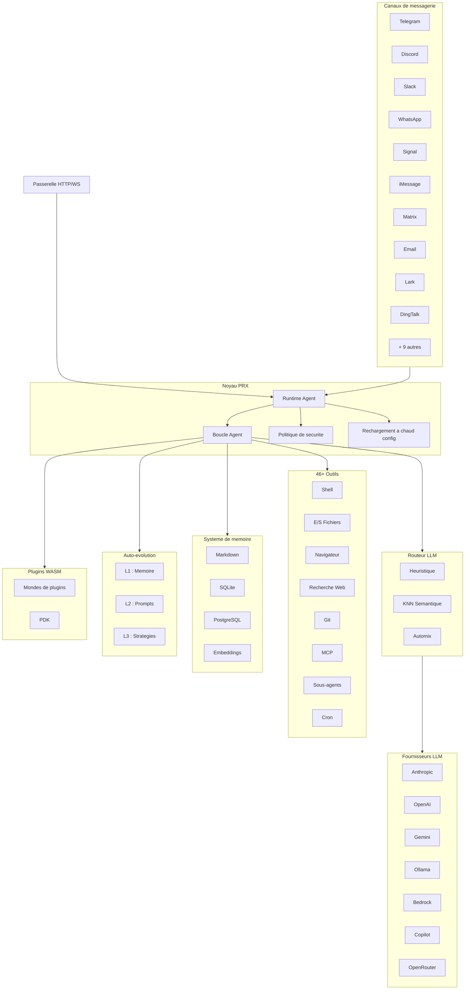

# PRX

**PRX** est un runtime d'agent IA haute performance et auto-evolutif ecrit en Rust. Il connecte les grands modeles de langage a 19 plateformes de messagerie, fournit plus de 46 outils integres, prend en charge les extensions par plugins WASM, et ameliore de maniere autonome son propre comportement grace a un systeme d'auto-evolution a 3 couches.

PRX est concu pour les developpeurs et les equipes qui ont besoin d'un agent unique et unifie fonctionnant sur toutes les plateformes de messagerie qu'ils utilisent -- de Telegram et Discord a Slack, WhatsApp, Signal, iMessage, DingTalk, Lark et bien d'autres -- tout en maintenant une securite, une observabilite et une fiabilite de niveau production.

## Pourquoi PRX ?

La plupart des frameworks d'agents IA se concentrent sur un seul point d'integration ou necessitent un code de liaison extensif pour connecter differents services. PRX adopte une approche differente :

- **Un seul binaire, tous les canaux.** Un seul binaire `prx` se connecte simultanement aux 19 plateformes de messagerie. Pas de bots separes, pas de proliferation de microservices.
- **Auto-evolutif.** PRX affine de maniere autonome sa memoire, ses prompts et ses strategies en fonction des retours d'interaction -- avec retour en arriere securise a chaque couche.
- **Performance native Rust.** 177K lignes de Rust offrent une faible latence, une empreinte memoire minimale et zero pause GC. Le daemon tourne confortablement sur un Raspberry Pi.
- **Extensible par conception.** Les plugins WASM, l'integration d'outils MCP et une architecture basee sur les traits rendent PRX facile a etendre sans fork.

## Fonctionnalites cles

<div class="vp-features">

- **19 canaux de messagerie** -- Telegram, Discord, Slack, WhatsApp, Signal, iMessage, Matrix, Email, Lark, DingTalk, QQ, IRC, Mattermost, Nextcloud Talk, LINQ, CLI, et plus encore.

- **9 fournisseurs LLM** -- Anthropic Claude, OpenAI, Google Gemini, GitHub Copilot, Ollama, AWS Bedrock, GLM (Zhipu), OpenAI Codex, OpenRouter, ainsi que tout endpoint compatible OpenAI.

- **46+ outils integres** -- Execution shell, E/S fichiers, automatisation navigateur, recherche web, requetes HTTP, operations git, gestion memoire, planification cron, integration MCP, sous-agents, et plus encore.

- **Auto-evolution a 3 couches** -- Evolution memoire L1, evolution de prompts L2, evolution de strategies L3 -- chacune avec des limites de securite et un retour en arriere automatique.

- **Systeme de plugins WASM** -- Etendez PRX avec des composants WebAssembly a travers 6 mondes de plugins : tool, middleware, hook, cron, provider et storage. PDK complet avec 47 fonctions hote.

- **Routeur LLM** -- Selection intelligente de modeles via un scoring heuristique (capacite, Elo, cout, latence), routage semantique KNN et escalade basee sur la confiance Automix.

- **Securite de production** -- Controle d'autonomie a 4 niveaux, moteur de politiques, isolation sandbox (Docker/Firejail/Bubblewrap/Landlock), stockage de secrets ChaCha20, authentification par appairage.

- **Observabilite** -- Tracing OpenTelemetry, metriques Prometheus, journalisation structuree et console web integree.

</div>

## Architecture



## Installation rapide

```bash
curl -fsSL https://openprx.dev/install.sh | bash
```

Ou installer via Cargo :

```bash
cargo install openprx
```

Puis lancez l'assistant de configuration :

```bash
prx onboard
```

Consultez le [Guide d'installation](./getting-started/installation) pour toutes les methodes, y compris Docker et la compilation depuis les sources.

## Sections de la documentation

| Section | Description |
|---------|-------------|
| [Installation](./getting-started/installation) | Installer PRX sur Linux, macOS ou Windows WSL2 |
| [Demarrage rapide](./getting-started/quickstart) | Faire fonctionner PRX en 5 minutes |
| [Assistant de configuration](./getting-started/onboarding) | Configurer votre fournisseur LLM et les parametres initiaux |
| [Canaux](./channels/) | Se connecter a Telegram, Discord, Slack et 16 autres plateformes |
| [Fournisseurs](./providers/) | Configurer Anthropic, OpenAI, Gemini, Ollama et plus |
| [Outils](./tools/) | 46+ outils integres pour shell, navigateur, git, memoire et plus |
| [Auto-evolution](./self-evolution/) | Systeme d'amelioration autonome L1/L2/L3 |
| [Plugins (WASM)](./plugins/) | Etendre PRX avec des composants WebAssembly |
| [Configuration](./config/) | Reference complete de la configuration et rechargement a chaud |
| [Securite](./security/) | Moteur de politiques, sandbox, secrets, modele de menaces |
| [Reference CLI](./cli/) | Reference complete des commandes du binaire `prx` |

## Informations sur le projet

- **Licence :** MIT OR Apache-2.0
- **Langage :** Rust (edition 2024)
- **Depot :** [github.com/openprx/prx](https://github.com/openprx/prx)
- **Rust minimum :** 1.92.0
