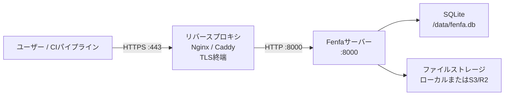

# プロダクションデプロイ

このガイドでは、Fenfaをプロダクション環境で実行するために必要なすべてをカバーします：TLSを使用したリバースプロキシ、安全なトークン設定、バックアップ戦略、監視。

## アーキテクチャ



## リバースプロキシのセットアップ

### Caddy（推奨）

CaddyはLet's EncryptからTLS証明書を自動的に取得して更新します：

```
dist.example.com {
    reverse_proxy localhost:8000
}
```

これだけです。CaddyはHTTPS、HTTP/2、証明書管理を自動的に処理します。

### Nginx

```nginx
server {
    listen 443 ssl http2;
    server_name dist.example.com;

    ssl_certificate /etc/letsencrypt/live/dist.example.com/fullchain.pem;
    ssl_certificate_key /etc/letsencrypt/live/dist.example.com/privkey.pem;

    client_max_body_size 2G;

    location / {
        proxy_pass http://127.0.0.1:8000;
        proxy_set_header Host $host;
        proxy_set_header X-Real-IP $remote_addr;
        proxy_set_header X-Forwarded-For $proxy_add_x_forwarded_for;
        proxy_set_header X-Forwarded-Proto $scheme;

        # 大容量ファイルのアップロード
        proxy_request_buffering off;
        proxy_read_timeout 600s;
    }
}

server {
    listen 80;
    server_name dist.example.com;
    return 301 https://$host$request_uri;
}
```

::: warning client_max_body_size
最大ビルドサイズに十分な`client_max_body_size`を設定してください。IPAおよびAPKファイルは数百メガバイトになる場合があります。上記の例では最大2 GBを許可しています。
:::

### TLS証明書の取得

NginxでCertbotを使用する：

```bash
sudo certbot --nginx -d dist.example.com
```

Certbotスタンドアロンを使用する：

```bash
sudo certbot certonly --standalone -d dist.example.com
```

## セキュリティチェックリスト

### 1. デフォルトトークンを変更する

安全なランダムトークンを生成します：

```bash
# ランダムな32文字のトークンを生成
openssl rand -hex 16
```

環境変数または設定を通じて設定します：

```bash
FENFA_ADMIN_TOKEN=$(openssl rand -hex 16)
FENFA_UPLOAD_TOKEN=$(openssl rand -hex 16)
```

### 2. ローカルホストにバインドする

リバースプロキシを通じてのみFenfaを公開します：

```yaml
ports:
  - "127.0.0.1:8000:8000"  # 0.0.0.0:8000ではない
```

### 3. プライマリドメインを設定する

iOSマニフェストとコールバックのために正しい公開ドメインを設定します：

```bash
FENFA_PRIMARY_DOMAIN=https://dist.example.com
```

::: danger iOSマニフェスト
`primary_domain`が間違っていると、iOS OTAインストールは失敗します。マニフェストplistにはiOSがIPAファイルを取得するために使用するダウンロードURLが含まれています。これらのURLはユーザーのデバイスから到達可能でなければなりません。
:::

### 4. アップロードトークンを分離する

異なるCI/CDパイプラインやチームメンバーに異なるアップロードトークンを発行します：

```json
{
  "auth": {
    "upload_tokens": [
      "token-for-ios-pipeline",
      "token-for-android-pipeline",
      "token-for-desktop-pipeline"
    ],
    "admin_tokens": [
      "admin-token-for-ops-team"
    ]
  }
}
```

これにより、他のパイプラインを中断することなく個別のトークンを取り消せます。

## バックアップ戦略

### バックアップするもの

| コンポーネント | パス | サイズ | 頻度 |
|-----------|------|------|-----------|
| SQLiteデータベース | `/data/fenfa.db` | 小（通常100 MB未満） | 毎日 |
| アップロードされたファイル | `/app/uploads/` | 大きくなる可能性あり | 各アップロード後（またはS3を使用） |
| 設定ファイル | `config.json` | 非常に小さい | 変更時 |

### SQLiteバックアップ

```bash
# データベースファイルをコピー（Fenfaの実行中も安全 -- SQLiteはWALモードを使用）
cp /data/fenfa.db /backups/fenfa-$(date +%Y%m%d).db
```

### 自動バックアップスクリプト

```bash
#!/bin/bash
BACKUP_DIR="/backups/fenfa"
DATE=$(date +%Y%m%d-%H%M)

mkdir -p "$BACKUP_DIR"

# データベース
cp /path/to/data/fenfa.db "$BACKUP_DIR/fenfa-$DATE.db"

# アップロード（ローカルストレージを使用する場合）
tar czf "$BACKUP_DIR/uploads-$DATE.tar.gz" /path/to/uploads/

# 古いバックアップをクリーンアップ（30日間保持）
find "$BACKUP_DIR" -name "*.db" -mtime +30 -delete
find "$BACKUP_DIR" -name "*.tar.gz" -mtime +30 -delete
```

::: tip S3ストレージ
S3互換ストレージ（R2、AWS S3、MinIO）を使用する場合、アップロードされたファイルはすでに冗長なストレージバックエンドにあります。SQLiteデータベースのみをバックアップする必要があります。
:::

## 監視

### ヘルスチェック

`/healthz`エンドポイントを監視します：

```bash
curl -sf http://localhost:8000/healthz || echo "Fenfa is down"
```

### アップタイム監視

アップタイム監視サービス（UptimeRobot、Hetrixなど）を以下に向けます：

```
https://dist.example.com/healthz
```

期待されるレスポンス：HTTP 200で`{"ok": true}`。

### ログ監視

Fenfaはstdoutにログを出力します。コンテナランタイムのログドライバーを使用してログを集約システムに転送します：

```yaml
services:
  fenfa:
    logging:
      driver: "json-file"
      options:
        max-size: "10m"
        max-file: "3"
```

## フルプロダクションDocker Compose

```yaml
version: "3.8"

services:
  fenfa:
    image: fenfa/fenfa:latest
    container_name: fenfa
    restart: unless-stopped
    ports:
      - "127.0.0.1:8000:8000"
    environment:
      FENFA_ADMIN_TOKEN: ${FENFA_ADMIN_TOKEN}
      FENFA_UPLOAD_TOKEN: ${FENFA_UPLOAD_TOKEN}
      FENFA_PRIMARY_DOMAIN: https://dist.example.com
    volumes:
      - fenfa-data:/data
      - fenfa-uploads:/app/uploads
    healthcheck:
      test: ["CMD", "wget", "-q", "--spider", "http://localhost:8000/healthz"]
      interval: 30s
      timeout: 5s
      retries: 3
      start_period: 10s
    logging:
      driver: "json-file"
      options:
        max-size: "10m"
        max-file: "3"
    deploy:
      resources:
        limits:
          memory: 512M

volumes:
  fenfa-data:
  fenfa-uploads:
```

## 次のステップ

- [Dockerデプロイ](./docker) -- Docker基本と設定
- [設定リファレンス](../configuration/) -- すべての設定
- [トラブルシューティング](../troubleshooting/) -- よくあるプロダクションの問題
