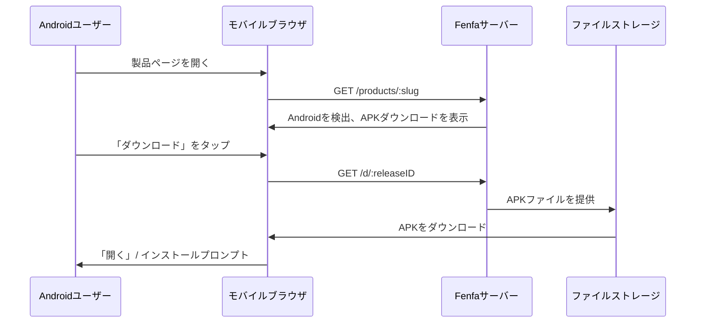

# Android配布

FenfaでのAndroid配布はシンプルです：APKファイルをアップロードすると、ユーザーは製品ページから直接ダウンロードできます。FenfaはAndroidデバイスを自動検出し、適切なダウンロードボタンを表示します。

## 仕組み



iOSとは異なり、Androidはインストールに特別なプロトコルを必要としません。APKファイルはHTTP(S)経由で直接ダウンロードされ、ユーザーはシステムパッケージインストーラーを使用してインストールします。

## Androidバリアントの設定

製品のAndroidバリアントを作成します：

```bash
curl -X POST http://localhost:8000/admin/api/products/prd_abc123/variants \
  -H "X-Auth-Token: YOUR_ADMIN_TOKEN" \
  -H "Content-Type: application/json" \
  -d '{
    "platform": "android",
    "display_name": "Android",
    "identifier": "com.example.myapp",
    "arch": "universal",
    "installer_type": "apk"
  }'
```

::: tip アーキテクチャバリアント
アーキテクチャごとに別のAPKをビルドする場合は、複数のバリアントを作成します：
- `Android ARM64`（arch: `arm64-v8a`）
- `Android ARM`（arch: `armeabi-v7a`）
- `Android x86_64`（arch: `x86_64`）

ユニバーサルAPKまたはAABを提供する場合は、`universal`アーキテクチャの単一バリアントで十分です。
:::

## APKファイルのアップロード

### 標準アップロード

```bash
curl -X POST http://localhost:8000/upload \
  -H "X-Auth-Token: YOUR_UPLOAD_TOKEN" \
  -F "variant_id=var_android" \
  -F "app_file=@app-release.apk" \
  -F "version=2.1.0" \
  -F "build=210" \
  -F "changelog=Added dark mode support"
```

### スマートアップロード

スマートアップロードはAPKファイルからメタデータを自動抽出します：

```bash
curl -X POST http://localhost:8000/admin/api/smart-upload \
  -H "X-Auth-Token: YOUR_ADMIN_TOKEN" \
  -F "variant_id=var_android" \
  -F "app_file=@app-release.apk"
```

抽出されたメタデータには以下が含まれます：
- パッケージ名（`com.example.myapp`）
- バージョン名（`2.1.0`）
- バージョンコード（`210`）
- アプリアイコン
- 最低SDKバージョン

## ユーザーインストール

ユーザーがAndroidデバイスで製品ページにアクセスすると：

1. ページがAndroidプラットフォームを自動検出します。
2. ユーザーが**ダウンロード**ボタンをタップします。
3. ブラウザがAPKファイルをダウンロードします。
4. AndroidがユーザーにAPKのインストールを促します。

::: warning 不明なソース
FenfaからのAPKをインストールする前に、ユーザーはデバイス設定で「不明なソースからのインストール」（または新しいAndroidバージョンでは「不明なアプリをインストール」）を有効にする必要があります。これはサイドローディングされたアプリの標準的なAndroid要件です。
:::

## 直接ダウンロードリンク

各リリースには任意のHTTPクライアントで動作する直接ダウンロードURLがあります：

```bash
# curlでダウンロード
curl -LO http://localhost:8000/d/rel_xxx

# wgetでダウンロード
wget http://localhost:8000/d/rel_xxx
```

このURLは低速接続での再開可能なダウンロードのためにHTTP Rangeリクエストをサポートします。

## 次のステップ

- [デスクトップ配布](./desktop) -- macOS、Windows、Linux配布
- [リリース管理](../products/releases) -- APKリリースのバージョン管理と管理
- [アップロードAPI](../api/upload) -- CI/CDからのAPKアップロードの自動化
