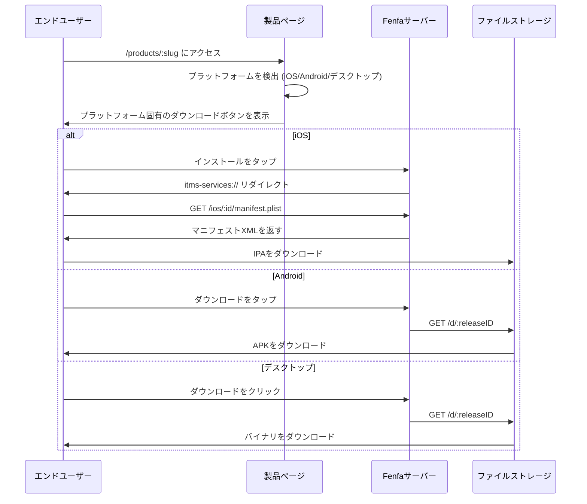

# 配布概要

Fenfaはすべてのプラットフォームに統一された配布エクスペリエンスを提供します。各製品には、訪問者のプラットフォームを自動検出して適切なダウンロードボタンを表示する公開ダウンロードページがあります。

## 配布の仕組み



## 製品ダウンロードページ

公開された各製品には`/products/:slug`の公開ページがあります。ページには以下が含まれます：

- **アプリアイコンと名前** -- 製品設定から
- **プラットフォーム検出** -- ページはブラウザのUser-Agentを使用して最初に正しいダウンロードボタンを表示します
- **QRコード** -- モバイルで簡単にスキャンできるように自動生成
- **リリース履歴** -- 選択したバリアントのすべてのリリース（新しい順）
- **チェンジログ** -- リリースごとのノートがインラインで表示
- **複数バリアント** -- 製品が複数のプラットフォーム向けバリアントを持つ場合、ユーザーはそれらを切り替えられます

## プラットフォーム固有の配布

| プラットフォーム | 方法 | 詳細 |
|----------|--------|---------|
| iOS | `itms-services://`経由のOTA | マニフェストplist + 直接IPAダウンロード。HTTPSが必要。 |
| Android | 直接APKダウンロード | ブラウザがAPKをダウンロードします。ユーザーは「不明なソースからのインストール」を有効にします。 |
| macOS | 直接ダウンロード | DMG、PKG、またはZIPファイルをブラウザ経由でダウンロード。 |
| Windows | 直接ダウンロード | EXE、MSI、またはZIPファイルをブラウザ経由でダウンロード。 |
| Linux | 直接ダウンロード | DEB、RPM、AppImage、またはtar.gzファイルをブラウザ経由でダウンロード。 |

## 直接ダウンロードリンク

すべてのリリースには直接ダウンロードURLがあります：

```
https://your-domain.com/d/:releaseID
```

このURL：
- 正しい`Content-Type`と`Content-Disposition`ヘッダーでバイナリファイルを返します
- 再開可能なダウンロードのためにHTTP Rangeリクエストをサポートします
- ダウンロードカウンターをインクリメントします
- 任意のHTTPクライアント（curl、wget、ブラウザ）で動作します

## イベント追跡

Fenfaは3種類のイベントを追跡します：

| イベント | トリガー | 追跡データ |
|-------|---------|-------------|
| `visit` | ユーザーが製品ページを開く | IP、User-Agent、バリアント |
| `click` | ユーザーがダウンロードボタンをクリック | IP、User-Agent、リリースID |
| `download` | ファイルが実際にダウンロードされる | IP、User-Agent、リリースID |

イベントは管理パネルで表示するか、CSVとしてエクスポートできます：

```bash
curl -o events.csv http://localhost:8000/admin/exports/events.csv \
  -H "X-Auth-Token: YOUR_ADMIN_TOKEN"
```

## HTTPS要件

::: warning iOSはHTTPSが必要
`itms-services://`経由のiOS OTAインストールには、有効なTLS証明書を使用したHTTPSが必要です。自己署名証明書は動作しません。ローカルテストには`ngrok`や`mkcert`などのツールを使用してください。プロダクションにはLet's Encryptを使用したリバースプロキシを使用してください。[プロダクションデプロイ](../deployment/production)を参照してください。
:::

## プラットフォームガイド

- [iOS配布](./ios) -- OTAインストール、マニフェスト生成、UDIDデバイスバインディング
- [Android配布](./android) -- APK配布とインストール
- [デスクトップ配布](./desktop) -- macOS、Windows、Linux配布
