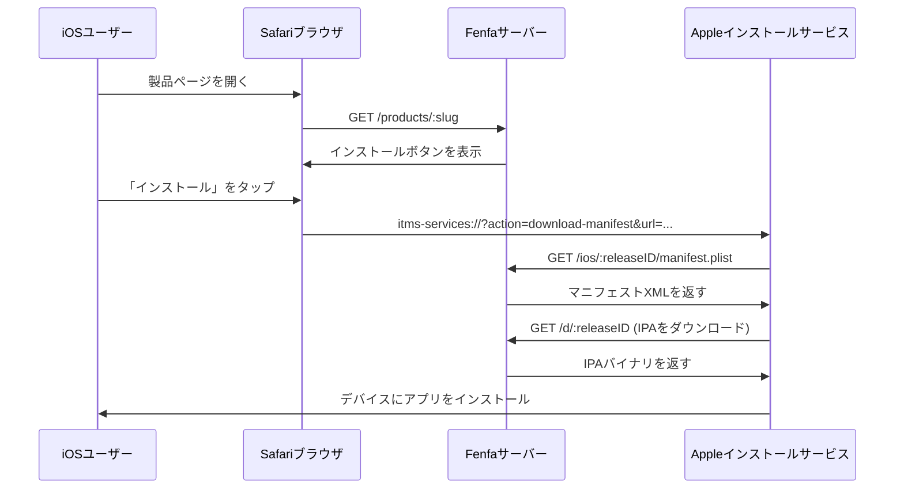
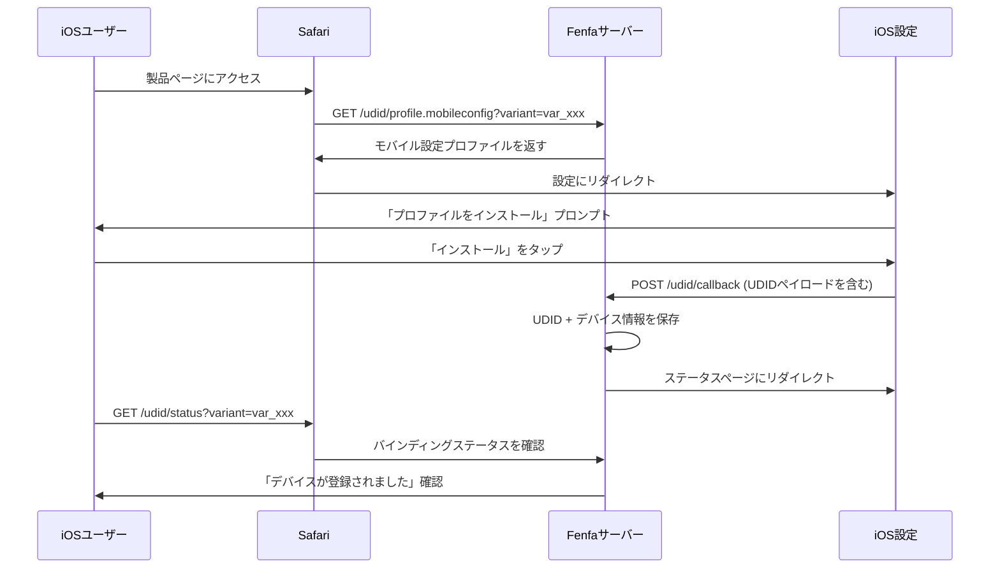

# iOS配布

FenfaはiOSのフルOTA（Over-The-Air）配布サポートを提供します。`itms-services://`マニフェスト生成、アドホックプロビジョニングのためのUDIDデバイスバインディング、デバイス自動登録のためのオプションのApple Developer API統合が含まれます。

## iOS OTAの仕組み



iOSは`itms-services://`プロトコルを使用してWebページから直接アプリをインストールします。ユーザーがインストールボタンをタップすると、Safariがシステムインストーラーに処理を引き渡し、以下を実行します：

1. FenfaからマニフェストPlistを取得
2. IPAファイルをダウンロード
3. デバイスにアプリをインストール

::: warning HTTPSが必要
iOS OTAインストールには有効なTLS証明書を使用したHTTPSが必要です。自己署名証明書は動作しません。ローカルテストには`ngrok`を使用して一時的なHTTPSトンネルを作成してください。
:::

## マニフェスト生成

Fenfaは各iOSリリースの`manifest.plist`ファイルを自動生成します。マニフェストは以下で提供されます：

```
GET /ios/:releaseID/manifest.plist
```

マニフェストには以下が含まれます：
- バンドル識別子（バリアントの識別子フィールドから）
- バンドルバージョン（リリースバージョンから）
- ダウンロードURL（`/d/:releaseID`を指す）
- アプリタイトル

`itms-services://`インストールリンク：

```
itms-services://?action=download-manifest&url=https://your-domain.com/ios/rel_xxx/manifest.plist
```

このリンクはアップロードAPIレスポンスに自動的に含まれ、製品ページに表示されます。

## UDIDデバイスバインディング

アドホック配布の場合、iOSデバイスはアプリのプロビジョニングプロファイルに登録されている必要があります。Fenfaはユーザーからデバイス識別子を収集するUDIDバインディングフローを提供します。

### UDIDバインディングの仕組み



### UDIDエンドポイント

| エンドポイント | メソッド | 説明 |
|----------|--------|-------------|
| `/udid/profile.mobileconfig?variant=:variantID` | GET | モバイル設定プロファイルをダウンロード |
| `/udid/callback` | POST | プロファイルインストール後のiOSからのコールバック（UDIDを含む） |
| `/udid/status?variant=:variantID` | GET | 現在のデバイスがバインドされているかどうかを確認 |

### セキュリティ

UDIDバインディングフローはリプレイ攻撃を防ぐためにワンタイムノンスを使用します：
- 各プロファイルダウンロードは一意のノンスを生成します
- ノンスはコールバックURLに埋め込まれます
- 一度使用されると、ノンスは再使用できません
- ノンスは設定可能なタイムアウト後に期限切れになります

## Apple Developer API統合

Fenfaはデバイスを自動的にApple Developerアカウントに登録できるため、Apple Developer PortalでUDIDを手動で追加する手順を排除できます。

### セットアップ

1. **管理パネル > 設定 > Apple Developer API**に移動します。
2. App Store Connect APIの認証情報を入力します：

| フィールド | 説明 |
|-------|-------------|
| キーID | APIキーID（例：「ABC123DEF4」） |
| 発行者ID | 発行者ID（UUID形式） |
| 秘密鍵 | PEM形式の秘密鍵コンテンツ |
| チームID | Apple DeveloperチームID |

::: tip APIキーの作成
[Apple Developer Portal](https://developer.apple.com/account/resources/authkeys/list)で「デバイス」権限を持つAPIキーを作成します。`.p8`秘密鍵ファイルをダウンロードします -- 一度のみダウンロードできます。
:::

### デバイスの登録

設定が完了したら、管理パネルからAppleにデバイスを登録できます：

**単一デバイス：**

```bash
curl -X POST http://localhost:8000/admin/api/devices/DEVICE_ID/register-apple \
  -H "X-Auth-Token: YOUR_ADMIN_TOKEN"
```

**バッチ登録：**

```bash
curl -X POST http://localhost:8000/admin/api/devices/register-apple \
  -H "X-Auth-Token: YOUR_ADMIN_TOKEN"
```

### Apple APIステータスの確認

```bash
curl http://localhost:8000/admin/api/apple/status \
  -H "X-Auth-Token: YOUR_ADMIN_TOKEN"
```

### Apple登録デバイスの一覧表示

```bash
curl http://localhost:8000/admin/api/apple/devices \
  -H "X-Auth-Token: YOUR_ADMIN_TOKEN"
```

## アドホック配布ワークフロー

iOSアドホック配布の完全なワークフロー：

1. **ユーザーがデバイスをバインドする** -- 製品ページにアクセスし、mobileconfigプロファイルをインストールし、UDIDが取得されます。
2. **管理者がデバイスを登録する** -- 管理パネルで、Appleにデバイスを登録します（またはバッチ登録を使用）。
3. **開発者がIPAを再署名する** -- 新しいデバイスを含むようにプロビジョニングプロファイルを更新し、IPAを再署名します。
4. **新しいビルドをアップロードする** -- 再署名されたIPAをFenfaにアップロードします。
5. **ユーザーがインストールする** -- ユーザーは製品ページからアプリをインストールできます。

::: info エンタープライズ配布
Apple Enterprise Developerアカウントをお持ちの場合は、UDIDバインディングを完全にスキップできます。エンタープライズプロファイルはすべてのデバイスへのインストールを許可します。バリアントを適切に設定し、エンタープライズ署名済みのIPAをアップロードします。
:::

## iOSデバイスの管理

管理パネルまたはAPIで、バインドされたすべてのデバイスを表示します：

```bash
curl http://localhost:8000/admin/api/ios_devices \
  -H "X-Auth-Token: YOUR_ADMIN_TOKEN"
```

デバイスをCSVとしてエクスポートします：

```bash
curl -o devices.csv http://localhost:8000/admin/exports/ios_devices.csv \
  -H "X-Auth-Token: YOUR_ADMIN_TOKEN"
```

## 次のステップ

- [Android配布](./android) -- Android APK配布
- [アップロードAPI](../api/upload) -- CI/CDからのiOSアップロードの自動化
- [プロダクションデプロイ](../deployment/production) -- iOS OTAのためのHTTPS設定
