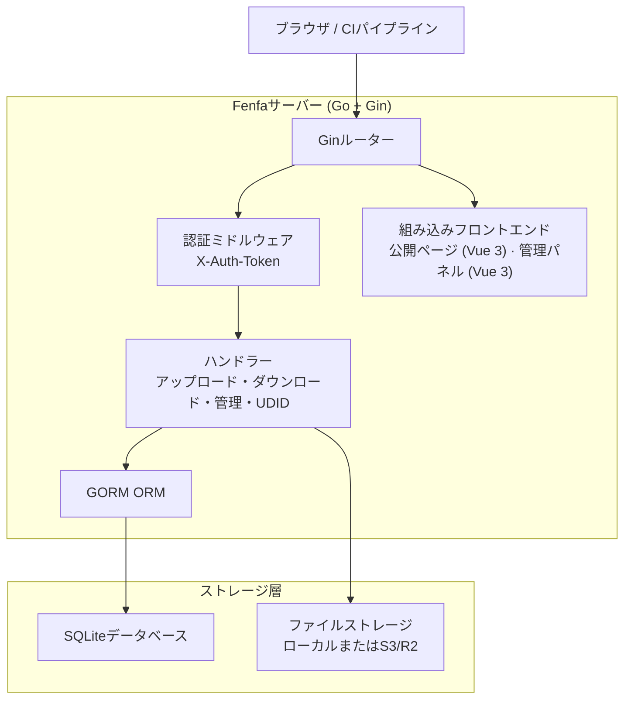
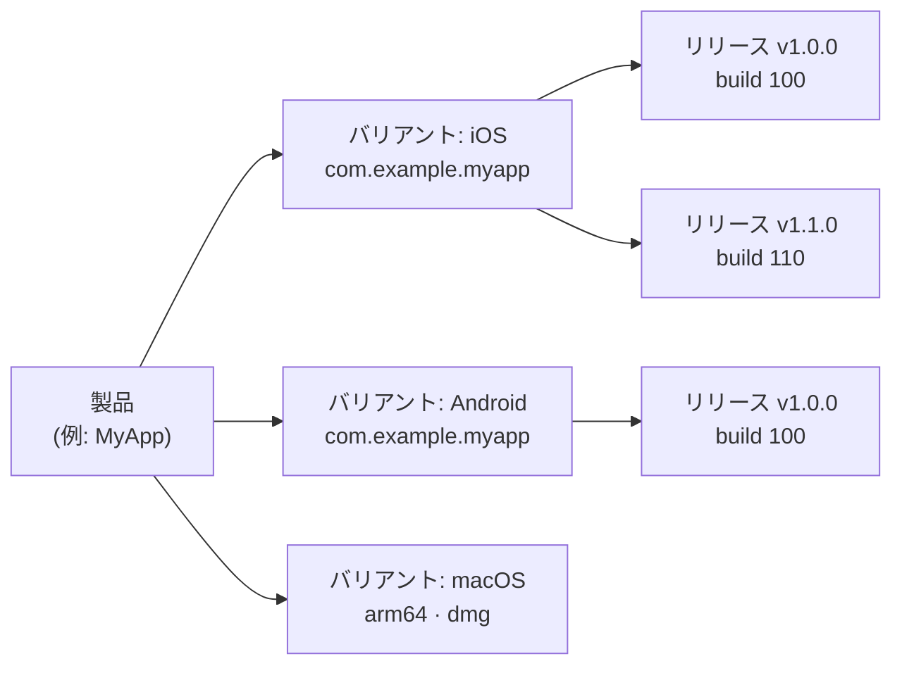

# Fenfa

**Fenfa**（分发、中国語で「配布」の意味）は、iOS、Android、macOS、Windows、Linux向けのセルフホスト型アプリ配布プラットフォームです。ビルドをアップロードし、QRコード付きのインストールページを取得し、クリーンな管理パネルでリリースを管理できます。これらすべてが、組み込みフロントエンドとSQLiteストレージを持つ単一のGoバイナリから実現されます。

Fenfaは、プライベートで制御可能なアプリ配布チャンネルを必要とする開発チーム、QAエンジニア、エンタープライズIT部門向けに設計されています。公開アプリストアや第三者サービスに依存することなく、iOS OTAインストール、Android APK配布、デスクトップアプリ配信を処理します。

## なぜFenfaを使うのか？

公開アプリストアはレビューの遅延、コンテンツの制限、プライバシーの懸念を課します。第三者の配布サービスはダウンロードごとに料金を請求し、データを管理します。Fenfaは完全な制御を提供します：

- **セルフホスト。** あなたのビルド、あなたのサーバー、あなたのデータ。ベンダーロックインなし、ダウンロードごとの料金なし。
- **マルチプラットフォーム。** 単一の製品ページで、自動プラットフォーム検出によりiOS、Android、macOS、Windows、Linuxのビルドを提供します。
- **依存関係ゼロ。** 組み込みSQLiteを持つ単一のGoバイナリ。Redis、PostgreSQL、メッセージキューは不要。
- **iOS OTA配布。** `itms-services://`マニフェスト生成、UDIDデバイスバインディング、アドホックプロビジョニングのためのApple Developer API統合を完全サポート。

## 主な機能

<div class="vp-features">

- **スマートアップロード** -- IPAおよびAPKパッケージからアプリのメタデータ（バンドルID、バージョン、アイコン）を自動検出します。ファイルをアップロードするだけで残りはFenfaが処理します。

- **製品ページ** -- QRコード、プラットフォーム検出、リリースごとのチェンジログを持つ公開ダウンロードページ。すべてのプラットフォーム向けに単一のURLを共有できます。

- **iOS UDIDバインディング** -- アドホック配布のためのデバイス登録フロー。ユーザーはガイド付きモバイル設定プロファイルを通じてデバイスのUDIDをバインドし、管理者はApple Developer APIを通じてデバイスを自動登録できます。

- **S3/R2ストレージ** -- スケーラブルなファイルホスティングのためのオプションのS3互換オブジェクトストレージ（Cloudflare R2、AWS S3、MinIO）。ローカルストレージはそのまま使用できます。

- **管理パネル** -- 製品、バリアント、リリース、デバイス、システム設定を管理するためのフル機能のVue 3管理パネル。中国語と英語のUIをサポート。

- **トークン認証** -- 個別のアップロードと管理トークンスコープ。CI/CDパイプラインはアップロードトークンを使用し、管理者は完全なコントロールのために管理トークンを使用します。

- **イベント追跡** -- リリースごとにページ訪問、ダウンロードクリック、ファイルダウンロードを追跡します。分析のためにイベントをCSVとしてエクスポートできます。

</div>

## アーキテクチャ



## データモデル



- **製品**: 名前、スラッグ、アイコン、説明を持つ論理的なアプリ。単一の製品ページがすべてのプラットフォームを提供します。
- **バリアント**: 独自の識別子、アーキテクチャ、インストーラータイプを持つプラットフォーム固有のビルドターゲット（iOS、Android、macOS、Windows、Linux）。
- **リリース**: バージョン、ビルド番号、チェンジログ、バイナリファイルを持つ特定のアップロードされたビルド。

## クイックインストール

```bash
docker run -d --name fenfa -p 8000:8000 fenfa/fenfa:latest
```

`http://localhost:8000/admin`にアクセスし、トークン`dev-admin-token`でログインします。

Docker Compose、ソースビルド、プロダクション設定については[インストールガイド](./getting-started/installation)を参照してください。

## ドキュメントセクション

| セクション | 説明 |
|---------|-------------|
| [インストール](./getting-started/installation) | DockerまたはソースからFenfaをインストール |
| [クイックスタート](./getting-started/quickstart) | Fenfaを起動して5分で最初のビルドをアップロード |
| [製品管理](./products/) | マルチプラットフォーム製品の作成と管理 |
| [プラットフォームバリアント](./products/variants) | iOS、Android、デスクトップバリアントの設定 |
| [リリース管理](./products/releases) | リリースのアップロード、バージョン管理、管理 |
| [配布概要](./distribution/) | Fenfaがアプリをエンドユーザーにどのようにdeliverするか |
| [iOS配布](./distribution/ios) | iOS OTAインストール、マニフェスト生成、UDIDバインディング |
| [Android配布](./distribution/android) | Android APK配布 |
| [デスクトップ配布](./distribution/desktop) | macOS、Windows、Linux配布 |
| [API概要](./api/) | REST APIリファレンス |
| [アップロードAPI](./api/upload) | APIまたはCI/CDを通じたビルドのアップロード |
| [管理API](./api/admin) | 完全な管理APIリファレンス |
| [設定](./configuration/) | すべての設定オプション |
| [Dockerデプロイ](./deployment/docker) | DockerとDocker Composeのデプロイ |
| [プロダクションデプロイ](./deployment/production) | リバースプロキシ、TLS、バックアップ、監視 |
| [トラブルシューティング](./troubleshooting/) | よくある問題と解決策 |

## プロジェクト情報

- **ライセンス:** MIT
- **言語:** Go 1.25+（バックエンド）、Vue 3 + Vite（フロントエンド）
- **データベース:** SQLite（GORM経由）
- **リポジトリ:** [github.com/openprx/fenfa](https://github.com/openprx/fenfa)
- **組織:** [OpenPRX](https://github.com/openprx)
