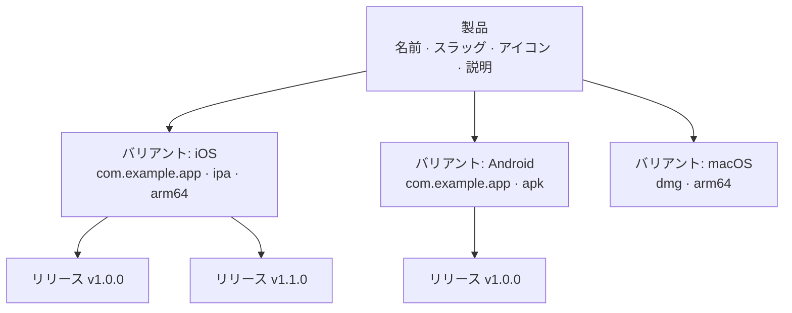

# 製品管理

製品はFenfaの最上位組織単位です。各製品は単一のアプリケーションを表し、複数のプラットフォームバリアント（iOS、Android、macOS、Windows、Linux）を含むことができます。製品には独自の公開ダウンロードページ、アイコン、スラッグURLがあります。

## コンセプト



- **製品**: 論理的なアプリケーション。ダウンロードページのURL（`/products/:slug`）になるユニークなスラッグを持ちます。
- **バリアント**: 製品の下にあるプラットフォーム固有のビルドターゲット。[プラットフォームバリアント](./variants)を参照してください。
- **リリース**: バリアントの下にある特定のアップロードされたビルド。[リリース管理](./releases)を参照してください。

## 製品を作成する

### 管理パネルから

1. サイドバーの**製品**に移動します。
2. **製品を作成**をクリックします。
3. フィールドを入力します：

| フィールド | 必須 | 説明 |
|-------|----------|-------------|
| 名前 | はい | 表示名（例：「MyApp」） |
| スラッグ | はい | URL識別子（例：「myapp」）。ユニークでなければなりません。 |
| 説明 | いいえ | ダウンロードページに表示されるアプリの簡単な説明 |
| アイコン | いいえ | アプリアイコン（画像ファイルとしてアップロード） |

4. **保存**をクリックします。

### APIから

```bash
curl -X POST http://localhost:8000/admin/api/products \
  -H "X-Auth-Token: YOUR_ADMIN_TOKEN" \
  -H "Content-Type: application/json" \
  -d '{
    "name": "MyApp",
    "slug": "myapp",
    "description": "A cross-platform mobile app"
  }'
```

## 製品を一覧表示する

### 管理パネルから

管理パネルの**製品**ページには、バリアント数と総ダウンロード数を含むすべての製品が表示されます。

### APIから

```bash
curl http://localhost:8000/admin/api/products \
  -H "X-Auth-Token: YOUR_ADMIN_TOKEN"
```

レスポンス：

```json
{
  "ok": true,
  "data": [
    {
      "id": "prd_abc123",
      "name": "MyApp",
      "slug": "myapp",
      "description": "A cross-platform mobile app",
      "published": true,
      "created_at": "2025-01-15T10:30:00Z"
    }
  ]
}
```

## 製品を更新する

```bash
curl -X PUT http://localhost:8000/admin/api/products/prd_abc123 \
  -H "X-Auth-Token: YOUR_ADMIN_TOKEN" \
  -H "Content-Type: application/json" \
  -d '{
    "name": "MyApp Pro",
    "description": "Updated description"
  }'
```

## 製品を削除する

::: danger カスケード削除
製品を削除すると、そのすべてのバリアント、リリース、アップロードされたファイルが永久に削除されます。
:::

```bash
curl -X DELETE http://localhost:8000/admin/api/products/prd_abc123 \
  -H "X-Auth-Token: YOUR_ADMIN_TOKEN"
```

## 公開と非公開

製品は公開または非公開にできます。非公開の製品はその公開ダウンロードページで404を返します。

```bash
# 非公開にする
curl -X PUT http://localhost:8000/admin/api/apps/prd_abc123/unpublish \
  -H "X-Auth-Token: YOUR_ADMIN_TOKEN"

# 公開する
curl -X PUT http://localhost:8000/admin/api/apps/prd_abc123/publish \
  -H "X-Auth-Token: YOUR_ADMIN_TOKEN"
```

## 公開ダウンロードページ

公開された各製品には以下の公開ダウンロードページがあります：

```
https://your-domain.com/products/:slug
```

ページの機能：
- アプリアイコン、名前、説明
- プラットフォーム固有のダウンロードボタン（訪問者のデバイスに基づいて自動検出）
- モバイルスキャン用QRコード
- バージョン番号とチェンジログを含むリリース履歴
- OTAインストール用のiOS `itms-services://`リンク

## IDフォーマット

製品IDはプレフィックス`prd_`とランダムな文字列を使用します（例：`prd_abc123`）。IDは自動生成され、変更できません。

## 次のステップ

- [プラットフォームバリアント](./variants) -- 製品にiOS、Android、デスクトップバリアントを追加
- [リリース管理](./releases) -- ビルドのアップロードと管理
- [配布概要](../distribution/) -- エンドユーザーがアプリをインストールする方法
