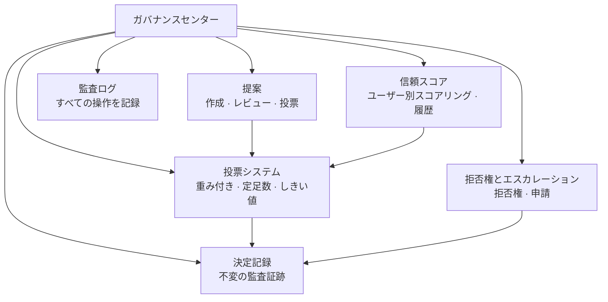

# ガバナンスセンター

ガバナンスセンターはOpenPRのコアモジュールで、プロジェクト管理に透明で構造化された意思決定をもたらします。提案、投票、決定記録、信頼スコア、拒否権メカニズム、包括的な監査証跡を提供します。

## なぜガバナンスが必要なのか？

従来のプロジェクト管理ツールはタスク追跡に焦点を当てていますが、意思決定は構造化されていないまま放置されています。OpenPRのガバナンスセンターは以下を確保します：

- **決定が文書化される。** すべての提案、投票、決定は完全な監査証跡と共に記録されます。
- **プロセスが透明。** 投票しきい値、定足数ルール、信頼スコアはすべてのメンバーに可視化されます。
- **権力が分散。** 拒否権メカニズムとエスカレーションパスが一方的な決定を防ぎます。
- **履歴が保存。** 決定記録は何が決定され、誰が、なぜそうしたかの不変のログを作成します。

## ガバナンスモジュール

| モジュール | 説明 |
|--------|-------------|
| [提案](./proposals) | 提案を作成、レビュー、投票 |
| [投票と決定](./voting) | 定足数としきい値ルール付き重み付き投票 |
| [信頼スコア](./trust-scores) | 履歴付きユーザー別評判スコアリング |
| 拒否権とエスカレーション | エスカレーション投票と申請付き拒否権 |
| 決定ドメイン | ドメイン別に決定を分類 |
| 影響評価 | メトリクスを使用して提案の影響を評価 |
| 監査ログ | すべてのガバナンス操作の完全な記録 |

## データベーススキーマ

ガバナンスモジュールは20の専用テーブルを使用します：

| テーブル | 目的 |
|-------|---------|
| `proposals` | 提案レコード |
| `proposal_templates` | 再利用可能な提案テンプレート |
| `proposal_comments` | 提案に関するディスカッション |
| `proposal_issue_links` | 提案を関連イシューにリンク |
| `votes` | 個別の投票レコード |
| `decisions` | 確定した決定レコード |
| `decision_domains` | 決定分類ドメイン |
| `decision_audit_reports` | 決定に関する監査レポート |
| `governance_configs` | ワークスペースのガバナンス設定 |
| `governance_audit_logs` | すべてのガバナンス操作ログ |
| `vetoers` | 拒否権を持つユーザー |
| `veto_events` | 拒否権操作レコード |
| `appeals` | 決定または拒否権への申請 |
| `trust_scores` | ユーザー別の現在の信頼スコア |
| `trust_score_logs` | 信頼スコア変更履歴 |
| `impact_reviews` | 提案の影響評価 |
| `impact_metrics` | 定量的な影響測定 |
| `review_participants` | レビュー割り当てレコード |
| `feedback_loop_links` | フィードバックループ接続 |

## APIエンドポイント

| カテゴリ | ベースパス | 操作 |
|----------|-----------|------------|
| 提案 | `/api/proposals/*` | 作成、投票、提出、アーカイブ |
| ガバナンス | `/api/governance/*` | 設定、監査ログ |
| 決定 | `/api/decisions/*` | 決定レコード |
| 信頼スコア | `/api/trust-scores/*` | スコア、履歴、申請 |
| 拒否権 | `/api/veto/*` | 拒否権、エスカレーション、投票 |

## MCPツール

| ツール | パラメータ | 説明 |
|------|--------|-------------|
| `proposals.list` | `project_id` | オプションのステータスフィルタ付きで提案をリスト |
| `proposals.get` | `proposal_id` | 提案の詳細を取得 |
| `proposals.create` | `project_id`, `title`, `description` | ガバナンス提案を作成 |

## 次のステップ

- [提案](./proposals) -- ガバナンス提案を作成・管理
- [投票と決定](./voting) -- 投票ルールを設定して決定を確認
- [信頼スコア](./trust-scores) -- 信頼スコアメカニズムを理解
