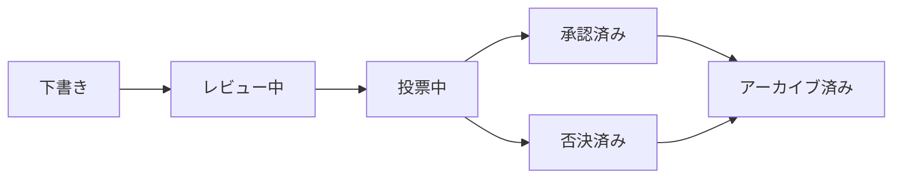

# 提案

提案はOpenPRのガバナンス決定へのエントリーポイントです。提案はチームの意見が必要な変更、改善、または決定を説明し、作成から投票を経て最終決定までの構造化されたライフサイクルに従います。

## 提案のライフサイクル



1. **Draft（下書き）** -- 作成者がタイトル、説明、コンテキストを含む提案を作成。
2. **Under Review（レビュー中）** -- チームメンバーがコメントを通じて議論しフィードバックを提供。
3. **Voting（投票中）** -- 投票期間が開始。メンバーはガバナンスルールに基づいて投票。
4. **Approved/Rejected（承認/否決）** -- 投票が終了。結果はしきい値と定足数によって決定。
5. **Archived（アーカイブ済み）** -- 決定が記録され、提案がアーカイブされる。

## 提案の作成

### Web UIから

1. プロジェクトに移動。
2. **Governance（ガバナンス）** > **Proposals（提案）**に移動。
3. **New Proposal（新規提案）**をクリック。
4. タイトル、説明、リンクされたイシューを入力。
5. **Create（作成）**をクリック。

### APIから

```bash
curl -X POST http://localhost:8080/api/proposals \
  -H "Content-Type: application/json" \
  -H "Authorization: Bearer <token>" \
  -d '{
    "project_id": "<project_uuid>",
    "title": "Adopt TypeScript for frontend modules",
    "description": "Proposal to migrate frontend modules from JavaScript to TypeScript for better type safety."
  }'
```

### MCPから

```json
{
  "method": "tools/call",
  "params": {
    "name": "proposals.create",
    "arguments": {
      "project_id": "<project_uuid>",
      "title": "Adopt TypeScript for frontend modules",
      "description": "Proposal to migrate frontend modules from JavaScript to TypeScript."
    }
  }
}
```

## 提案テンプレート

ワークスペース管理者は提案フォーマットを標準化するための提案テンプレートを作成できます。テンプレートは以下を定義します：

- タイトルパターン
- 説明の必須セクション
- デフォルトの投票パラメータ

テンプレートは**Workspace Settings（ワークスペース設定）** > **Governance（ガバナンス）** > **Templates（テンプレート）**で管理されます。

## 提案をイシューにリンク

提案は`proposal_issue_links`テーブルを通じて関連イシューにリンクできます。これにより双方向の参照が作成されます：

- 提案からは影響を受けるイシューを確認できます。
- イシューからはそれを参照する提案を確認できます。

## 提案コメント

各提案にはイシューコメントとは別の独自のディスカッションスレッドがあります。提案コメントはMarkdownフォーマットをサポートし、すべてのワークスペースメンバーに表示されます。

## MCPツール

| ツール | パラメータ | 説明 |
|------|--------|-------------|
| `proposals.list` | `project_id` | 提案をリスト、オプションの`status`フィルタ |
| `proposals.get` | `proposal_id` | 提案の完全な詳細を取得 |
| `proposals.create` | `project_id`, `title`, `description` | 新しい提案を作成 |

## 次のステップ

- [投票と決定](./voting) -- 投票の方法と決定がされる仕組み
- [信頼スコア](./trust-scores) -- 信頼スコアが投票の重みに与える影響
- [ガバナンス概要](./index) -- 完全なガバナンスモジュールリファレンス
