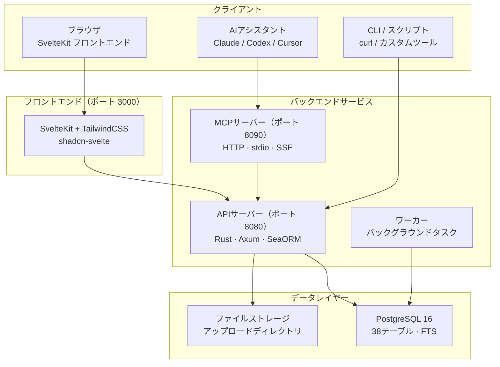

# OpenPR

**OpenPR**は、透明なガバナンス、AI支援ワークフロー、プロジェクトデータの完全制御を必要とするチーム向けに設計されたオープンソースのプロジェクト管理プラットフォームです。イシュー追跡、スプリント計画、カンバンボード、完全なガバナンスセンター（提案、投票、信頼スコア、拒否権メカニズム）を単一のセルフホスティングプラットフォームに統合しています。

OpenPRはバックエンドに**Rust**（Axum + SeaORM）、フロントエンドに**SvelteKit**を使用し、**PostgreSQL**で裏付けられています。REST APIと34ツールを3つのトランスポートプロトコルで提供する組み込みMCPサーバーを公開し、Claude、Codex、その他のMCP互換クライアントなどのAIアシスタントにとってファーストクラスのツールプロバイダーとなっています。

## なぜOpenPRなのか？

ほとんどのプロジェクト管理ツールは、カスタマイズが限られたクローズドソースのSaaSプラットフォームか、ガバナンス機能を欠くオープンソースの代替品です。OpenPRは異なるアプローチを取ります：

- **セルフホスティングで監査可能。** プロジェクトデータはあなたのインフラに留まります。すべての機能、すべての決定記録、すべての監査ログはあなたの管理下にあります。
- **組み込みのガバナンス。** 提案、投票、信頼スコア、拒否権、エスカレーションは後付けではなく、完全なAPIサポートを持つコアモジュールです。
- **AI-ネイティブ。** 組み込みMCPサーバーがOpenPRをAIエージェントのツールプロバイダーにします。ボットトークン、AIタスク割り当て、Webhookコールバックにより完全自動化されたワークフローが可能です。
- **Rustのパフォーマンス。** バックエンドは最小限のリソース使用量で何千もの同時リクエストを処理します。PostgreSQLのフルテキスト検索がすべてのエンティティに対して即座の検索を実現します。

## 主要機能

| カテゴリ | 機能 |
|----------|----------|
| **プロジェクト管理** | ワークスペース、プロジェクト、イシュー、カンバンボード、スプリント、ラベル、コメント、ファイル添付、アクティビティフィード、通知、フルテキスト検索 |
| **ガバナンスセンター** | 提案、定足数付き投票、決定記録、拒否権とエスカレーション、履歴と申請付き信頼スコア、提案テンプレート、影響評価、監査ログ |
| **AI統合** | ボットトークン（`opr_`プレフィックス）、AIエージェント登録、進捗追跡付きAIタスク割り当て、提案に対するAIレビュー、MCPサーバー（34ツール、3トランスポート）、Webhookコールバック |
| **認証** | JWT（アクセス + リフレッシュトークン）、ボットトークン認証、ロールベースアクセス（admin/user）、ワークスペーススコープの権限（owner/admin/member） |
| **デプロイメント** | Docker Compose、Podman、Caddy/Nginxリバースプロキシ、PostgreSQL 15+ |

## アーキテクチャ



## テックスタック

| レイヤー | テクノロジー |
|-------|-----------|
| **バックエンド** | Rust, Axum, SeaORM, PostgreSQL |
| **フロントエンド** | SvelteKit, TailwindCSS, shadcn-svelte |
| **MCP** | JSON-RPC 2.0 (HTTP + stdio + SSE) |
| **認証** | JWT (アクセス + リフレッシュ) + ボットトークン (`opr_`) |
| **デプロイメント** | Docker Compose, Podman, Caddy, Nginx |

## クイックスタート

```bash
git clone https://github.com/openprx/openpr.git
cd openpr
cp .env.example .env
docker-compose up -d
```

サービスは以下のアドレスで起動します：
- **フロントエンド**: http://localhost:3000
- **API**: http://localhost:8080
- **MCPサーバー**: http://localhost:8090

最初に登録したユーザーが自動的に管理者になります。

すべてのデプロイメント方法については[インストールガイド](./getting-started/installation)を、5分で起動するには[クイックスタート](./getting-started/quickstart)を参照してください。

## ドキュメントセクション

| セクション | 説明 |
|---------|-------------|
| [インストール](./getting-started/installation) | Docker Compose、ソースビルド、デプロイメントオプション |
| [クイックスタート](./getting-started/quickstart) | 5分でOpenPRを起動 |
| [ワークスペース管理](./workspace/) | ワークスペース、プロジェクト、メンバーロール |
| [イシューと追跡](./issues/) | イシュー、ワークフロー状態、スプリント、ラベル |
| [ガバナンスセンター](./governance/) | 提案、投票、決定、信頼スコア |
| [REST API](./api/) | 認証、エンドポイント、レスポンスフォーマット |
| [MCPサーバー](./mcp-server/) | 34ツールと3トランスポートによるAI統合 |
| [設定](./configuration/) | 環境変数と設定 |
| [デプロイメント](./deployment/docker) | DockerおよびプロダクションデプロイメントガイD |
| [トラブルシューティング](./troubleshooting/) | 一般的な問題と解決策 |

## 関連プロジェクト

| リポジトリ | 説明 |
|------------|-------------|
| [openpr](https://github.com/openprx/openpr) | コアプラットフォーム（このプロジェクト） |
| [openpr-webhook](https://github.com/openprx/openpr-webhook) | 外部統合のためのWebhookレシーバー |
| [prx](https://github.com/openprx/prx) | 組み込みOpenPR MCPを持つAIアシスタントフレームワーク |
| [prx-memory](https://github.com/openprx/prx-memory) | コーディングエージェント向けローカルファーストMCPメモリ |

## プロジェクト情報

- **ライセンス:** MIT OR Apache-2.0
- **言語:** Rust（2024エディション）
- **リポジトリ:** [github.com/openprx/openpr](https://github.com/openprx/openpr)
- **最小Rustバージョン:** 1.75.0
- **フロントエンド:** SvelteKit
