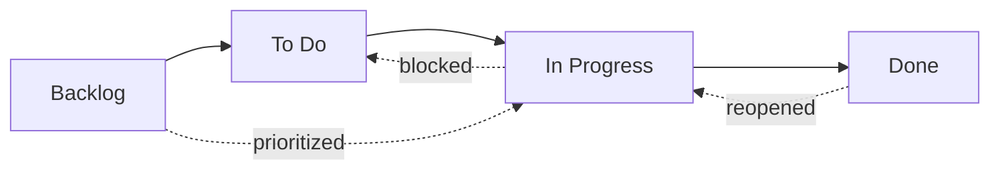
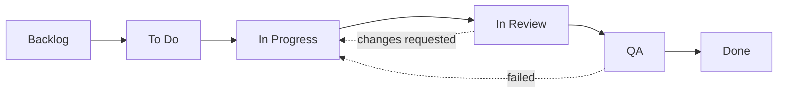

# ワークフロー状態

OpenPRのすべてのイシューにはワークフロー内の位置を表す**状態**があります。カンバンボードのカラムはこれらの状態に直接マッピングされます。

OpenPRは4つのデフォルト状態を提供しますが、3層解決システムを通じた完全な**カスタムワークフロー状態**もサポートしています。プロジェクトごと、ワークスペースごと、またはシステムデフォルトに依存する異なるワークフローを定義できます。

## デフォルト状態



| 状態 | 値 | 説明 |
|-------|-------|-------------|
| **Backlog** | `backlog` | アイデア、将来の作業、未計画のアイテム。まだスケジュールされていない。 |
| **To Do** | `todo` | 計画済みで優先度付き。取り掛かれる状態。 |
| **In Progress** | `in_progress` | 担当者が積極的に作業中。 |
| **Done** | `done` | 完了して検証済み。 |

これらはすべての新しいワークスペースが開始するビルトイン状態です。以下の[カスタムワークフロー](#カスタムワークフロー)セクションで説明するようにカスタマイズしたり、追加の状態を追加したりできます。

## 状態遷移

OpenPRは柔軟な状態遷移を許可します。強制的な制約はなく、どの状態から他の状態へも遷移できます。一般的なパターン：

| 遷移 | トリガー | 例 |
|-----------|---------|---------|
| Backlog -> To Do | スプリント計画、優先度付け | 次のスプリントにイシューを取り込み |
| To Do -> In Progress | 開発者が作業を開始 | 担当者が実装を開始 |
| In Progress -> Done | 作業完了 | プルリクエストがマージ |
| In Progress -> To Do | 作業がブロックまたは一時停止 | 外部依存を待機中 |
| Done -> In Progress | イシューが再オープン | バグのリグレッションが発見 |
| Backlog -> In Progress | 緊急ホットフィックス | 重大な本番問題 |

## カスタムワークフロー

OpenPRは**3層解決**システムを通じたカスタムワークフロー状態をサポートします。APIがワークアイテムの状態を検証する際、3つのレベルを順番にチェックして有効なワークフローを解決します：

```
プロジェクトワークフロー  >  ワークスペースワークフロー  >  システムデフォルト
```

プロジェクトが独自のワークフローを定義している場合、それが優先されます。そうでなければワークスペースレベルのワークフローが使用されます。どちらも存在しない場合は、4つのシステムデフォルト状態が適用されます。

### データベーススキーマ

カスタムワークフローはマイグレーション`0024_workflow_config.sql`で導入された2つのテーブルに保存されます：

- **`workflows`** -- プロジェクトまたはワークスペースに紐づけられた名前付きワークフローを定義。
- **`workflow_states`** -- ワークフロー内の個々の状態。

各状態には以下のプロパティがあります：

| フィールド | タイプ | 説明 |
|-------|------|-------------|
| `key` | string | 機械可読な識別子（例：`in_review`） |
| `display_name` | string | 人間が読める名前（例："In Review"） |
| `category` | string | 状態のグループ化カテゴリ |
| `position` | integer | カンバンボードの表示順 |
| `color` | string | 状態バッジの16進数カラーコード |
| `is_initial` | boolean | 新しいイシューのデフォルト状態かどうか |
| `is_terminal` | boolean | この状態が完了を表すかどうか |

### APIでカスタムワークフローを作成

**ステップ1 -- プロジェクト用のワークフローを作成：**

```bash
curl -X POST http://localhost:8080/api/workflows \
  -H "Content-Type: application/json" \
  -H "Authorization: Bearer <token>" \
  -d '{
    "name": "Engineering Flow",
    "project_id": "<project_uuid>"
  }'
```

**ステップ2 -- ワークフローに状態を追加：**

```bash
curl -X POST http://localhost:8080/api/workflows/<workflow_id>/states \
  -H "Content-Type: application/json" \
  -H "Authorization: Bearer <token>" \
  -d '{
    "key": "in_review",
    "display_name": "In Review",
    "category": "active",
    "position": 3,
    "color": "#f59e0b",
    "is_initial": false,
    "is_terminal": false
  }'
```

### 例：6状態エンジニアリングワークフロー



| 状態 | キー | カテゴリ | 初期 | 終端 |
|-------|-----|----------|---------|----------|
| Backlog | `backlog` | backlog | yes | no |
| To Do | `todo` | planned | no | no |
| In Progress | `in_progress` | active | no | no |
| In Review | `in_review` | active | no | no |
| QA | `qa` | active | no | no |
| Done | `done` | completed | no | yes |

### 動的バリデーション

ワークアイテムの状態が更新される際、APIはそのプロジェクトの**有効なワークフロー**に対して新しい状態を検証します。解決されたワークフローに存在しない状態キーを設定すると、APIは`422 Unprocessable Entity`エラーを返します。状態はハードコードされておらず、リクエスト時に動的に検索されます。

## カンバンボード

ボードビューはイシューをワークフロー状態に対応するカラムにカードとして表示します。カラム間でカードをドラッグ＆ドロップして状態を変更します。カスタムワークフローがアクティブな場合、ボードは自動的にカスタム状態とその設定された順序を反映します。

各カードが表示するもの：
- イシュー識別子（例：`API-42`）
- タイトル
- 優先度インジケーター
- 担当者のアバター
- ラベルバッジ

## APIで状態を更新

```bash
# Move issue to "in_progress"
curl -X PATCH http://localhost:8080/api/issues/<issue_id> \
  -H "Content-Type: application/json" \
  -H "Authorization: Bearer <token>" \
  -d '{"state": "in_progress"}'
```

## MCPで状態を更新

```json
{
  "method": "tools/call",
  "params": {
    "name": "work_items.update",
    "arguments": {
      "work_item_id": "<issue_uuid>",
      "state": "in_progress"
    }
  }
}
```

## 優先度レベル

状態に加えて、各イシューには優先度レベルを設定できます：

| 優先度 | 値 | 説明 |
|----------|-------|-------------|
| Low | `low` | あると良い、時間的プレッシャーなし |
| Medium | `medium` | 標準的な優先度、計画済み作業 |
| High | `high` | 重要、すぐに対処すべき |
| Urgent | `urgent` | 重大、即時対応が必要 |

## アクティビティ追跡

すべての状態変更は、アクター、タイムスタンプ、古い値と新しい値と共にイシューのアクティビティフィードに記録されます。完全な監査証跡を提供します。

## 次のステップ

- [スプリント計画](./sprints) -- イシューを時間制限のあるイテレーションに整理
- [ラベル](./labels) -- イシューに分類を追加
- [イシュー概要](./index) -- 完全なイシューフィールドリファレンス
