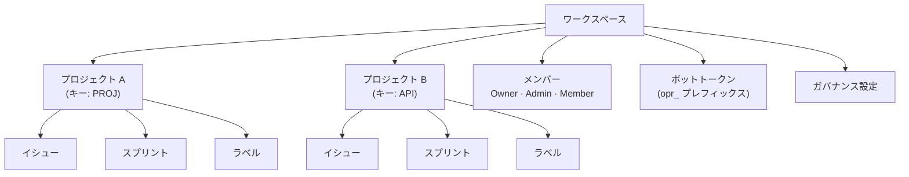

# ワークスペース管理

**ワークスペース**はOpenPRの最上位の組織単位です。マルチテナントの分離を提供し、各ワークスペースには独自のプロジェクト、メンバー、ラベル、ボットトークン、ガバナンス設定があります。ユーザーは複数のワークスペースに所属できます。

## ワークスペースの作成

ログイン後、ダッシュボードで**Create Workspace（ワークスペースを作成）**をクリックするか、**Settings（設定）** > **Workspaces（ワークスペース）** > **New（新規）**に移動します。

以下を入力：

| フィールド | 必須 | 説明 |
|-------|----------|-------------|
| 名前 | はい | 表示名（例："Engineering Team"） |
| スラッグ | はい | URLフレンドリーな識別子（例："engineering"） |

作成したユーザーに自動的に**Owner（オーナー）**ロールが割り当てられます。

## ワークスペース構造



## ワークスペース設定

サイドバーのギアアイコンまたは**Settings（設定）**からワークスペース設定にアクセス：

- **General（一般）** -- ワークスペース名、スラッグ、説明を更新。
- **Members（メンバー）** -- ユーザーを招待、ロールを変更、メンバーを削除。[メンバー](./members)を参照。
- **Bot Tokens（ボットトークン）** -- MCP用ボットトークンを作成・管理。
- **Governance（ガバナンス）** -- 投票しきい値、提案テンプレート、信頼スコアルールを設定。[ガバナンス](../governance/)を参照。
- **Webhooks** -- 外部統合のためのWebhookエンドポイントをセットアップ。

## APIアクセス

```bash
# List workspaces
curl -H "Authorization: Bearer <token>" \
  http://localhost:8080/api/workspaces

# Get workspace details
curl -H "Authorization: Bearer <token>" \
  http://localhost:8080/api/workspaces/<workspace_id>
```

## MCPアクセス

MCPサーバーを通じて、AIアシスタントは`OPENPR_WORKSPACE_ID`環境変数で指定されたワークスペース内で操作します。すべてのMCPツールは自動的にそのワークスペースに操作をスコープします。

## 次のステップ

- [プロジェクト](./projects) -- ワークスペース内でプロジェクトを作成・管理
- [メンバーと権限](./members) -- ユーザーを招待してロールを設定
