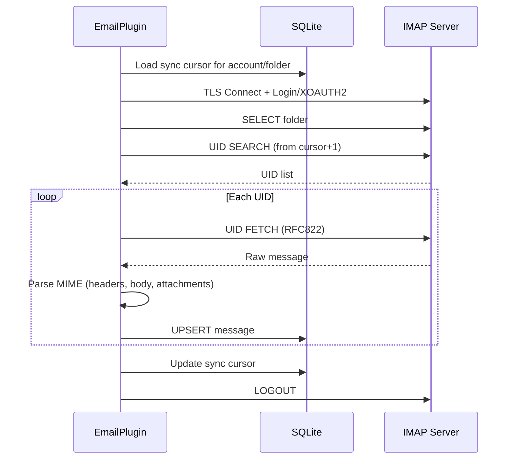

# IMAP設定

PRX-Emailは`rustls`ライブラリを使用してTLS経由でIMAPサーバーに接続します。パスワード認証とGmailおよびOutlook用のXOAUTH2をサポートします。受信トレイ同期はUIDベースで増分的に行われ、カーソルはSQLiteデータベースに永続化されます。

## 基本的なIMAP設定

```rust
use prx_email::plugin::{ImapConfig, AuthConfig};

let imap = ImapConfig {
    host: "imap.example.com".to_string(),
    port: 993,
    user: "you@example.com".to_string(),
    auth: AuthConfig {
        password: Some("your-app-password".to_string()),
        oauth_token: None,
    },
};
```

### 設定フィールド

| フィールド | タイプ | 必須 | 説明 |
|---------|------|------|------|
| `host` | `String` | はい | IMAPサーバーホスト名（空であってはならない） |
| `port` | `u16` | はい | IMAPサーバーポート（TLSは通常993） |
| `user` | `String` | はい | IMAPユーザー名（通常はメールアドレス） |
| `auth.password` | `Option<String>` | いずれか | IMAP LOGINのアプリパスワード |
| `auth.oauth_token` | `Option<String>` | いずれか | XOAUTH2のOAuthアクセストークン |

::: warning 認証
`password`または`oauth_token`のいずれか一方のみを設定する必要があります。両方または両方なしの場合は検証エラーになります。
:::

## 一般的なプロバイダ設定

| プロバイダ | ホスト | ポート | 認証方式 |
|----------|------|------|--------|
| Gmail | `imap.gmail.com` | 993 | アプリパスワードまたはXOAUTH2 |
| Outlook / Office 365 | `outlook.office365.com` | 993 | XOAUTH2（推奨） |
| Yahoo | `imap.mail.yahoo.com` | 993 | アプリパスワード |
| Fastmail | `imap.fastmail.com` | 993 | アプリパスワード |
| ProtonMail Bridge | `127.0.0.1` | 1143 | Bridgeパスワード |

## 受信トレイの同期

`sync`メソッドはIMAPサーバーに接続し、フォルダを選択し、UIDで新しいメッセージを取得し、SQLiteに保存します：

```rust
use prx_email::plugin::SyncRequest;

plugin.sync(SyncRequest {
    account_id: 1,
    folder: Some("INBOX".to_string()),
    cursor: None,        // Resume from last saved cursor
    now_ts: now,
    max_messages: 100,   // Fetch at most 100 messages per sync
})?;
```

### 同期フロー



### 増分同期

PRX-EmailはUIDベースのカーソルを使用してメッセージの再取得を防ぎます。各同期後：

1. 見た最高のUIDがカーソルとして保存されます
2. 次の同期は`cursor + 1`から始まります
3. 既存の`(account_id, message_id)`ペアを持つメッセージは更新されます（UPSERT）

カーソルは複合キー`(account_id, folder_id)`を持つ`sync_state`テーブルに保存されます。

## マルチフォルダ同期

同じアカウントの複数のフォルダを同期します：

```rust
for folder in &["INBOX", "Sent", "Drafts", "Archive"] {
    plugin.sync(SyncRequest {
        account_id,
        folder: Some(folder.to_string()),
        cursor: None,
        now_ts: now,
        max_messages: 100,
    })?;
}
```

## 同期スケジューラ

定期的な同期には組み込みの同期ランナーを使用します：

```rust
use prx_email::plugin::{SyncJob, SyncRunnerConfig};

let jobs = vec![
    SyncJob { account_id: 1, folder: "INBOX".into(), max_messages: 100 },
    SyncJob { account_id: 1, folder: "Sent".into(), max_messages: 50 },
    SyncJob { account_id: 2, folder: "INBOX".into(), max_messages: 100 },
];

let config = SyncRunnerConfig {
    max_concurrency: 4,         // Max jobs per runner tick
    base_backoff_seconds: 10,   // Initial backoff on failure
    max_backoff_seconds: 300,   // Maximum backoff (5 minutes)
};

let report = plugin.run_sync_runner(&jobs, now, &config);
println!(
    "Run {}: attempted={}, succeeded={}, failed={}",
    report.run_id, report.attempted, report.succeeded, report.failed
);
```

### スケジューラの動作

- **並行性キャップ**: ティックごとに最大`max_concurrency`ジョブが実行される
- **失敗バックオフ**: `base * 2^failures`の計算式で指数バックオフ、`max_backoff_seconds`でキャップ
- **期限確認**: バックオフウィンドウが経過していない場合はジョブがスキップされる
- **状態追跡**: `account::folder`キーごとに`(next_allowed_at, failure_count)`を追跡

## メッセージパース

受信メッセージは`mail-parser`クレートを使用して以下の抽出を行います：

| フィールド | ソース | 備考 |
|---------|------|------|
| `message_id` | `Message-ID`ヘッダー | 生バイトのSHA-256にフォールバック |
| `subject` | `Subject`ヘッダー | |
| `sender` | `From`ヘッダーの最初のアドレス | |
| `recipients` | `To`ヘッダーのすべてのアドレス | カンマ区切り |
| `body_text` | 最初の`text/plain`パート | |
| `body_html` | 最初の`text/html`パート | フォールバック: 生セクション抽出 |
| `snippet` | body_textまたはbody_htmlの最初の120文字 | |
| `references_header` | `References`ヘッダー | スレッドのため |
| `attachments` | MIME添付ファイルパート | JSONシリアライズされたメタデータ |

## TLS

すべてのIMAP接続は`webpki-roots`証明書バンドルを持つ`rustls`経由でTLSを使用します。TLSを無効にするオプションやSTARTTLSを使用するオプションはありません。接続は常に最初から暗号化されます。

## 次のステップ

- [SMTP設定](./smtp) -- メール送信の設定
- [OAuth認証](./oauth) -- GmailとOutlookのXOAUTH2を設定
- [SQLiteストレージ](../storage/) -- データベーススキーマを理解する
