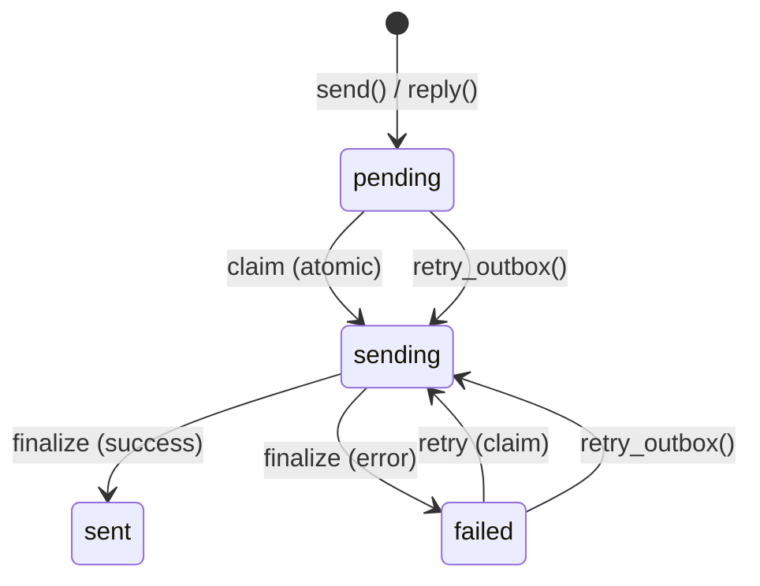

# SMTP設定

PRX-Emailは`rustls` TLSを持つ`lettre`クレートを通じてSMTP経由でメールを送信します。アウトボックスパイプラインは重複送信を防ぐアトミックなクレーム・送信・ファイナライズワークフローを使用し、指数バックオフリトライと決定論的なMessage-IDべき等性キーを提供します。

## 基本的なSMTP設定

```rust
use prx_email::plugin::{SmtpConfig, AuthConfig};

let smtp = SmtpConfig {
    host: "smtp.example.com".to_string(),
    port: 465,
    user: "you@example.com".to_string(),
    auth: AuthConfig {
        password: Some("your-app-password".to_string()),
        oauth_token: None,
    },
};
```

### 設定フィールド

| フィールド | タイプ | 必須 | 説明 |
|---------|------|------|------|
| `host` | `String` | はい | SMTPサーバーホスト名（空であってはならない） |
| `port` | `u16` | はい | SMTPサーバーポート（暗黙的TLSは465、STARTTLSは587） |
| `user` | `String` | はい | SMTPユーザー名（通常はメールアドレス） |
| `auth.password` | `Option<String>` | いずれか | SMTP AUTH PLAIN/LOGINのパスワード |
| `auth.oauth_token` | `Option<String>` | いずれか | XOAUTH2のOAuthアクセストークン |

## 一般的なプロバイダ設定

| プロバイダ | ホスト | ポート | 認証方式 |
|----------|------|------|--------|
| Gmail | `smtp.gmail.com` | 465 | アプリパスワードまたはXOAUTH2 |
| Outlook / Office 365 | `smtp.office365.com` | 587 | XOAUTH2 |
| Yahoo | `smtp.mail.yahoo.com` | 465 | アプリパスワード |
| Fastmail | `smtp.fastmail.com` | 465 | アプリパスワード |

## メールの送信

### 基本的な送信

```rust
use prx_email::plugin::SendEmailRequest;

let response = plugin.send(SendEmailRequest {
    account_id: 1,
    to: "recipient@example.com".to_string(),
    subject: "Hello".to_string(),
    body_text: "Message body here.".to_string(),
    now_ts: now,
    attachment: None,
    failure_mode: None,
});
```

### メッセージへの返信

```rust
use prx_email::plugin::ReplyEmailRequest;

let response = plugin.reply(ReplyEmailRequest {
    account_id: 1,
    in_reply_to_message_id: "<original-msg-id@example.com>".to_string(),
    body_text: "Thanks for your message!".to_string(),
    now_ts: now,
    attachment: None,
    failure_mode: None,
});
```

返信は自動的に：
- `In-Reply-To`ヘッダーを設定する
- 親メッセージから`References`チェーンをビルドする
- 受信者を親メッセージの送信者から派生させる
- 件名に`Re:`のプレフィックスを付ける

## アウトボックスパイプライン

アウトボックスパイプラインはアトミックな状態マシンを通じて信頼性の高いメール配信を保証します：



### 状態マシンのルール

| 遷移 | 条件 | ガード |
|------|------|------|
| `pending` -> `sending` | `claim_outbox_for_send()` | `status IN ('pending','failed') AND next_attempt_at <= now` |
| `sending` -> `sent` | プロバイダが受け入れた | `update_outbox_status_if_current(status='sending')` |
| `sending` -> `failed` | プロバイダが拒否またはネットワークエラー | `update_outbox_status_if_current(status='sending')` |
| `failed` -> `sending` | `retry_outbox()` | `status IN ('pending','failed') AND next_attempt_at <= now` |

### べき等性

各アウトボックスメッセージは決定論的なMessage-IDを取得します：

```
<outbox-{id}-{retries}@prx-email.local>
```

これによりリトライが元の送信と区別でき、Message-IDで重複排除するプロバイダが各リトライを受け入れます。

### リトライバックオフ

失敗した送信は指数バックオフを使用します：

```
next_attempt_at = now + base_backoff * 2^retries
```

ベースバックオフ5秒の場合：

| リトライ | バックオフ |
|--------|---------|
| 1 | 10秒 |
| 2 | 20秒 |
| 3 | 40秒 |
| 4 | 80秒 |
| 5 | 160秒 |
| 6 | 320秒 |
| 7 | 640秒 |
| 10 | 5,120秒（約85分） |

### 手動リトライ

```rust
use prx_email::plugin::RetryOutboxRequest;

let response = plugin.retry_outbox(RetryOutboxRequest {
    outbox_id: 42,
    now_ts: now,
    failure_mode: None,
});
```

以下の場合にリトライは拒否されます：
- アウトボックスのステータスが`sent`または`sending`（リトライ不可）
- `next_attempt_at`にまだ達していない場合（`retry_not_due`）

## 添付ファイル

### 添付ファイルで送信する

```rust
use prx_email::plugin::{SendEmailRequest, AttachmentInput};

let response = plugin.send(SendEmailRequest {
    account_id: 1,
    to: "recipient@example.com".to_string(),
    subject: "Report attached".to_string(),
    body_text: "Please find the report attached.".to_string(),
    now_ts: now,
    attachment: Some(AttachmentInput {
        filename: "report.pdf".to_string(),
        content_type: "application/pdf".to_string(),
        base64: Some(base64_encoded_content),
        path: None,
    }),
    failure_mode: None,
});
```

### 添付ファイルポリシー

`AttachmentPolicy`はサイズとMIMEタイプの制限を適用します：

```rust
use prx_email::plugin::AttachmentPolicy;

let policy = AttachmentPolicy {
    max_size_bytes: 25 * 1024 * 1024,  // 25 MiB
    allowed_content_types: [
        "application/pdf",
        "image/jpeg",
        "image/png",
        "text/plain",
        "application/zip",
    ].into_iter().map(String::from).collect(),
};
```

| ルール | 動作 |
|-------|------|
| サイズが`max_size_bytes`を超える | `attachment exceeds size limit`で拒否 |
| MIMEタイプが`allowed_content_types`にない | `attachment content type is not allowed`で拒否 |
| `attachment_store`なしのパスベース添付 | `attachment store not configured`で拒否 |
| パスがストレージルートを逸脱する（`../`トラバーサル） | `attachment path escapes storage root`で拒否 |

### パスベース添付ファイル

ディスクに保存された添付ファイルには、添付ファイルストアを設定します：

```rust
use prx_email::plugin::AttachmentStoreConfig;

let store = AttachmentStoreConfig {
    enabled: true,
    dir: "/var/lib/prx-email/attachments".to_string(),
};
```

パス解決にはディレクトリトラバーサルガードが含まれています。設定されたストレージルート外で解決されるパス（シンボリックリンクベースのエスケープを含む）はすべて拒否されます。

## APIレスポンス形式

すべての送信操作は`ApiResponse<SendResult>`を返します：

```rust
pub struct SendResult {
    pub outbox_id: i64,
    pub status: String,          // "sent" or "failed"
    pub retries: i64,
    pub provider_message_id: Option<String>,
    pub next_attempt_at: i64,
}
```

## 次のステップ

- [OAuth認証](./oauth) -- 必要なプロバイダのXOAUTH2を設定
- [設定リファレンス](../configuration/) -- すべての設定と環境変数
- [トラブルシューティング](../troubleshooting/) -- 一般的なSMTPの問題と解決策
