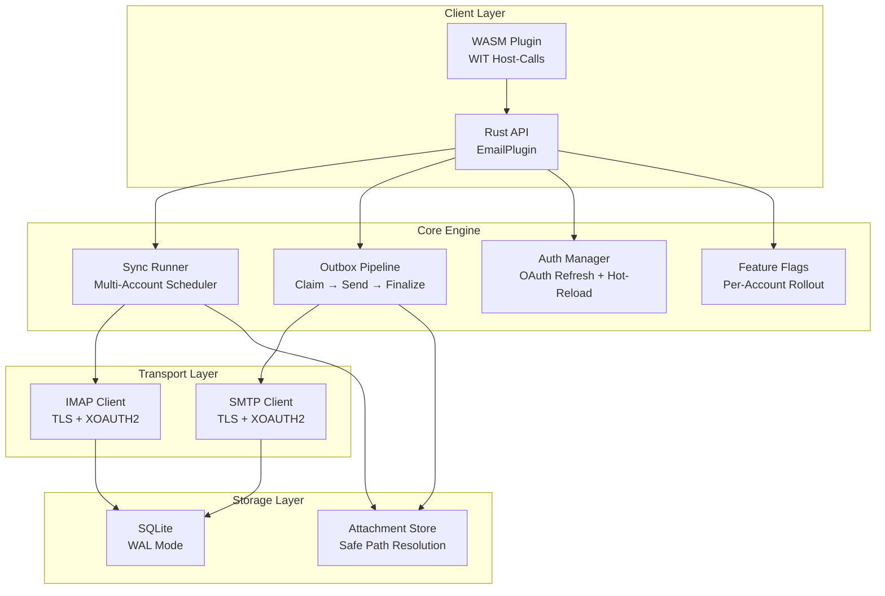

# PRX-Email

**PRX-Email** はSQLite永続化とプロダクション対応プリミティブを持つRustで書かれたセルフホスト型メールクライアントプラグインです。IMAPの受信トレイ同期、アトミックなアウトボックスパイプラインを持つSMTP送信、GmailとOutlookのためのOAuth 2.0認証、添付ファイルガバナンス、PRXエコシステムへの統合のためのWASMプラグインインターフェースを提供します。

PRX-Emailは信頼性の高い組み込み可能なメールバックエンドを必要とする開発者やチームのために設計されています。マルチアカウント同期スケジューリング、リトライとバックオフを持つ安全なアウトボックス配信、OAuthトークンライフサイクル管理、フィーチャーフラグロールアウトを、サードパーティのSaaSメールAPIに依存せずに処理します。

## PRX-Emailを選ぶ理由

ほとんどのメール統合はベンダー固有のAPIや、重複送信、トークン期限切れ、添付ファイルの安全性などのプロダクション上の懸念を無視した脆弱なIMAP/SMTPラッパーに依存しています。PRX-Emailは異なるアプローチを取ります：

- **プロダクション対応のアウトボックス。** アトミックなクレーム・ファイナライズ状態マシンが重複送信を防止します。指数バックオフと決定論的なMessage-IDべき等性キーが安全なリトライを保証します。
- **OAuthファーストの認証。** トークン期限切れ追跡、プラガブルなリフレッシュプロバイダ、環境変数からのホットリロードを持つIMAPとSMTP両方のネイティブXOAUTH2サポート。
- **SQLiteネイティブストレージ。** WALモード、境界付きチェックポイント、パラメータ化クエリにより、外部データベース依存なしに高速で信頼性の高いローカル永続化を提供します。
- **WASMによる拡張性。** プラグインはWebAssemblyにコンパイルされ、WITホスト呼び出しを通じてメール操作を公開します。デフォルトでは実際のIMAP/SMTPを無効にするネットワーク安全スイッチを持ちます。

## 主要機能

<div class="vp-features">

- **IMAP受信トレイ同期** -- TLSで任意のIMAPサーバーに接続。UIDベースの増分フェッチとカーソル永続化で複数のアカウントとフォルダを同期。

- **SMTPアウトボックスパイプライン** -- アトミックなクレーム・送信・ファイナライズワークフローが重複送信を防止。失敗したメッセージは指数バックオフと設定可能な制限でリトライ。

- **OAuth 2.0認証** -- GmailとOutlookのXOAUTH2。トークン期限切れ追跡、プラガブルなリフレッシュプロバイダ、再起動なしの環境ベースホットリロード。

- **マルチアカウント同期スケジューラ** -- アカウントとフォルダごとの定期ポーリング。設定可能な並行性、失敗バックオフ、実行ごとのハードキャップ。

- **SQLite永続化** -- WALモード、NORMAL同期、5秒のビジータイムアウト。アカウント、フォルダ、メッセージ、アウトボックス、同期状態、フィーチャーフラグを持つ完全なスキーマ。

- **添付ファイルガバナンス** -- 最大サイズ制限、MIMEホワイトリスト適用、ディレクトリトラバーサルガードが過大または悪意のある添付ファイルから保護。

- **フィーチャーフラグロールアウト** -- アカウントごとのフィーチャーフラグとパーセンテージベースのロールアウト。受信トレイ読み取り、検索、送信、返信、リトライ機能を独立して制御。

- **WASMプラグインインターフェース** -- PRXランタイムでのサンドボックス実行のためにWebAssemblyにコンパイル。ホスト呼び出しがemail.sync、list、get、search、send、reply操作を提供。

- **オブザーバビリティ** -- インメモリランタイムメトリクス（同期試行/成功/失敗、送信失敗、リトライ数）とアカウント、フォルダ、message_id、run_id、error_codeを持つ構造化ログペイロード。

</div>

## アーキテクチャ



## クイックインストール

リポジトリをクローンしてビルドします：

```bash
git clone https://github.com/openprx/prx_email.git
cd prx_email
cargo build --release
```

またはお使いの`Cargo.toml`に依存関係として追加します：

```toml
[dependencies]
prx_email = { git = "https://github.com/openprx/prx_email.git" }
```

WASMプラグインのコンパイルを含む完全なセットアップ手順については[インストールガイド](./getting-started/installation)を参照してください。

## ドキュメントセクション

| セクション | 説明 |
|-----------|------|
| [インストール](./getting-started/installation) | PRX-Emailのインストール、依存関係の設定、WASMプラグインのビルド |
| [クイックスタート](./getting-started/quickstart) | 最初のアカウントを設定して5分でメールを送信 |
| [アカウント管理](./accounts/) | メールアカウントの追加、設定、管理 |
| [IMAP設定](./accounts/imap) | IMAPサーバー設定、TLS、フォルダ同期 |
| [SMTP設定](./accounts/smtp) | SMTPサーバー設定、TLS、送信パイプライン |
| [OAuth認証](./accounts/oauth) | GmailとOutlookのOAuth 2.0セットアップ |
| [SQLiteストレージ](./storage/) | データベーススキーマ、WALモード、パフォーマンスチューニング、メンテナンス |
| [WASMプラグイン](./plugins/) | WITホスト呼び出しを持つWASMプラグインのビルドとデプロイ |
| [設定リファレンス](./configuration/) | すべての環境変数、ランタイム設定、ポリシーオプション |
| [トラブルシューティング](./troubleshooting/) | 一般的な問題と解決策 |

## プロジェクト情報

- **ライセンス:** MIT OR Apache-2.0
- **言語:** Rust (2024 edition)
- **リポジトリ:** [github.com/openprx/prx_email](https://github.com/openprx/prx_email)
- **ストレージ:** SQLite (bundled機能を持つrusqlite)
- **IMAP:** rustls TLSを持つ`imap`クレート
- **SMTP:** rustls TLSを持つ`lettre`クレート
