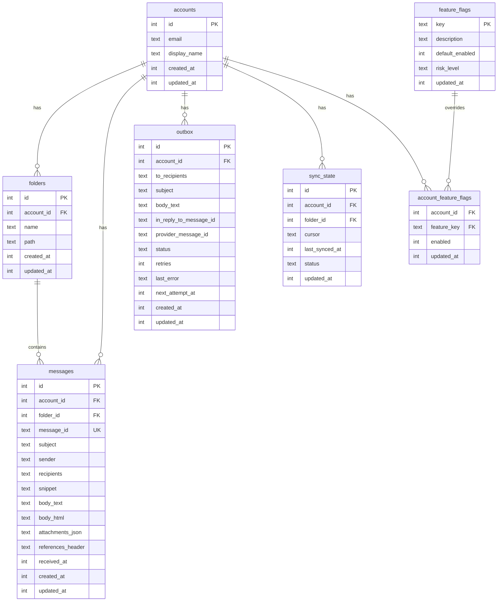

# SQLiteストレージ

PRX-Emailは、bundled SQLiteコンパイルを持つ`rusqlite`クレートを通じてアクセスされるSQLiteを唯一のストレージバックエンドとして使用します。データベースはWALモードで実行され、外部キーが有効になっており、高速な並行読み取りと信頼性の高い書き込み分離を提供します。

## データベース設定

### デフォルト設定

| 設定 | 値 | 説明 |
|-----|---|------|
| `journal_mode` | WAL | 並行読み取りのための先行書き込みログ |
| `synchronous` | NORMAL | バランスの取れた耐久性/パフォーマンス |
| `foreign_keys` | ON | 参照整合性を適用 |
| `busy_timeout` | 5000ms | ロックされたデータベースの待機時間 |
| `wal_autocheckpoint` | 1000ページ | 自動WALチェックポイントしきい値 |

### カスタム設定

```rust
use prx_email::db::{EmailStore, StoreConfig, SynchronousMode};

let config = StoreConfig {
    enable_wal: true,
    busy_timeout_ms: 5_000,
    wal_autocheckpoint_pages: 1_000,
    synchronous: SynchronousMode::Normal,
};

let store = EmailStore::open_with_config("./email.db", &config)?;
```

### 同期モード

| モード | 耐久性 | パフォーマンス | ユースケース |
|------|------|------------|---------|
| `Full` | 最大 | 書き込みが最も遅い | 金融またはコンプライアンスワークロード |
| `Normal` | 良好（デフォルト） | バランス | 一般的なプロダクション使用 |
| `Off` | 最小 | 書き込みが最も速い | 開発とテストのみ |

### インメモリデータベース

テスト用にインメモリデータベースを使用します：

```rust
let store = EmailStore::open_in_memory()?;
store.migrate()?;
```

## スキーマ

データベーススキーマは増分マイグレーションを通じて適用されます。`store.migrate()`を実行すると保留中のすべてのマイグレーションが適用されます。

### テーブル



### インデックス

| テーブル | インデックス | 目的 |
|---------|-----------|------|
| `messages` | `(account_id)` | アカウントでメッセージをフィルタ |
| `messages` | `(folder_id)` | フォルダでメッセージをフィルタ |
| `messages` | `(subject)` | 件名のLIKE検索 |
| `messages` | `(account_id, message_id)` | UPSERTのユニーク制約 |
| `outbox` | `(account_id)` | アカウントでアウトボックスをフィルタ |
| `outbox` | `(status, next_attempt_at)` | 対象アウトボックスレコードをクレーム |
| `sync_state` | `(account_id, folder_id)` | UPSERTのユニーク制約 |
| `account_feature_flags` | `(account_id)` | フィーチャーフラグの検索 |

## マイグレーション

マイグレーションはバイナリに埋め込まれて順番に適用されます：

| マイグレーション | 説明 |
|-------------|------|
| `0001_init.sql` | アカウント、フォルダ、メッセージ、sync_stateテーブル |
| `0002_outbox.sql` | 送信パイプライン用アウトボックステーブル |
| `0003_rollout.sql` | フィーチャーフラグとアカウントフィーチャーフラグ |
| `0005_m41.sql` | M4.1スキーマの改良 |
| `0006_m42_perf.sql` | M4.2パフォーマンスインデックス |

追加カラム（`body_html`、`attachments_json`、`references_header`）は存在しない場合`ALTER TABLE`で追加されます。

## パフォーマンスチューニング

### 読み取り集中型ワークロード

書き込みよりも読み取りが多いアプリケーション（典型的なメールクライアント）の場合：

```rust
let config = StoreConfig {
    enable_wal: true,              // Concurrent reads
    busy_timeout_ms: 10_000,       // Higher timeout for contention
    wal_autocheckpoint_pages: 2_000, // Less frequent checkpoints
    synchronous: SynchronousMode::Normal,
};
```

### 書き込み集中型ワークロード

高ボリュームの同期操作の場合：

```rust
let config = StoreConfig {
    enable_wal: true,
    busy_timeout_ms: 5_000,
    wal_autocheckpoint_pages: 500, // More frequent checkpoints
    synchronous: SynchronousMode::Normal,
};
```

### クエリプラン分析

`EXPLAIN QUERY PLAN`で遅いクエリを確認します：

```sql
EXPLAIN QUERY PLAN
SELECT * FROM messages
WHERE account_id = 1 AND subject LIKE '%invoice%'
ORDER BY received_at DESC LIMIT 50;
```

## 容量計画

### 増加要因

| テーブル | 増加パターン | 保持戦略 |
|---------|-----------|--------|
| `messages` | 支配的なテーブル。同期ごとに増加 | 古いメッセージを定期的に削除 |
| `outbox` | 送信済み + 失敗履歴が蓄積 | 古い送信済みレコードを削除 |
| WALファイル | 書き込みバースト中にスパイク | 自動チェックポイント |

### 監視しきい値

- DBファイルサイズとWALサイズを個別に追跡する
- 複数のチェックポイントにわたってWALが大きいままの場合にアラートする
- アウトボックスの失敗バックログが運用SLOを超えた場合にアラートする

## データメンテナンス

### クリーンアップヘルパー

```rust
// Delete sent outbox records older than 30 days
let cutoff = now - 30 * 86400;
let deleted = repo.delete_sent_outbox_before(cutoff)?;
println!("Deleted {} old sent records", deleted);

// Delete messages older than 90 days
let cutoff = now - 90 * 86400;
let deleted = repo.delete_old_messages_before(cutoff)?;
println!("Deleted {} old messages", deleted);
```

### メンテナンスSQL

アウトボックスのステータス分布を確認します：

```sql
SELECT status, COUNT(*) FROM outbox GROUP BY status;
```

メッセージの年齢分布：

```sql
SELECT
  CASE
    WHEN received_at >= strftime('%s','now') - 86400 THEN 'lt_1d'
    WHEN received_at >= strftime('%s','now') - 604800 THEN 'lt_7d'
    ELSE 'ge_7d'
  END AS age_bucket,
  COUNT(*)
FROM messages
GROUP BY age_bucket;
```

WALチェックポイントとコンパクション：

```sql
PRAGMA wal_checkpoint(TRUNCATE);
VACUUM;
```

::: warning VACUUM
`VACUUM`はデータベースファイル全体を再構築し、データベースサイズと同等の空きディスク容量が必要です。大規模な削除後はメンテナンスウィンドウで実行してください。
:::

## SQL安全性

すべてのデータベースクエリはSQLインジェクションを防ぐためにパラメータ化文を使用します：

```rust
// Safe: parameterized query
conn.execute(
    "SELECT * FROM messages WHERE account_id = ?1 AND message_id = ?2",
    params![account_id, message_id],
)?;
```

動的な識別子（テーブル名、カラム名）はSQL文字列で使用する前に`^[a-zA-Z_][a-zA-Z0-9_]{0,62}$`に対して検証されます。

## 次のステップ

- [設定リファレンス](../configuration/) -- すべてのランタイム設定
- [トラブルシューティング](../troubleshooting/) -- データベース関連の問題
- [IMAP設定](../accounts/imap) -- 同期データフローを理解する
