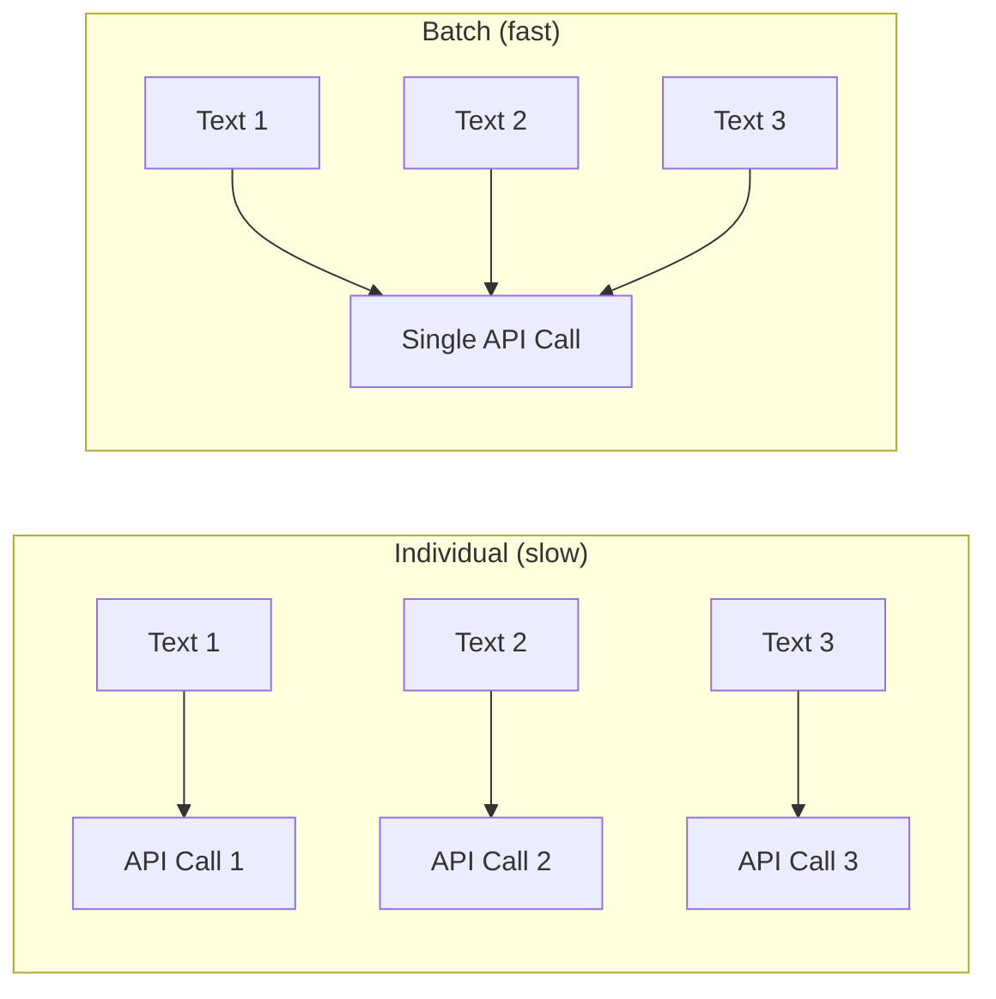

# バッチ処理

大量のメモリセットを扱う場合、テキストを1つずつ埋め込むのは非効率です。PRX-MemoryはAPIラウンドトリップを削減しスループットを向上させるバッチ埋め込みをサポートします。

## バッチ埋め込みの動作方法

各メモリに個別のAPI呼び出しを行う代わりに、バッチ処理は複数のテキストを1回のリクエストにまとめます。ほとんどの埋め込みプロバイダは1回の呼び出しで100〜2048件のテキストをサポートします。



## ユースケース

### 初期インポート

大量の既存知識をインポートする場合は`memory_import`を使用してメモリを読み込み、バッチ埋め込みをトリガーします：

```json
{
  "jsonrpc": "2.0",
  "id": 1,
  "method": "tools/call",
  "params": {
    "name": "memory_import",
    "arguments": {
      "data": "... exported memory JSON ..."
    }
  }
}
```

### モデル変更後の再埋め込み

新しい埋め込みモデルに切り替えるとき、`memory_reembed`ツールはバッチで保存済みのすべてのメモリを処理します：

```json
{
  "jsonrpc": "2.0",
  "id": 1,
  "method": "tools/call",
  "params": {
    "name": "memory_reembed",
    "arguments": {}
  }
}
```

### ストレージコンパクション

`memory_compact`ツールはストレージを最適化し、古くなったまたは欠落しているベクトルを持つエントリの再埋め込みをトリガーできます：

```json
{
  "jsonrpc": "2.0",
  "id": 1,
  "method": "tools/call",
  "params": {
    "name": "memory_compact",
    "arguments": {}
  }
}
```

## パフォーマンスのヒント

| ヒント | 説明 |
|-------|------|
| バッチ対応プロバイダを使用 | JinaおよびOpenAI互換エンドポイントは大きなバッチサイズをサポート |
| 低使用時間帯に実行 | バッチ操作はリアルタイムクエリと同じAPIクォータを消費 |
| メトリクスでモニタリング | `/metrics`エンドポイントで埋め込み呼び出し数とレイテンシを追跡 |
| 効率的なモデルを選択 | 小さいモデル（768次元）は大きいモデル（3072次元）より速く埋め込める |

## レート制限

ほとんどの埋め込みプロバイダはレート制限を適用します。PRX-Memoryはレート制限レスポンス（HTTP 429）を自動バックオフで処理します。持続的なレート制限に直面する場合は：

- 一度に処理するメモリを減らしてバッチサイズを削減する。
- より高いレート制限を持つプロバイダを使用する。
- バッチ操作を長い時間ウィンドウにまたがって分散させる。

::: tip
大規模な再埋め込み操作では、レート制限を完全に回避するためにローカル推論サーバーの使用を検討してください。`PRX_EMBED_PROVIDER=openai-compatible`を設定し、`PRX_EMBED_BASE_URL`をローカルサーバーに向けてください。
:::

## 次のステップ

- [サポートモデル](./models) -- 適切な埋め込みモデルを選択
- [ストレージバックエンド](../storage/) -- ベクトルの保存場所
- [設定リファレンス](../configuration/) -- すべての環境変数
