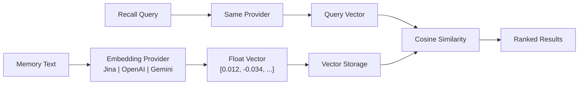

# 埋め込みエンジン

埋め込みエンジンはPRX-Memoryのセマンティック検索機能の基盤です。テキストメモリを意味を捉えた高次元ベクトルに変換することで、キーワードマッチングを超えた類似性ベースの検索を可能にします。

## 動作の仕組み

埋め込みが有効でメモリが保存される場合、PRX-Memoryは次のことを行います：

1. メモリテキストを設定済みの埋め込みプロバイダに送信します。
2. ベクトル表現（通常768〜3072次元）を受け取ります。
3. ベクトルをメモリメタデータと共に保存します。
4. 検索時にコサイン類似度検索のためにベクトルを使用します。



## プロバイダアーキテクチャ

`prx-memory-embed`クレートはすべての埋め込みバックエンドが実装するプロバイダトレイトを定義します。この設計によりアプリケーションコードを変更せずにプロバイダを切り替えられます。

サポートされるプロバイダ：

| プロバイダ | 環境キー | 説明 |
|-----------|---------|------|
| OpenAI互換 | `PRX_EMBED_PROVIDER=openai-compatible` | 任意のOpenAI互換API（OpenAI、Azure、ローカルサーバー） |
| Jina | `PRX_EMBED_PROVIDER=jina` | Jina AI埋め込みモデル |
| Gemini | `PRX_EMBED_PROVIDER=gemini` | Google Gemini埋め込みモデル |

## 設定

環境変数でプロバイダと認証情報を設定します：

```bash
PRX_EMBED_PROVIDER=jina
PRX_EMBED_API_KEY=your_api_key
PRX_EMBED_MODEL=jina-embeddings-v3
PRX_EMBED_BASE_URL=https://api.jina.ai  # optional, for custom endpoints
```

::: tip プロバイダフォールバックキー
`PRX_EMBED_API_KEY`が設定されていない場合、システムはプロバイダ固有キーにフォールバックします：
- Jina: `JINA_API_KEY`
- Gemini: `GEMINI_API_KEY`
:::

## 埋め込みを有効にするタイミング

| シナリオ | 埋め込みが必要か？ |
|---------|---------------|
| 小さなメモリセット（100件未満） | オプション -- 語彙検索で十分な場合がある |
| 大きなメモリセット（1000件以上） | 推奨 -- ベクトル類似度で検索が大幅に改善 |
| 自然言語クエリ | 推奨 -- セマンティックな意味を捉える |
| 正確なタグ/スコープフィルタリング | 不要 -- 語彙検索で対応可能 |
| 多言語検索 | 推奨 -- 多言語モデルは言語をまたいで機能する |

## パフォーマンス特性

- **レイテンシ:** プロバイダとモデルによって埋め込み呼び出しあたり50〜200ms。
- **バッチモード:** 複数のテキストを1回のAPI呼び出しにまとめてラウンドトリップを削減。
- **ローカルキャッシュ:** ベクトルはローカルに保存され再利用されます。新しいまたは変更されたメモリのみ埋め込み呼び出しが必要です。
- **100kベンチマーク:** 100,000件のエントリでの語彙+重要度+再近接度検索のp95検索は123ms以内（ネットワーク呼び出しなし）。

## 次のステップ

- [サポートモデル](./models) -- 詳細なモデル比較
- [バッチ処理](./batch-processing) -- 効率的なバルク埋め込み
- [リランキング](../reranking/) -- より高い精度のための第2段階リランキング
