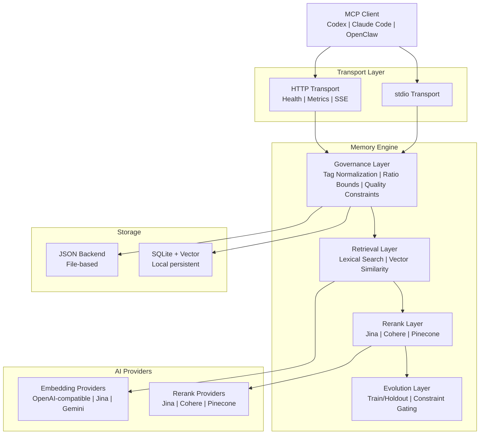

# PRX-Memory

**PRX-Memory** はコーディングエージェント向けに設計されたローカルファースト型セマンティックメモリエンジンです。埋め込みベースの検索、リランキング、ガバナンス制御、測定可能な進化機能を単一のMCP互換コンポーネントに統合しています。PRX-Memoryはスタンドアロンデーモンとしてシップされており（`prx-memoryd`）、stdioまたはHTTPで通信します。Codex、Claude Code、OpenClaw、OpenPRX、その他のMCPクライアントと互換性があります。

PRX-Memoryは生のログではなく**再利用可能なエンジニアリング知識**に焦点を当てています。タグ、スコープ、重要度スコアを持つ構造化メモリを保存し、語彙検索、ベクトル類似度、オプションのリランキングを組み合わせて検索します。すべてが品質・安全制約によりガバナンスされます。

## PRX-Memoryを選ぶ理由

多くのコーディングエージェントはメモリをあとから追加するものとして扱っています。フラットファイル、非構造化ログ、ベンダーロックのクラウドサービスなどです。PRX-Memoryは異なるアプローチを取ります。

- **ローカルファースト。** すべてのデータはあなたのマシンに留まります。クラウド依存なし、テレメトリなし、ネットワーク外にデータが出ることなし。
- **構造化とガバナンス。** すべてのメモリエントリはタグ、スコープ、カテゴリ、品質制約を持つ標準化フォーマットに従います。タグの正規化とレシオ境界によりドリフトを防止します。
- **セマンティック検索。** 語彙マッチングとベクトル類似度、オプションのリランキングを組み合わせて、指定されたコンテキストに最も関連するメモリを検索します。
- **測定可能な進化。** `memory_evolve`ツールはトレイン/ホールドアウト分割と制約ゲーティングを使用して候補改善を受け入れるか拒否します。推測は不要です。
- **MCPネイティブ。** stdioおよびHTTPトランスポート上のModel Context Protocolをファーストクラスでサポートします。リソーステンプレート、スキルマニフェスト、ストリーミングセッションも含みます。

## 主要機能

<div class="vp-features">

- **マルチプロバイダ埋め込み** -- 統一されたアダプタインターフェースを通じてOpenAI互換、Jina、Gemini埋め込みプロバイダをサポートします。環境変数を変更するだけでプロバイダを切り替えられます。

- **リランキングパイプライン** -- Jina、Cohere、またはPineconeリランカーを使用したオプションの第2段階リランキングで、生のベクトル類似度を超える検索精度を実現します。

- **ガバナンス制御** -- タグの正規化、レシオ境界、定期メンテナンス、品質制約を持つ構造化メモリフォーマットにより、メモリ品質を長期的に高水準に保ちます。

- **メモリ進化** -- `memory_evolve`ツールはトレイン/ホールドアウト受け入れテストと制約ゲーティングを使用して候補変更を評価し、測定可能な改善保証を提供します。

- **デュアルトランスポートMCPサーバー** -- 直接統合のためのstdioサーバー、またはヘルスチェック、Prometheusメトリクス、ストリーミングセッションを持つHTTPサーバーとして実行できます。

- **スキル配布** -- MCPリソースおよびツールプロトコルを通じて検索可能な組み込みガバナンススキルパッケージと、標準化されたメモリ操作のためのペイロードテンプレートを提供します。

- **オブザーバビリティ** -- Prometheusメトリクスエンドポイント、Grafanaダッシュボードテンプレート、設定可能なアラートしきい値、プロダクションデプロイ用のカーディナリティ制御を提供します。

</div>

## アーキテクチャ



## クイックスタート

メモリデーモンをビルドして実行します：

```bash
cargo build -p prx-memory-mcp --bin prx-memoryd

PRX_MEMORYD_TRANSPORT=stdio \
PRX_MEMORY_DB=./data/memory-db.json \
./target/debug/prx-memoryd
```

またはCargoでインストールします：

```bash
cargo install prx-memory-mcp
```

詳細なメソッドと設定オプションについては[インストールガイド](./getting-started/installation)を参照してください。

## ワークスペースクレート

| クレート | 説明 |
|---------|------|
| `prx-memory-core` | コアスコアリングと進化のドメインプリミティブ |
| `prx-memory-embed` | 埋め込みプロバイダの抽象化とアダプタ |
| `prx-memory-rerank` | リランクプロバイダの抽象化とアダプタ |
| `prx-memory-ai` | 埋め込みとリランクの統一プロバイダ抽象化 |
| `prx-memory-skill` | 組み込みガバナンススキルペイロード |
| `prx-memory-storage` | ローカル永続ストレージエンジン（JSON、SQLite、LanceDB） |
| `prx-memory-mcp` | stdioおよびHTTPトランスポートを持つMCPサーバーサーフェス |

## ドキュメントセクション

| セクション | 説明 |
|-----------|------|
| [インストール](./getting-started/installation) | ソースからビルドするかCargoでインストール |
| [クイックスタート](./getting-started/quickstart) | 5分でPRX-Memoryを起動 |
| [埋め込みエンジン](./embedding/) | 埋め込みプロバイダとバッチ処理 |
| [サポートモデル](./embedding/models) | OpenAI互換、Jina、Geminiモデル |
| [リランキングエンジン](./reranking/) | 第2段階リランキングパイプライン |
| [ストレージバックエンド](./storage/) | JSON、SQLite、ベクトル検索 |
| [MCP統合](./mcp/) | MCPプロトコル、ツール、リソース、テンプレート |
| [Rust APIリファレンス](./api/) | RustプロジェクトにPRX-Memoryを埋め込むためのライブラリAPI |
| [設定](./configuration/) | すべての環境変数とプロファイル |
| [トラブルシューティング](./troubleshooting/) | 一般的な問題と解決策 |

## プロジェクト情報

- **ライセンス:** MIT OR Apache-2.0
- **言語:** Rust (2024 edition)
- **リポジトリ:** [github.com/openprx/prx-memory](https://github.com/openprx/prx-memory)
- **最小Rust:** stable toolchain
- **トランスポート:** stdio、HTTP
