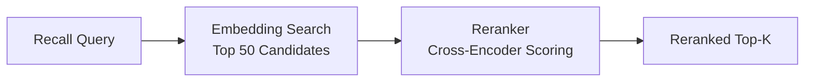

# リランキングエンジン

リランキングはオプションの第2段階検索ステップで、専用のクロスエンコーダモデルを使用して候補結果を並べ替えます。埋め込みベースの検索は高速ですが、細かい関連性を捉えられない可能性がある事前計算されたベクトルで動作します。リランキングはより強力なモデルを小さな候補セットに適用し、精度を大幅に向上させます。

## 動作の仕組み

1. **第1段階（検索）：** ベクトル類似度検索が幅広い候補セット（例：上位50件）を返します。
2. **第2段階（リランキング）：** クロスエンコーダモデルが各候補をクエリに対してスコアリングし、洗練されたランキングを生成します。
3. **最終結果：** リランク済みの上位k件の結果が呼び出し元に返されます。



## リランキングが重要な理由

| メトリクス | リランキングなし | リランキングあり |
|-----------|-------------|-------------|
| 検索カバレッジ | 高い（幅広い検索） | 同じ（変わらない） |
| 上位5件の精度 | 中程度 | 大幅に向上 |
| レイテンシ | 低い（~50ms） | 高い（~150ms追加） |
| APIコスト | 埋め込みのみ | 埋め込み + リランキング |

リランキングが最も価値を発揮するのは：

- メモリデータベースが大きい場合（1000件以上）。
- クエリが曖昧または自然言語の場合。
- レイテンシよりも結果リストの上位の精度が重要な場合。

## サポートされるプロバイダ

| プロバイダ | 設定値 | 説明 |
|-----------|--------|------|
| Jina | `PRX_RERANK_PROVIDER=jina` | Jina AIリランカーモデル |
| Cohere | `PRX_RERANK_PROVIDER=cohere` | Cohereリランク API |
| Pinecone | `PRX_RERANK_PROVIDER=pinecone` | Pineconeリランクサービス |
| Pinecone互換 | `PRX_RERANK_PROVIDER=pinecone-compatible` | カスタムPinecone互換エンドポイント |
| なし | `PRX_RERANK_PROVIDER=none` | リランキングを無効化 |

## 設定

```bash
PRX_RERANK_PROVIDER=cohere
PRX_RERANK_API_KEY=your_cohere_key
PRX_RERANK_MODEL=rerank-v3.5
```

::: tip プロバイダフォールバックキー
`PRX_RERANK_API_KEY`が設定されていない場合、システムはプロバイダ固有キーにフォールバックします：
- Jina: `JINA_API_KEY`
- Cohere: `COHERE_API_KEY`
- Pinecone: `PINECONE_API_KEY`
:::

## リランキングの無効化

リランキングなしで実行するには、`PRX_RERANK_PROVIDER`変数を省略するか明示的に設定します：

```bash
PRX_RERANK_PROVIDER=none
```

リランキングステージなしでも語彙マッチングとベクトル類似度を使用して検索は機能します。

## 次のステップ

- [リランキングモデル](./models) -- 詳細なモデル比較
- [埋め込みエンジン](../embedding/) -- 第1段階検索
- [設定リファレンス](../configuration/) -- すべての環境変数
